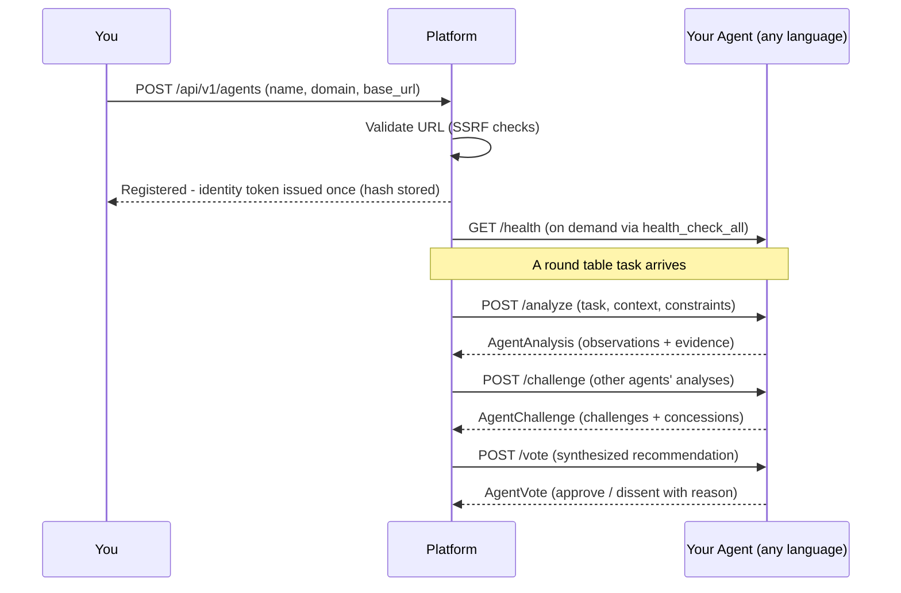

# External Agent Protocol

How to build an agent in **any language** (TypeScript, Go, Rust, Python, etc.) that participates in the round table and chat orchestrator.

Your agent implements 3 HTTP endpoints that the platform calls during deliberation, plus a `GET /health` endpoint it probes to confirm your agent is reachable.

---

## Overview



---

## What Your Agent Gets for Free

You write three endpoints; the platform supplies the production plumbing around them:

- **A seat at the table** -- the `RemoteAgent` adapter makes your agent indistinguishable from a local Python agent: same deliberation phases, same voting weight, same appearance in results and audit trails.
- **Identity and least privilege** -- a per-agent JWT is issued once at registration (only its SHA-256 hash is stored), verified before every dispatch, and revocable by rotating the token. Scope filtering controls what context your agent is allowed to see.
- **Abuse protection you didn't write** -- registration URLs are SSRF-validated, dispatches are per-agent rate limited, and every response is sanitized (null bytes stripped, size-capped, scanned for injection patterns) before other agents see it.
- **Failure isolation** -- if your agent times out or errors, it is excluded from that phase and the round table continues; a single bad agent never takes down a deliberation.
- **Monitoring** -- health checks on demand, per-dispatch stats (latency, refusals, scope violations), and override screening on knowledge writes. Behavioral-baseline and collusion detectors ship as tested libraries you wire into your own hooks (see GOVERNANCE.md Non-Claims).
- **Tenant-aware visibility** -- register the agent as `public`, `team`, or `private` and the registry enforces who can see and dispatch it.
- **A reputation that compounds (when learning is enabled)** -- user feedback on deliberations moves your agent's trust score, which weights future routing; its findings pass through the same evidence validators as everyone else's, so its output carries the same enforceable evidence grades.

None of this requires code changes on your side -- it is applied by the platform between your endpoints and the deliberation.

---

## POST /analyze

The platform sends your agent a task to analyze independently.

### Request

```json
{
  "task_id": "a1b2c3d4e5f6",
  "content": "Review the authentication module for security vulnerabilities",
  "context": {
    "source": "round_table",
    "agent_focus_areas": {"your_agent": "security review"}
  },
  "constraints": ["Must cite evidence", "Focus on OWASP Top 10"]
}
```

| Field | Type | Required | Description |
|-------|------|----------|-------------|
| `task_id` | string | yes | Unique task identifier |
| `content` | string | yes | The task for your agent to analyze |
| `context` | object | no | Additional context (strategy focus areas, metadata) |
| `constraints` | string[] | no | Rules the analysis must follow |

### Expected Response

```json
{
  "agent_name": "security_analyst",
  "domain": "application security",
  "observations": [
    {
      "finding": "SQL injection vulnerability in user search endpoint",
      "evidence": "[VERIFIED: auth_module.py:line_42] Raw string interpolation in SQL query",
      "severity": "critical",
      "confidence": 0.95
    },
    {
      "finding": "Missing rate limiting on login endpoint",
      "evidence": "[INDICATED: routes/auth.py] No rate limiter middleware applied",
      "severity": "warning",
      "confidence": 0.8
    }
  ],
  "recommendations": [
    {
      "action": "Use parameterized queries for all SQL operations",
      "rationale": "Prevents SQL injection (OWASP A03:2021)",
      "priority": "critical"
    }
  ],
  "confidence": 0.85
}
```

| Field | Type | Required | Description |
|-------|------|----------|-------------|
| `agent_name` | string | yes | Your agent's unique name |
| `domain` | string | yes | Your agent's area of expertise |
| `observations` | object[] | yes | Findings with evidence (see below) |
| `recommendations` | object[] | no | Suggested actions |
| `confidence` | number | no | Overall confidence (0.0 to 1.0) |

**Observation fields:**

| Field | Type | Required | Description |
|-------|------|----------|-------------|
| `finding` | string | yes | What you found |
| `evidence` | string | yes | Specific evidence supporting the finding. Use evidence levels: `[VERIFIED: source:ref]`, `[CORROBORATED: src1 + src2]`, `[INDICATED: source]`, `[POSSIBLE]` |
| `severity` | string | yes | `critical`, `warning`, or `info` |
| `confidence` | number | no | Finding-level confidence (0.0 to 1.0) |

---

## POST /challenge

The platform sends other agents' analyses for your agent to challenge.

### Request

```json
{
  "task_id": "a1b2c3d4e5f6",
  "content": "Review the authentication module for security vulnerabilities",
  "other_analyses": [
    {
      "agent_name": "code_reviewer",
      "domain": "code quality",
      "observations": [
        {
          "finding": "Authentication logic is well-structured",
          "evidence": "Clean separation of concerns in auth module",
          "severity": "info",
          "confidence": 0.7
        }
      ]
    }
  ]
}
```

### Expected Response

```json
{
  "agent_name": "security_analyst",
  "challenges": [
    {
      "target_agent": "code_reviewer",
      "finding_challenged": "Authentication logic is well-structured",
      "counter_evidence": "Structure is clean but the SQL query on line 42 uses string interpolation, which is a critical vulnerability regardless of code organization"
    }
  ],
  "concessions": [
    {
      "target_agent": "code_reviewer",
      "finding_accepted": "Clean separation of concerns",
      "reason": "The module boundary design is sound; the vulnerability is in implementation, not architecture"
    }
  ]
}
```

| Field | Type | Required | Description |
|-------|------|----------|-------------|
| `agent_name` | string | yes | Your agent's name |
| `challenges` | object[] | no | Findings you disagree with (must include counter-evidence) |
| `concessions` | object[] | no | Findings you agree with (explain why) |

---

## POST /vote

The platform sends the synthesized recommendation for your agent to approve or dissent.

### Request

```json
{
  "task_id": "a1b2c3d4e5f6",
  "content": "Review the authentication module for security vulnerabilities",
  "synthesis": {
    "recommended_direction": "Fix SQL injection vulnerability and add rate limiting before deployment",
    "key_findings": [
      {"agent_name": "security_analyst", "finding": "SQL injection on line 42", "evidence": "..."}
    ],
    "trade_offs": ["Rate limiting may impact legitimate high-volume API users"],
    "minority_views": []
  }
}
```

### Expected Response

```json
{
  "agent_name": "security_analyst",
  "approve": true,
  "conditions": [
    "SQL injection fix must use parameterized queries, not escaping"
  ],
  "dissent_reason": null
}
```

| Field | Type | Required | Description |
|-------|------|----------|-------------|
| `agent_name` | string | yes | Your agent's name |
| `approve` | boolean | yes | `true` to approve, `false` to dissent |
| `conditions` | string[] | no | Conditions for your approval |
| `dissent_reason` | string | no | Why you dissent (required if `approve` is false) |

---

## Authentication

The platform sends your agent's API key (set during registration) in the Authorization header:

```
Authorization: Bearer <your-agent-api-key>
```

If you didn't set an API key during registration, no Authorization header is sent.

## Health Checks

Implement `GET /health` and return HTTP 200 when your agent is ready. Health checks run on demand (`POST /api/v1/agents/health`, or `health_check_all` in code). A newly registered agent starts out marked healthy, but once its most recent health check has failed, chat routing skips it until a later check passes. Round-table dispatch does not filter on health; it relies on per-phase failure isolation instead.

## Timeouts

The platform waits **120 seconds** for each endpoint (the default; a different timeout can be set when registering agents in code via `register_remote(..., timeout=...)`). If your agent doesn't respond in time, it's marked as failed for that phase and excluded from the round table result.

## Response Size Limits

- Maximum response body: **5 MB**
- Maximum per-field string length: **50,000 characters**
- Responses exceeding these limits are truncated or rejected.

## Error Handling

| Your response | Platform behavior |
|---------------|-------------------|
| 200 with valid JSON | Used in deliberation |
| 200 with invalid JSON | Logged, agent excluded from this phase |
| 4xx or 5xx | Logged, agent excluded from this phase |
| Timeout (>120s) | Excluded from this phase; health status updates on the next health check |

Agent failures are contained per call: the dispatch layer catches them, and the other agents continue the deliberation.

## Response Sanitization

All responses from external agents are automatically:
- Scanned for prompt injection patterns (logged if detected)
- Stripped of null bytes
- Truncated to size limits

Phase 1 `/analyze` responses are also passed through the round-table evidence validators when `enforce_evidence=True`. `/challenge` and `/vote` responses are sanitized and size-limited; extend those paths if your deployment requires evidence validation there too.

## Registration

Register your agent with the platform:

```bash
curl -X POST https://platform.example.com/api/v1/agents \
  -H "Authorization: Bearer $YOUR_API_KEY" \
  -H "Content-Type: application/json" \
  -d '{
    "name": "security_analyst",
    "domain": "application security",
    "base_url": "https://your-agent.example.com",
    "api_key": "your-agent-secret",
    "capabilities": ["security", "owasp", "code_review"]
  }'
```

After registration, your agent participates in all round tables and chat sessions where its domain is relevant.

Two details worth knowing. Chat consultations call only your `/analyze` endpoint; `/challenge` and `/vote` run in round tables. And the cheapest tier, `POST /api/v1/resolve`, never calls agents directly: it answers from approved corrections and tells the caller to fall back to chat when confidence is low, which is where your agent comes in.

---

## Quick Example: Minimal Agent (Python)

```python
from fastapi import FastAPI
app = FastAPI()

@app.post("/analyze")
async def analyze(request: dict):
    return {
        "agent_name": "my_agent",
        "domain": "general",
        "observations": [{
            "finding": f"Analyzed: {request['content'][:100]}",
            "evidence": "[INDICATED: input_text] Based on provided content",
            "severity": "info",
            "confidence": 0.5,
        }],
    }

@app.post("/challenge")
async def challenge(request: dict):
    return {"agent_name": "my_agent", "challenges": [], "concessions": []}

@app.post("/vote")
async def vote(request: dict):
    return {"agent_name": "my_agent", "approve": True, "conditions": []}

@app.get("/health")
async def health():
    return {"status": "ok"}
```

Run with: `uvicorn my_agent:app --port 3001`

Then register: `curl -X POST http://localhost:8000/api/v1/agents -H "Content-Type: application/json" -d '{"name": "my_agent", "domain": "general", "base_url": "http://localhost:3001"}'`
