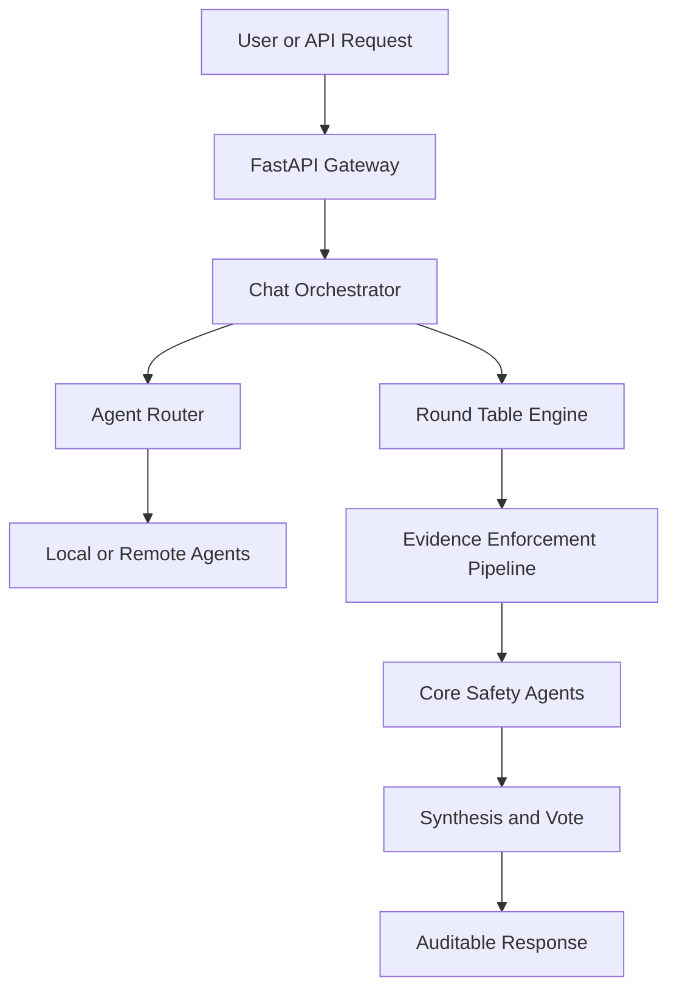

# Roundtable Architecture

`roundtable` is a scaffold for building AI-agent systems with explicit deliberation, evidence enforcement, and operational guardrails. The repository has two layers of architecture: the public template repository and the generated project architecture that Copier renders for each user.

## Repository Architecture

```text
roundtable/
  README.md                 # Public landing page and quick start
  copier.yml                # Template questions and post-generation tasks
  template/{{project_slug}}/ # Files rendered into generated projects
  scripts/                  # Validation for the scaffold itself
  core/                     # Optional roundtable CLI/core utilities
  docs/                     # Public documentation for reviewers and builders
```

The root repository is optimized for three jobs:

- Present the design clearly to reviewers and hiring managers.
- Generate a complete project with one Copier command.
- Validate that generated projects keep architecture, security, and documentation guarantees intact.

Development work follows a gated AI-assisted workflow: architecture and data-flow design first, expert review next, tests before production logic, then code review, red-team review, and CI. See [DEVELOPMENT_PROCESS.md](DEVELOPMENT_PROCESS.md) for the full process.

## Generated Project Architecture

Generated projects use a layered layout with a safety-first multi-agent runtime:

```text
<project_slug>/
  src/<project_slug>/
    agents/           # Local agents, remote-agent adapter, core safety agents
    api/              # FastAPI gateway, routes, models, middleware
    enforcement/      # Evidence levels, citation validation, fact checking
    harness/          # Session lifecycle and external state hooks
    learning/         # Feedback, trust, preferences, RAG, graduation
    llm/              # Provider-aware LLM client with prompt caching
    orchestration/    # Round table, chat orchestrator, routing
    security/         # Prompt guard, SSRF validation, webhook verification
  docs/               # Generated project documentation
  evals/              # Capability and regression eval infrastructure
  tests/              # Architecture, security, API, and orchestration tests
```

## Core Runtime Flow



The chat orchestrator handles normal real-time requests. It routes to the most relevant specialists and escalates to the full round table when confidence is low or agents disagree.

The round table engine handles complex decisions through four phases:

1. Strategy: the orchestrator plans how to divide the task.
2. Independent analysis: agents produce separate evidence-backed findings.
3. Challenge: agents question each other's assumptions and evidence.
4. Synthesis and voting: recommendations are merged while preserving dissent.

## Safety Agents

Generated projects include core safety agents by default:

| Agent | Responsibility |
|-------|----------------|
| Skeptic | Challenges assumptions and flags weak reasoning |
| Quality | Checks completeness, edge cases, and requirement coverage |
| Evidence | Grades claim strength and flags speculation-as-fact |
| FactChecker | Detects unsupported confidence and hedging patterns |
| Citation | Checks evidence-level tagging and citation discipline |

These are meta-agents. They evaluate the quality of analysis rather than replacing domain specialists.

## Evidence Enforcement

The enforcement pipeline runs between independent analysis and cross-agent challenge. It checks for:

- unsupported speculation presented as fact
- missing or weak evidence citations
- malformed evidence-level tags such as `VERIFIED`, `CORROBORATED`, `INDICATED`, and `POSSIBLE`
- numeric claims that can be checked against a ground-truth provider

Critical findings are logged in validation results; projects can add stricter correction behavior by configuring concrete validators and LLM correction paths.

## External Agent Protocol

Remote agents can be written in any language. They only need to expose three HTTP endpoints:

```text
POST /analyze
POST /challenge
POST /vote
```

The generated `RemoteAgent` adapter wraps those endpoints so the orchestrator treats remote and local agents through the same protocol. See [AGENT_PROTOCOL.md](AGENT_PROTOCOL.md) for schemas and examples.

## Dependency Direction

Generated projects enforce architecture rules in `tests/test_architecture.py`. The default layers depend only downward, while shared systems such as `security/`, `llm/`, and `orchestration/` have explicit import boundaries.

The intent is simple: domain code should not quietly reach across the system and create hidden coupling. Shared interfaces should move down into stable modules, and higher-level workflows should coordinate through the orchestrator or API boundary.

## Operational Guardrails

The scaffold includes checks for:

- architecture boundary violations
- prompt-injection and SSRF risk patterns
- hardcoded secret patterns
- oversized files
- generated project import syntax
- red-team checks for risky agent behavior
- CI matrix validation across multiple project configurations

Those checks are designed to make quality visible in the repository, not dependent on memory or manual review.
