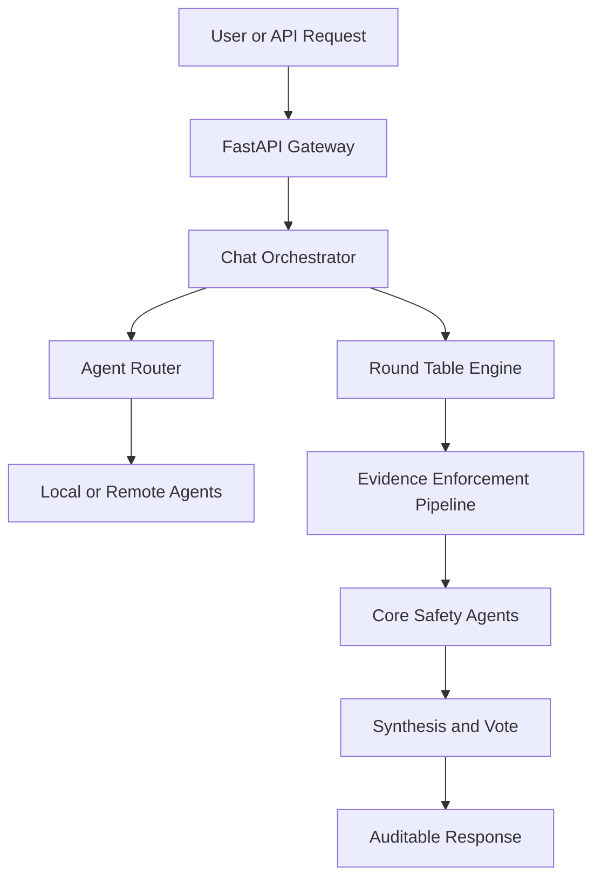
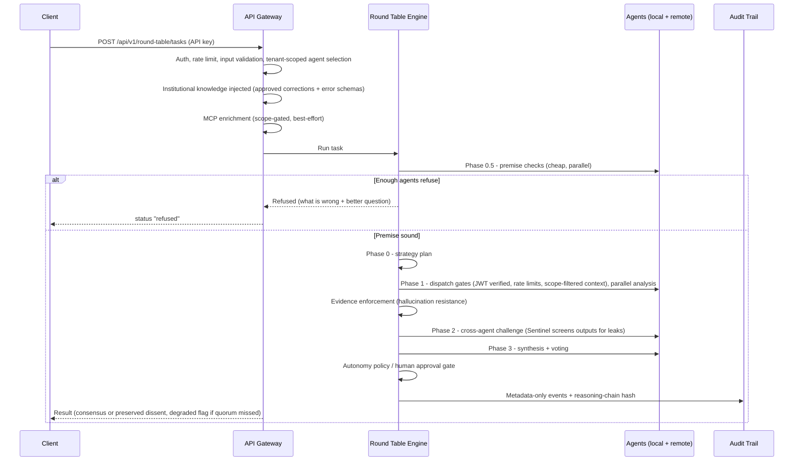

# Roundtable Architecture

`roundtable` is a scaffold for building AI-agent systems with explicit deliberation, evidence enforcement, and operational guardrails. The repository has two layers of architecture: the public template repository and the generated project architecture that Copier renders for each user.

## Repository Architecture

```text
roundtable/
  README.md                 # Public landing page and quick start
  copier.yml                # Template questions and post-generation tasks
  template/{{project_slug}}/ # Files rendered into generated projects
  scripts/                  # Validation for the scaffold itself
  core/                     # Optional roundtable CLI/core utilities
  docs/                     # Public documentation for reviewers and builders
```

The root repository is optimized for three jobs:

- Present the design clearly to reviewers and hiring managers.
- Generate a complete project with one Copier command.
- Validate that generated projects keep architecture, security, and documentation guarantees intact.

A note on file names inside `template/`: files ending in `.jinja` (for example `ARCHITECTURE.md.jinja`) contain Copier template variables, so GitHub shows them as raw text. At generation time Copier substitutes the variables and strips the suffix, so a generated project gets a clean, fully rendered `ARCHITECTURE.md` with working diagrams and tables. This `docs/` directory holds the reviewer-facing, already-rendered documentation.

Development work follows a gated AI-assisted workflow: architecture and data-flow design first, expert review next, tests before production logic, then code review, red-team review, and CI. See [DEVELOPMENT_PROCESS.md](DEVELOPMENT_PROCESS.md) for the full process.

## Generated Project Architecture

Generated projects use a layered layout with a safety-first multi-agent runtime:

```text
<destination-dir>/        # the copier destination is the project root
  src/<project_slug>/
    agents/           # Local agents, remote-agent adapter, core safety agents
    api/              # FastAPI gateway, routes, models, middleware
    enforcement/      # Evidence levels, citation validation, fact checking
    harness/          # Session lifecycle and external state hooks
    learning/         # Feedback, trust, preferences, RAG, corrections, integrity analytics
    llm/              # Provider-aware LLM client with prompt caching
    orchestration/    # Round table, chat orchestrator, routing
    security/         # Prompt guard, injection defense, SSRF validation, webhook verification
  docs/               # Generated project documentation
  evals/              # Capability and regression eval infrastructure
  tests/              # Architecture, security, API, and orchestration tests
```

## Core Runtime Flow



The chat orchestrator handles normal real-time requests. It routes to the most relevant specialists and escalates to the full round table when confidence is low or agents disagree. Routing is tenant-scoped (only agents visible to the caller's tenant are candidates, including LLM-suggested ones), and the evidence, skeptic, and sentinel safety agents join every consultation. Each synthesis is checked by the FactChecker; a rejected synthesis is re-generated once with a correction note, and a repeat rejection triggers an escalation suggestion.

The round table engine handles complex decisions through a phased protocol:

1. Premise gate (Phase 0.5): agents may collectively refuse a flawed task before any expensive phase runs.
2. Strategy: the orchestrator plans how to divide the task.
3. Independent analysis: agents produce separate evidence-backed findings.
4. Challenge: agents question each other's assumptions and evidence.
5. Synthesis and voting: recommendations are merged while preserving dissent.

Before any agent is dispatched, it passes integrity gates: its platform-issued JWT identity token is verified (suspended agents and remote agents without valid credentials are blocked), a per-agent rate limit is checked, and the task context is filtered to the agent's declared access scopes. Skipped or crashed agents never abort the deliberation, but when too few domain agents produce analyses (below the configured quorum), the result is explicitly flagged as degraded so a thin deliberation is never mistaken for a real consensus.

## One Request, End to End

The full lifecycle of a round-table task, with every gate it passes:



## Safety Agents

Generated projects include core safety agents by default:

| Agent | Responsibility |
|-------|----------------|
| Skeptic | Challenges assumptions and flags weak reasoning |
| Quality | Checks completeness, edge cases, and requirement coverage |
| Evidence | Grades claim strength and flags speculation-as-fact |
| FactChecker | Detects unsupported confidence and hedging patterns |
| Citation | Checks evidence-level tagging and citation discipline |
| Sentinel | Semantic guard: screens inputs for injection and extraction attempts, screens outputs for leaks; fails closed |

These are meta-agents. They evaluate the quality of analysis rather than replacing domain specialists. Sentinel is also the semantic layer of a 3-layer injection defense: static pattern matching in `security/prompt_guard.py` (Layer 1), homoglyph normalization, invisible-character stripping, and encoding-attack detection in `security/injection_defense.py` (Layer 2), and Sentinel's LLM-based screening (Layer 3).

## Evidence Enforcement

The enforcement pipeline runs between independent analysis and cross-agent challenge. It checks for:

- unsupported speculation presented as fact
- missing or weak evidence citations
- malformed evidence-level tags such as `VERIFIED`, `CORROBORATED`, `INDICATED`, and `POSSIBLE`
- numeric claims that can be checked against a ground-truth provider

Critical findings are logged in validation results; projects can add stricter correction behavior by configuring concrete validators and LLM correction paths.

## Learning Persistence and Integrity

The learning module persists its extended tables (corrections, activity events, agent dispatch stats, integrity flags) behind a small `LearningStore` protocol with SQLite (default) and Postgres (opt-in) backends. The files added for this layer in generated projects:

- `learning/store.py` -- `LearningStore` protocol, SQLite/Postgres backends, allowlist-validated SQL, forward-only migrations
- `learning/corrections.py` -- Correction lifecycle (proposed -> approved -> retired) with four-eyes approval and budgeted prompt rendering
- `learning/override_detector.py` -- Screens proposed corrections for injection, safety-agent targeting, and evidence-level inflation
- `learning/collusion.py` -- Vote-lockstep, challenge-softness, and correction-drift detection (tested detector library; the default runtime does not invoke it -- see the generated GOVERNANCE.md Non-Claims)
- `learning/activity.py` -- User activity thresholds (wired into the sampled activity middleware) and per-agent behavioral baselines (a library the default dispatch does not invoke)
- `learning/content_policy.py` -- Heuristic classifier for knowledge writes (approved/flagged/rejected); blocks standing-rule manipulation and persists integrity flags

Findings are persisted as integrity flags and reviewed by humans through the anomalies API -- nothing is auto-rejected or auto-suspended.

## Agentic Governance

Generated projects also ship a governance layer over the deliberations themselves:

- `orchestration/autonomy.py` -- Graduated autonomy: trust levels 1-6 resolve to an `AutonomyPolicy` (approval gate, specialist cap, rate multiplier, conflict auto-escalation); unknown levels fail safe to the most restrictive
- `llm/budget_manager.py` -- Per-tenant LLM spend caps with warn/exhaust thresholds; exhausted tenants are blocked before the provider call
- `orchestration/deliberation_audit.py` -- Metadata-only audit trail (phases, agent counts, durations, outcomes) that structurally cannot store prompt or response content
- `security/pii.py` -- Pattern-based, idempotent PII redaction with Unicode normalization, applied before correction text is persisted
- `api/routes/budgets.py` -- GET/PUT per-tenant budget config, spend, and status
- `api/routes/audit.py` -- GET deliberation audit timelines by correlation id

See the generated project's `docs/GOVERNANCE.md` for the capability matrix and stated non-claims.

## External Agent Protocol

Remote agents can be written in any language. They only need to expose three HTTP endpoints:

```text
POST /analyze
POST /challenge
POST /vote
```

The generated `RemoteAgent` adapter wraps those endpoints so the orchestrator treats remote and local agents through the same protocol. See [AGENT_PROTOCOL.md](AGENT_PROTOCOL.md) for schemas and examples.

## Dependency Direction

Generated projects enforce architecture rules in `tests/test_architecture.py`. The default layers depend only downward, while shared systems such as `security/`, `llm/`, and `orchestration/` have explicit import boundaries.

The intent is simple: domain code should not quietly reach across the system and create hidden coupling. Shared interfaces should move down into stable modules, and higher-level workflows should coordinate through the orchestrator or API boundary.

## Operational Guardrails

The scaffold includes checks for:

- architecture boundary violations
- prompt-injection and SSRF risk patterns
- hardcoded secret patterns
- oversized files
- generated project import syntax
- red-team checks for risky agent behavior
- CI matrix validation across multiple project configurations

Those checks are designed to make quality visible in the repository, not dependent on memory or manual review.
