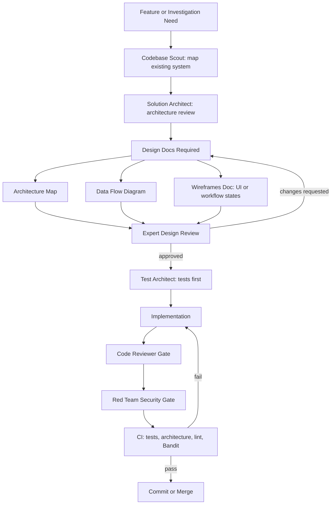

# Development Process

`roundtable` uses a gated AI-assisted development workflow. The goal is to make agent-written code reviewable, maintainable, and safe to operate in security-sensitive systems.

This is a governance scaffold, not a replacement for human accountability. The process makes risks explicit, creates durable design artifacts, and gives reviewers clear checkpoints before implementation and release.

## Workflow

## Required Design Artifacts

Every meaningful feature starts with three design documents:

| Artifact | Purpose |
|----------|---------|
| Architecture Map | Shows what exists, what is needed, layer ownership, dependencies, and implementation order |
| Data Flow Diagram | Identifies source of truth, data movement, trust boundaries, and write paths |
| Wireframes | Describes user-visible states; for non-UI work, describes workflow states and operator decisions |

Small test-only changes and tiny bug fixes can skip the full ceremony when the maintainer explicitly decides the risk is low.

## Gates

| Gate | What It Prevents |
|------|------------------|
| Architecture review | New code bypassing existing modules, layering rules, or ownership boundaries |
| Design review | Ambiguous scope, missing data-flow reasoning, and unreviewed trust-boundary changes |
| Test-first planning | Implementation that cannot be verified or safely refactored |
| Code review | Maintainability, correctness, and architecture drift |
| Red-team review | Security regressions, prompt-injection risk, data leaks, and unsafe automation |
| CI validation | Broken tests, lint failures, security findings, and generated-template regressions |

## Roundtable POC Handoff

If a POC changes agents, orchestration, external agent protocol behavior, or
evidence enforcement, complete [ROUNDTABLE_HANDOFF.md](ROUNDTABLE_HANDOFF.md)
before engineering review. The handoff captures agent contracts, phase evidence,
failure behavior, observability, and demo-only production blockers.

## Why This Matters

AI assistants can write code quickly, but speed without review creates fragile systems. This workflow keeps agentic development aligned with engineering discipline:

- design before implementation
- tests before production logic
- explicit source-of-truth and trust-boundary analysis
- adversarial review before commit or release
- automated checks that make quality repeatable

For investigation and security workflows, those gates matter because unsupported claims, leaked context, unsafe automation, or weak access boundaries can create real operational risk.
