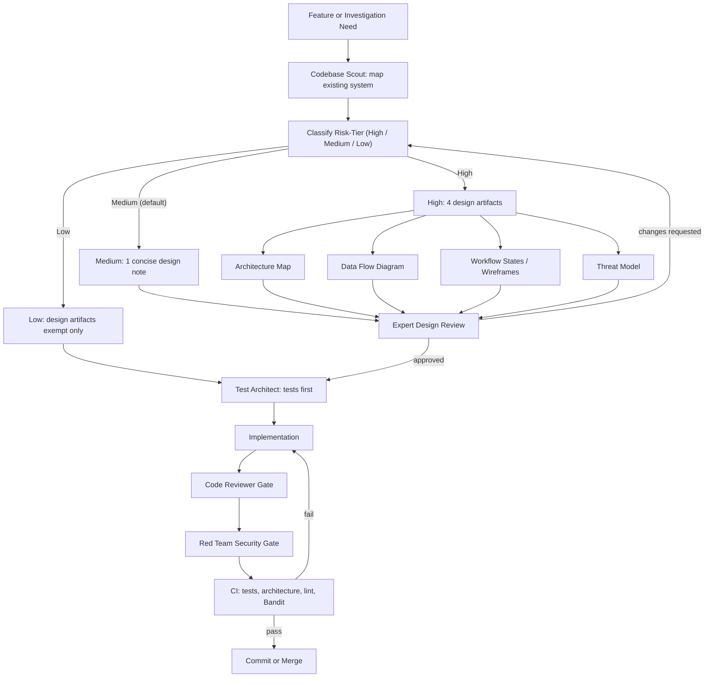

# Development Process

`roundtable` uses a gated AI-assisted development workflow. The goal is to make
agent-written code reviewable, maintainable, and safe to operate in production
systems.

This is a governance scaffold, not a replacement for human accountability. The
process makes risks explicit, creates durable design artifacts, and gives
reviewers clear checkpoints before implementation and release.

## Workflow

## Risk-Tier Policy

Every change is classified into a risk-tier — **High**, **Medium**, or
**Low** — before implementation. The **highest applicable tier wins**: a small
diff cannot be downgraded when it touches a high-tier path or invariant. The
maintainer records the chosen tier and the rationale in the PR description.

### High

High-tier changes touch security or authentication, agent identity or
permissions, enforcement, migrations/schema/RLS, tenant or learning data,
secrets or deployment boundaries, CI workflows, or hooks. Applicable path
globs — both root and generated — include:

- `src/*/security/**` and root `security/**`;
- authentication and authorization middleware
  (for example `api/middleware/auth.py`);
- agent-identity or scope dispatch (for example
  `agents/registry.py`, identity/scope routing);
- `enforcement/**` and any invariant-enforcement wiring;
- `learning/tables.py` and its `MIGRATIONS`;
- `.github/workflows/**` (any CI workflow);
- `.cursor/hooks*` and other agent hooks;
- deployment manifests (`deploy/**`, `Dockerfile*`, `docker-compose*.yml`,
  `k8s/**`);
- secret configuration (`.env*`, secret managers, key material).

Required before implementation — all four design artifacts:

| Artifact          | Purpose                                                                                     |
|-------------------|---------------------------------------------------------------------------------------------|
| Architecture Map  | Shows what exists, what is needed, layer ownership, dependencies, and implementation order  |
| Data Flow Diagram | Identifies source of truth, data movement, trust boundaries, and write paths                |
| Workflow States   | Describes workflow states, operator decisions, and (where relevant) UI wireframes           |
| Threat Model      | Assets, actors, trust boundaries, abuse cases, controls, residual risks, security acceptance |

Primary layout: `docs/designs/<feature>/{ARCHITECTURE_MAP,DATA_FLOW,WORKFLOW_STATES,THREAT_MODEL}.md`.
High-tier changes always receive all relevant domain reviews (security
architect, SRE, template-DX where applicable) and code review.

### Medium

**Medium is the default risk-tier** for every change that is neither High nor
Low, including single-file or multi-file behavioral changes that do not alter
a high-tier invariant. It requires **one concise design note** covering
architecture impact, data movement, failure behavior, risks, and planned
tests. The note may be split into two documents only when doing so makes
review materially clearer.

### Low

Low-tier work is limited to documentation- or presentation-only changes,
test-only changes, or fixes under 20 gross changed lines measured as
**additions plus deletions** (excluding mechanically generated artifacts)
that do not touch high-tier paths or invariants.

Low-tier work is **exempt from design artifacts** only. Every other gate
still applies. Low-tier changes preserve:

- branch isolation — never commit directly to `main`;
- CI validation — `bash scripts/validate_generated.sh`, quick checks, and the
  blocking `security` job (Gitleaks over full history plus `pip-audit`
  through the fail-closed exceptions gate) still run and still block;
- applicable tests — new or updated tests for the touched behavior when there
  is any behavior to test;
- human ownership — the maintainer approves the tier and the diff; and
- post-change review — Bugbot plus, when applicable, the matching domain
  reviewer.

The maintainer records the tier and rationale in the PR description whenever
invoking the Low exemption.

## Gates

| Gate | What It Prevents |
|------|------------------|
| Risk-tier classification | Downgrading changes that touch a high-tier path or invariant, and skipping design ceremony where it matters |
| Architecture review | New code bypassing existing modules, layering rules, or ownership boundaries |
| Design review | Ambiguous scope, missing data-flow reasoning, and unreviewed trust-boundary changes |
| Threat-model review (High) | Unmitigated abuse cases, missing controls, and undocumented residual risks |
| Test-first planning | Implementation that cannot be verified or safely refactored |
| Code review | Maintainability, correctness, and architecture drift |
| Red-team review | Security regressions, prompt-injection risk, data leaks, and unsafe automation |
| CI validation | Broken tests, lint failures, security findings, and generated-template regressions |
| Secret scanning (Gitleaks) | New secrets committed to the tree or reintroduced through history (`security` job, `.github/workflows/validate.yml`; pinned action, `fetch-depth: 0`) |
| Dependency auditing (`pip-audit`) | Merging a PR that ships known-vulnerable Python dependencies; every exception must pass through the fail-closed gate at `template/{{project_slug}}/scripts/pip_audit_gate.py` with a named owner, compensating control, and expiry -- expired entries automatically restore blocking behaviour |

## Roundtable POC Handoff

If a POC changes agents, orchestration, external agent protocol behavior, or
evidence enforcement, complete [ROUNDTABLE_HANDOFF.md](ROUNDTABLE_HANDOFF.md)
before engineering review. The handoff captures agent contracts, phase evidence,
failure behavior, observability, and demo-only production blockers.

## Bug-Class Feedback: One-off vs Recurring Class

Every confirmed finding from review, CI, or an incident is classified
by a human maintainer as either a **one-off** defect or a **recurring**
bug class. A one-off is isolated to this diff; a recurring class means
the same failure could re-emerge in a different diff because an
invariant is missing or under-specified.

Agents may propose the classification and cite prior register entries,
but they cannot auto-classify, self-edit their own rules, or approve
their own rule changes. A human maintainer records the classification
in [`docs/BUG_CLASS_REGISTER.md`](BUG_CLASS_REGISTER.md).

A recurring bug-class fix cannot receive final approval until the same
PR ships all three linked artifacts:

- a **regression test** that fails on the pre-fix code and passes after
  the fix;
- an **update to the nearest relevant agent rule or instruction** (the
  closest applicable rule that could have prevented recurrence, not
  merely prose appended to the register); and
- a **register entry** in [`docs/BUG_CLASS_REGISTER.md`](BUG_CLASS_REGISTER.md)
  that links the source finding, the invariant, the rule change, and
  the regression test.

A one-off defect requires the regression test only and is not entered
in the register. Findings whose classification a human maintainer has
not yet decided stay in the register with status `DRAFT` — the
vocabulary is closed to `DRAFT`, `SHADOW`, `BLOCKING`, and
`SUSPENDED`, matching the [reviewer-assurance](REVIEWER_ASSURANCE.md)
vocabulary.

This is a documentation-parity gate enforced by human review. CI
checks that the process docs and both bug-class registers exist and
are linked; it does not decide whether a given fix meets the
three-artifact bar — humans classify.

## Why This Matters

AI assistants can write code quickly, but speed without review creates fragile
systems. This workflow keeps agentic development aligned with engineering
discipline:

- risk-tier classification before implementation
- design before implementation (proportional to risk-tier)
- tests before production logic
- explicit source-of-truth and trust-boundary analysis
- adversarial review before commit or release
- automated checks that make quality repeatable

Wherever unsupported claims, leaked context, unsafe automation, or weak
access boundaries can create real operational risk, those gates matter.
