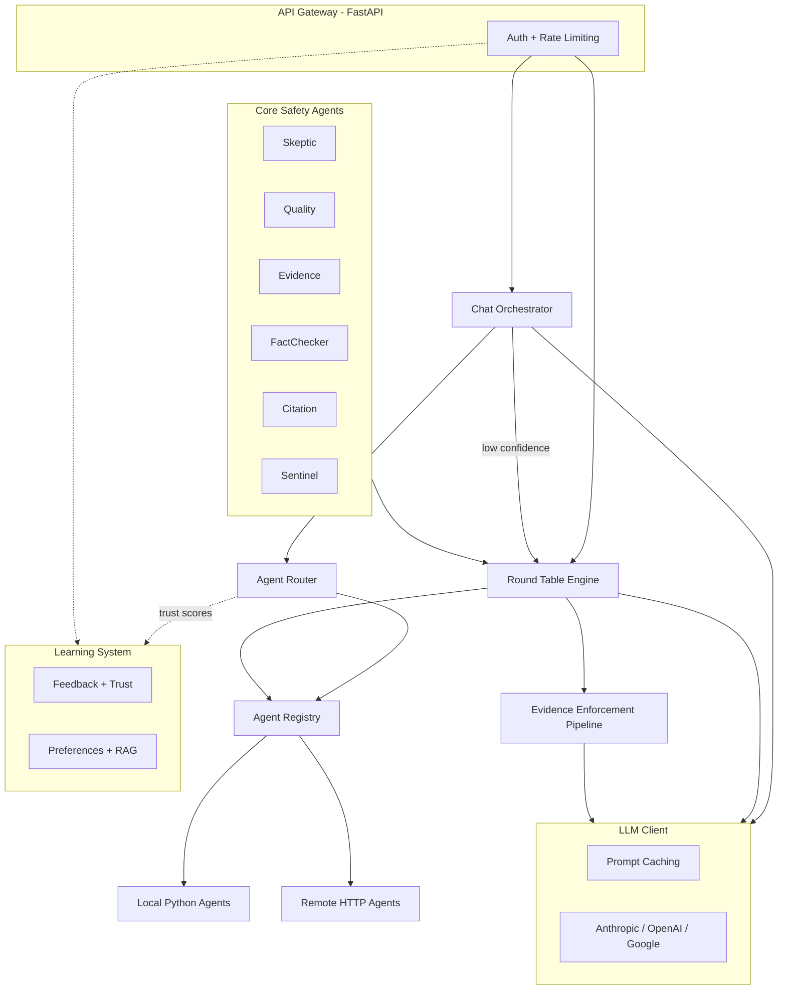
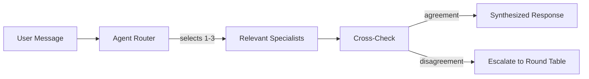
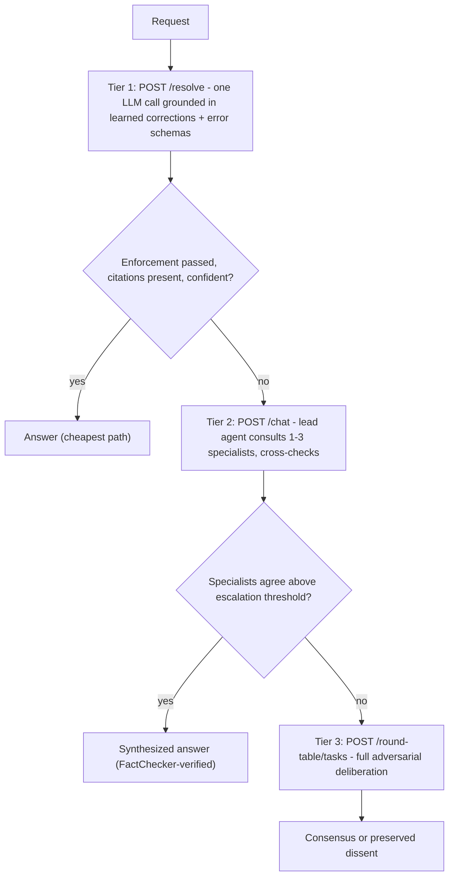
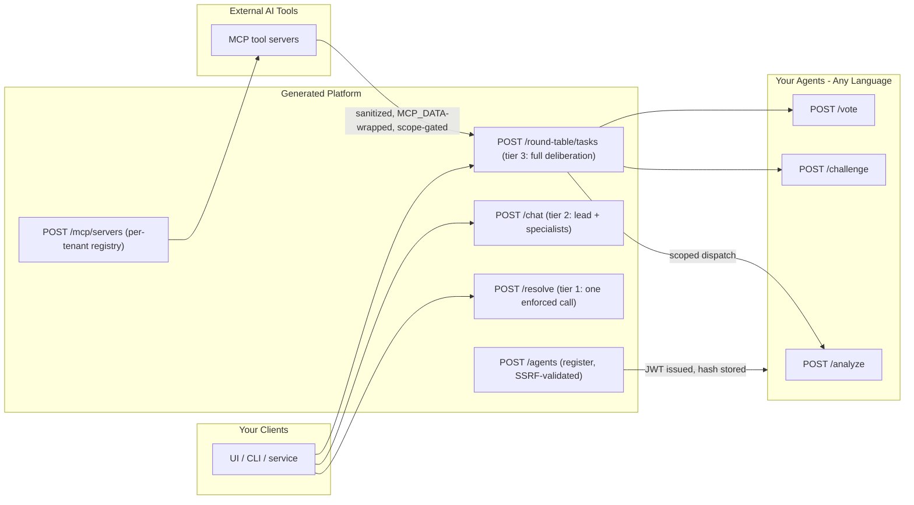
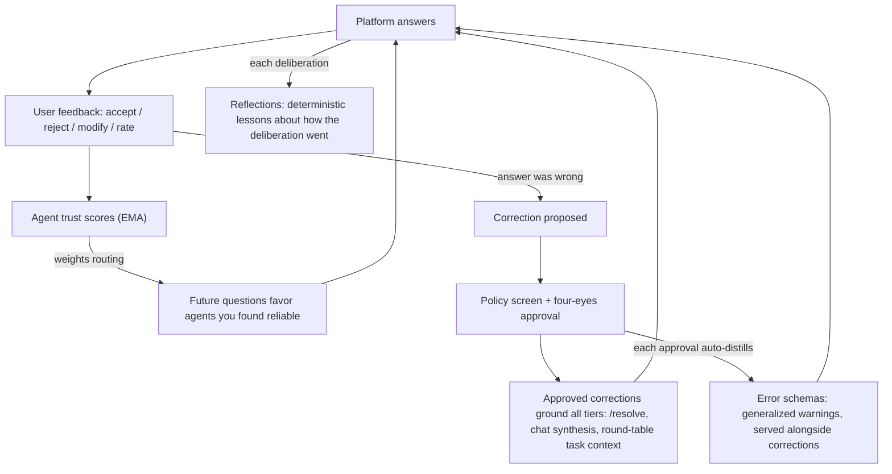
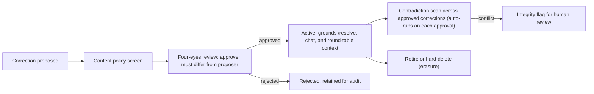
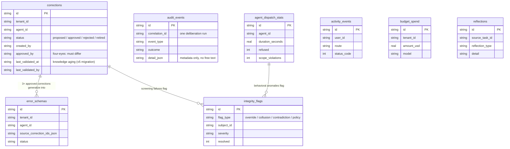
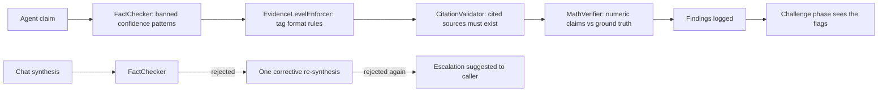
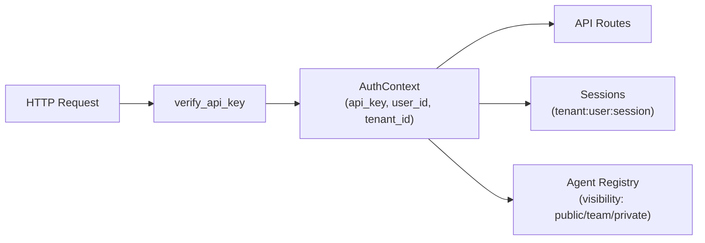

# Features and Reference

The complete tour of what a generated project contains. For the short version, read the [README](../README.md); for system design, read [ARCHITECTURE.md](ARCHITECTURE.md).

---

## How It Works

### System Architecture



Two interaction modes share the same agent registry, LLM client, and safety infrastructure. The chat orchestrator handles real-time queries and escalates to the full round table when needed.

### Chat Orchestrator: User-Facing Entry Point



The chat orchestrator routes messages to the most relevant specialists (based on domain matching + trust scores), cross-checks their responses, and escalates to the full round table when specialists disagree.

**Escalation triggers:** When the cross-check finds specialist agreement below 40% (configurable via `escalation_threshold` in `ChatConfig`), the response is flagged with `escalation_suggested=True` and both conflicting views are shown. The chat endpoint also escalates when the agent router can't find enough relevant specialists. Users can manually escalate any topic via `POST /api/v1/chat/escalate`.

### Round Table: Phased Multi-Agent Deliberation

```mermaid
flowchart LR
    subgraph gate [Phase 0.5: Premise Gate]
        PG["Agents may collectively refuse a flawed task"]
    end
    subgraph phase1 [Phase 1: Independent Analysis]
        A1[Agent A]
        A2[Agent B]
        A3[Agent C]
        S[Skeptic]
        Q[Quality]
        E[Evidence]
        SN[Sentinel]
    end
    subgraph enforce [Evidence Enforcement]
        EF[FactChecker + EvidenceLevelEnforcer]
    end
    subgraph phase2 [Phase 2: Challenge]
        CH[Cross-Agent Challenge]
    end
    subgraph phase3 [Phase 3: Synthesis + Voting]
        SY[Synthesis]
        V[Voting]
    end
    gate -->|"premise sound"| phase1
    gate -->|"refused"| Refuse["Short-circuit: what is wrong + a better question"]
    phase1 --> enforce
    enforce -->|"validation findings logged"| phase2
    phase2 --> phase3
    phase3 --> Result[Consensus or Dissent]
```



Before any expensive phase runs, each agent gets one cheap premise check: is this task sound, or is it built on a false premise, underspecified, or unanswerable? When enough agents independently refuse (threshold clamped so a single agent can never veto alone), the round table declines the task and returns what is wrong and how to reframe it, instead of confidently analyzing a flawed question. Each agent then analyzes the task independently. The enforcement pipeline validates Phase 1 analyses, flags speculation, checks evidence-tag formatting when tags are present, and logs weak-claim findings before challenge. Agents then challenge each other's findings with counter-evidence, and finally vote on a synthesized recommendation.

### Core Safety Agents

Core agents are **meta-agents** -- they evaluate *how well* the analysis was done, not *what* was analyzed. They are the deliberation's built-in guardrails, working alongside your domain specialists in every round table by default. Opt out with `include_core_agents=False` if you have a specific reason.

| Agent | Role |
|-------|------|
| **Skeptic** | Challenges assumptions, demands evidence, flags logical fallacies |
| **Quality** | Tracks requirement coverage, finds gaps in scope, checks edge cases |
| **Evidence** | Grades claim strength, flags speculation as fact, checks citation quality |
| **FactChecker** | Flags unsupported certainty, challenges weak claims |
| **Citation** | Requests source-backed claims, checks evidence levels |
| **Sentinel** | Screens inputs for injection, screens outputs for leaks, fails closed |

---

## What You Get

Every scaffolded project includes **100+ Python source files** across 10 modules:

### Three Cost Tiers, One Quality Bar

Every tier runs FactChecker enforcement; escalation is a routing decision, never a quality bypass:



- **Round Table** -- Full phased multi-agent deliberation (Premise Gate, Strategy, Independent Analysis, Challenge, Synthesis + Voting). For complex decisions needing all perspectives. Agents can collectively refuse a flawed task before any expensive phase runs. Six core safety agents participate automatically. Evidence enforcement pipeline runs between Phase 1 and Phase 2.
- **Chat Orchestrator** -- Lightweight real-time chat. A lead agent selectively consults 1-3 specialists, cross-checks for agreement, and escalates to the round table when needed.

### API Gateway (FastAPI)

The platform is API-first: everything a client, a custom agent, or an external tool needs is an HTTP endpoint.



API route modules expose the core workflow over HTTP:

- `POST /api/v1/resolve` -- Cheapest tier: one enforced LLM call grounded in learned corrections, escalates to chat
- `POST /api/v1/round-table/tasks` -- Submit task for full multi-agent deliberation
- `GET  /api/v1/round-table/search?q=` -- Semantic search over past deliberations
- `POST /api/v1/chat` -- Send message to chat orchestrator
- `POST /api/v1/chat/stream` -- Same, with Server-Sent Events streaming
- `POST /api/v1/agents` -- Register external agent (any language)
- `GET  /api/v1/agents` -- List registered agents with health status
- `POST /api/v1/feedback` -- Record user feedback signal
- `GET  /api/v1/preferences/search?q=` -- Semantic preference search
- `GET  /api/v1/checkins` -- List pending check-ins
- `POST /api/v1/mcp/servers` -- Register an MCP tool server (per-tenant, scope-gated, optional `[mcp]` extra)
- `POST /api/v1/corrections` (+ `/approve`, `/reject`, `/retire`, `/revalidate`, `DELETE`) -- Four-eyes correction lifecycle, including knowledge-aging revalidation and hard-delete erasure (`GET ?stale=true` lists the aging review queue, paged stalest-first)
- `GET  /api/v1/reflections` -- Deterministic lessons distilled from each deliberation
- `GET/POST /api/v1/graduation/...` -- Candidates, propose (opens check-ins), apply (requires approved check-in)
- `GET/PUT /api/v1/budgets/{tenant_id}` -- Read and set per-tenant spend budgets
- `GET  /api/v1/audit/deliberations/{correlation_id}` -- Full audit trail for one deliberation, with reasoning-chain hash
- `GET  /api/v1/reports/governance?from_date=&to_date=` -- Tenant-scoped governance report (counts only): deliberation outcomes, integrity flags, corrections lifecycle activity + stale-knowledge summary, reflections, budget spend
- `GET  /api/v1/activity/anomalies` -- Behavioral integrity flags (+ `POST .../resolve`)
- `POST /api/v1/sessions` -- Session lifecycle (turns, retrieval, listing)
- `POST /api/v1/webhooks/agents/{agent_id}` -- HMAC-verified async agent callbacks
- `GET  /health` -- Liveness
- `GET  /health/ready` -- Readiness
- `GET  /metrics` -- Basic operational metrics (JSON)
- `GET  /metrics/prometheus` -- Prometheus exposition (optional `[metrics]` extra; 501 with an install hint without it)

### External Agent Protocol (Any Language)

External agents implement 3 HTTP endpoints:

```
POST /analyze   -- Independent analysis with evidence citations
POST /challenge -- Challenge other agents' findings with counter-evidence
POST /vote      -- Vote on synthesis (approve with conditions, or dissent with reason)
```

The `RemoteAgent` adapter wraps these as `AgentProtocol` -- the round table and chat orchestrator see no difference between local Python agents and remote TypeScript/Go/Rust agents. See [AGENT_PROTOCOL.md](AGENT_PROTOCOL.md) for schemas.

### LLM Client with Prompt Caching

Provider-agnostic client (Anthropic, OpenAI, Google) with automatic prompt caching:

- `CacheablePrompt(system, context, user_message)` separates stable prefix from dynamic content
- Anthropic: `cache_control` for ~90% input token savings on cached prefixes
- OpenAI: prefix caching for ~50% savings
- Token tracking per call (input, output, cached, estimated USD cost)
- Budget enforcement with configurable spending limits
- Auto-retry with exponential backoff

### Compounding Institutional Knowledge (learning system)

Most agent deployments answer every question from zero. This platform closes the loop: every interaction can leave something behind that makes the next one better. The learning modules ship in every generated project (the `include_learning` copier flag tailors optional RAG dependencies and docs); nothing adapts until your team records feedback or corrections, and behavior changes are check-in gated.



The components, each independently usable:

- **Feedback Tracker** -- Accept/reject/modify/rate signals per agent
- **Agent Trust** -- EMA-based trust scores that weight agent routing in chat
- **Corrections** -- Reviewed, approved knowledge that grounds all three resolution tiers (`POST /resolve`, chat synthesis context, round-table task context); full lifecycle over the API
- **Error Schemas** -- Recurring approved corrections auto-distilled into generalized warnings on each approval, served alongside corrections
- **Reflections** -- Deterministic post-deliberation lessons, recorded automatically and readable via `GET /reflections`
- **Check-in Manager** -- Never adapts silently; behavior changes require an explicit user check-in
- **Extraction Defense** -- Timing-regularity, knowledge-read volume, and approval-pair detectors watch for insiders bulk-copying or steering the learned knowledge; detection-only by default (integrity flags for human review)
- **User Profile** -- Aggregates preferences into context bundles for LLM prompts
- **RAG** -- in-memory vector search for local development, with pgvector recommended for Postgres production deployments
- **Graduation** -- A rule engine that finds preferences stable across sessions and promotes them to a cross-project global profile, exposed at `GET /api/v1/graduation/candidates`, `POST .../propose`, and `POST .../apply`; applying requires an explicitly approved check-in, so nothing graduates without a human saying yes

Because learned corrections shape future behavior, writing one is a governed act, not a free write:



Everything the extended learning system persists lives in eight tables (single source of truth: `learning/tables.py`, allowlist-validated SQL, forward-only migrations, SQLite or Postgres). Every table is tenant-partitioned; the diagram shows key columns, not full schemas:



### Security (Baked In Everywhere)

- SSRF protection on agent registration (blocks private IPs, non-http schemes, cloud metadata endpoints)
- 3-layer prompt injection defense: static pattern detection (`prompt_guard`), homoglyph normalization / invisible-character stripping / encoding-attack detection (`injection_defense`), and semantic screening by the Sentinel agent -- applied per surface, with coverage that varies by surface (the honest per-surface breakdown lives in [SECURITY_MODEL.md](SECURITY_MODEL.md) and the generated GOVERNANCE.md Non-Claims)
- Injection-defense golden set (when `include_evals`): `evals/tasks/test_injection_defense_golden.py` grades a ~50-case labeled dataset through Layers 1 and 2 (imported, not reimplemented) against a frozen per-category FP/FN baseline and fails on regression -- a deterministic regression smoke set, explicitly not a security benchmark and not Layer-3 (Sentinel) coverage. Malicious cases reference the shared adversarial corpus; benign look-alikes measure false positives
- Input size limits on user-facing content endpoints (chat, tasks, sessions, feedback)
- Rate limiting per client IP with stale-IP eviction and 10K IP hard cap
- HMAC-SHA256 webhook signature verification for async agents
- API key auth with production enforcement (`AuthContext` with multi-tenancy structural prep)
- CORS restricted to configured origins (wildcard rejected)
- DNS TOCTOU limitation documented on URL validation
- Extraction defense (detection-first): timing-regularity detection (low CV over inter-request intervals = machine-like cadence, checked every Nth request from the activity middleware), a knowledge-read volume guard (successful reads of the corrections and reflections listings counted per-user + tenant-wide and mapped to normal/elevated/capped -- failed requests never count; detection-only by default, opt-in `EXTRACTION_GUARD_ENFORCE` returns 429 + Retry-After on `GET /corrections` while capped), and directed proposer→approver pair escalation over approved corrections -- all findings persist as integrity flags for human review

### Evidence Enforcement Pipeline (Hallucination Resistance)

This is the scaffold's hallucination-resistance layer: it does not claim to eliminate hallucination (no system can), it rejects the *shape* hallucination usually arrives in -- unsupported confidence, speculation stated as fact, citations that do not exist, and numbers that do not check out -- before any of it reaches synthesis.



Every agent's output is validated before it enters the challenge phase. Four evidence levels, from strongest to weakest:

| Level | Meaning | Requirement |
|-------|---------|-------------|
| **VERIFIED** | "Direct proof exists at this location" | Must cite specific data source and reference |
| **CORROBORATED** | "Multiple independent sources agree" | Must name at least 2 independent sources |
| **INDICATED** | "Data suggests this, but there are gaps" | Must name the source and acknowledge missing data |
| **POSSIBLE** | "Cannot rule out -- warrants investigation" | Must explain what would confirm or deny the finding |

The enforcement pipeline runs automatically after Phase 1 and records validation findings before challenge:

1. **FactChecker** -- scans for banned patterns: "probably", "I think", "90% confident", "seems to"
2. **EvidenceLevelEnforcer** -- validates tag format (VERIFIED needs source:ref, CORROBORATED needs 2+ sources)
3. **CitationValidator** -- checks cited sources exist (pluggable SourceRegistry)
4. **MathVerifier** -- validates numeric claims against ground truth (pluggable)

Projects can configure stricter correction behavior by providing concrete source registries, math verifiers, and LLM correction settings.

### Multi-Tenancy Structural Prep



- `AuthContext` propagates `tenant_id` and `user_id` to all routes
- Agent visibility controls: `public` (all tenants), `team` / `private` (same tenant; per-user private filtering is a documented extension in the platform guide)
- Session isolation: session keys are scoped by tenant + user + session id
- Legacy learning tables carry `project_id` (maps to tenant isolation); the extended learning tables are keyed by `tenant_id` directly
- Postgres deployments can add row-level security on the tenant-keyed learning tables for defense-in-depth: [PLATFORM_GUIDE.md](PLATFORM_GUIDE.md) ships copy-paste RLS policies, an honest note that the shipped autocommit store makes `SET LOCAL` a no-op on the app path (so the store needs per-request transaction scoping to enforce it), and a policy-coverage CI recipe
- Single-tenant deployments use defaults transparently

### Deployment Infrastructure

- **Dockerfile** -- Multi-stage build, non-root user, health check
- **docker-compose.yml** -- App + Postgres, one command to run
- **docker-compose.load.yml** -- Delta-only override for load runs (mock LLM, relaxed rate limit, activity tracking off)
- **Kubernetes manifests** -- Deployment (security context, replaceable image tag), Service, HPA (auto-scale 2-10 pods), ConfigMap, Secret template
- **OPERATIONS.md** -- Per-component failure postures (what fails open vs. closed), recovery hierarchy, Prometheus monitoring guide, backup/restore, load-test recipes

### Optional Extras

Optional capabilities install as extras -- never as base dependencies:

| Extra | Installs | Enables |
|-------|----------|---------|
| `[postgres]` | psycopg 3 | Learning store Postgres backend (`LEARNING_BACKEND=postgres`) |
| `[mcp]` | mcp | Real MCP transport for the tool connectors |
| `[metrics]` | prometheus_client | `GET /metrics/prometheus` exposition (no-op shim without it) |
| `[load]` | locust | Load harness (`tests/load/locustfile.py` + `make load-test`) |

### Development Subagents (`.cursor/agents/`)

Cursor IDE agent definitions that assist during development (not runtime agents). Generated projects include 15 always-on development agents plus up to 3 conditional specialists depending on project type and persistence choices. These prompts are portable to any agent framework including Claude Code.

| Agent | Role |
|-------|------|
| **solution-architect** | Must be consulted before any new feature is coded |
| **codebase-scout** | Searches existing code before allowing new code to be written |
| **data-flow-guardian** | Validates data paths, source of truth, transaction safety |
| **minimalist** | Prevents over-engineering and AI code bloat |
| **code-reviewer** | Quality, security, maintainability review |
| **red-team** | Adversarial pre-commit security gate (BLOCKS on findings) |
| **security-hardener** | Blue team -- proactive defensive security |
| **prompt-engineer** | 2026 Anthropic Skills patterns for prompt design |
| **test-architect** | Test strategy, eval design, coverage analysis |
| **debugger** | Systematic root cause analysis |
| **project-curator** | Directory structure and root cleanliness |
| **design-doc-author** | Produces required design docs before implementation |
| **agent-security-specialist** | Reviews agent definitions and orchestration for safety gaps |
| **sast-reviewer** | Static-analysis-style security review of changed code |
| **delivery-planner** | Breaks approved designs into phased, dependency-ordered work |
| **ai-engineer** | Conditional: multi-agent architecture and orchestration |
| **sql-pro** | Conditional: database optimization when persistence is enabled |
| **ux-researcher** | Conditional: user workflow optimization for web apps |

---

## Configuration Options

| Option | Default | Description |
|--------|---------|-------------|
| `project_type` | `web-app` | `web-app`, `cli-tool`, `multi-agent`, `api-service` |
| `llm_provider` | `anthropic` | `anthropic`, `openai`, `google`, `multi` |
| `persistence` | `sqlite` | App-database scaffolding for your own code (driver dep, compose db service, `DATABASE_URL`/`DATABASE_PATH` plumbing). No shipped runtime module reads these; the learning store is configured by `learning_backend` |
| `learning_backend` | `sqlite` | Storage backend for the built-in learning store (`sqlite` or `postgres`) |
| `include_evals` | `true` | Eval infrastructure (`evals/` tree excluded when false) |
| `include_api_gateway` | `true` | FastAPI gateway + external agent support (`src/<slug>/api/` tree excluded when false) |
| `include_deployment` | `true` | Dockerfile, docker-compose, K8s manifests (all excluded when false, including the Makefile docker/k8s targets) |
| `include_learning` | `false` | Optional RAG dependency guidance + learning docs (the learning modules themselves ship in every project) |

---

## Makefile

```bash
make help          # Show all commands
make test          # Run all tests
make test-arch     # Architecture enforcement
make serve         # Start API gateway (dev mode with auto-reload)
make serve-prod    # Start API gateway (production, 4 workers)
make demo          # Run round table demo (no API keys needed)
make new-agent NAME=my_analyst DOMAIN="code review"  # Scaffold a new agent
make docker-build  # Build Docker image
make docker-run    # Run with docker-compose
make load-test     # Start the stack in load mode (mock LLM), then run Locust
make k8s-deploy    # Apply Kubernetes manifests
make red-team      # Run red team on all source files
make lint          # Run linters
make format        # Format code
make doctor        # Full project health check
make clean         # Remove caches
```

---

## Validation Pipeline

The scaffold itself is validated by a multi-profile pipeline:

```
make quick     (~5s)  -- Template-level checks (banned patterns, secrets, Jinja syntax)
make validate         -- Generate test projects for all 4 profiles
                         (full / gateway-off / minimal / defaults) + full suite:
                         unrendered-template guard, ruff lint, bandit security,
                         import validation, red team, AI checks, agent review,
                         pytest (769 tests collected, 765 passing, 86% coverage),
                         injection-defense golden set, file structure and
                         toggle-wiring verification
make validate-matrix  -- Adds 2 more configurations (multi-agent/api-service)
```

---

## Generated Project Layout

```
template/{{project_slug}}/
  src/{{project_slug}}/
    agents/           # Agent implementations + core safety agents
      core/           # Skeptic, Quality, Evidence, FactChecker, Citation, Sentinel (auto-included)
      example_agent.py
      remote.py       # HTTP adapter for any-language agents
      registry.py     # Agent management with tenant visibility
    api/              # FastAPI gateway
      routes/         # API route modules
      middleware/     # Auth (AuthContext), rate limiting
      models/         # Request/response schemas
    connectors/       # MCP tool client + per-tenant server registry
    enforcement/      # Output signing (HMAC attestation)
    harness/          # Session lifecycle (Item/Turn/Thread) + sequence detector
    llm/              # LLM client with prompt caching + model router
    observability/    # Optional Prometheus metrics (no-op without the [metrics] extra)
    orchestration/    # Round Table + Chat Orchestrator + Agent Router
    security/         # Prompt guard, injection defense, validators, SSRF protection
    learning/         # Feedback, trust, preferences, RAG, corrections, reflections
      rag/            # VectorStore, embeddings, transcript search
  deploy/k8s/         # Kubernetes manifests
  .cursor/agents/     # Development subagent definitions
  docs/               # Progressive disclosure documentation
  tests/              # 769 tests across 31 files: 765 pass, 3 skip without the
                      # [metrics] extra, 1 opt-in Postgres skip (+ tests/load/ Locust harness)
  evals/              # Eval infrastructure
```
