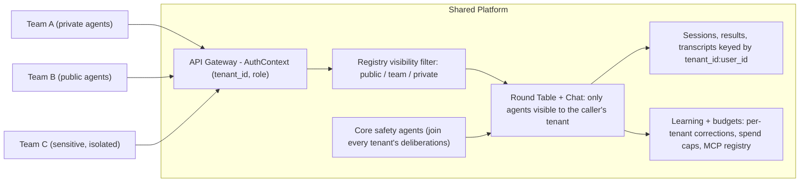

# Platform Deployment Guide

How to deploy this scaffold as a shared AI platform where multiple teams connect their own agents, with tenant isolation, RBAC, and cross-team agent sharing.

---

## Architecture Overview



Every request carries an `AuthContext`; agent visibility, session state, learned corrections, budgets, and MCP servers are all partitioned by `tenant_id`, so Team C's agents and data never appear in Team A's deliberations.

---

## Step 1: Enable Multi-Tenancy

The scaffold ships with `AuthContext` that propagates `tenant_id` to all routes. By default, everything is `"default"`. To enable real multi-tenancy:

### 1a. Replace API key auth with JWT/OIDC

Edit `src/<project>/api/middleware/auth.py`. Replace the API key logic in `verify_api_key` with your identity provider:

```python
async def verify_api_key(
    request: Request,
    credentials: HTTPAuthorizationCredentials | None = Security(security_scheme),
) -> AuthContext:
    # Replace this with your identity provider
    # Example: decode JWT, extract tenant_id and role
    if credentials is None:
        raise HTTPException(status_code=401, detail="Missing credentials")

    payload = decode_jwt(credentials.credentials)  # Your JWT decoder
    context = AuthContext(
        api_key=credentials.credentials,
        user_id=payload["sub"],
        tenant_id=payload["org_id"],      # Maps to tenant isolation
        # Add custom fields as needed:
        # role=payload.get("role", "viewer"),
    )
    # Keep this mirror: activity tracking (and any middleware that runs
    # outside the dependency graph) reads request.state.auth_context to
    # attribute events to the caller's tenant/user.
    request.state.auth_context = context
    return context
```

Every route in the system already receives `AuthContext` -- no other changes needed for tenant identification. Once your IdP integration is live, set `MULTI_TENANT_AUTH_ENABLED=true` in the environment: it is a detection-only declaration that makes the activity middleware log a one-time warning if an authenticated request's event ever resolves to the `"default"` tenant (the signature of a broken `request.state.auth_context` mirror; unauthenticated traffic such as health probes legitimately falls back to `"default"` and never triggers it). It never blocks anything.

> **SECURITY: JWT Verification**
> - Always verify the JWT signature cryptographically against your IdP's public key. Never use decode-only.
> - Validate `iss` (issuer), `aud` (audience), and `exp` (expiry) claims.
> - Reject `alg: none` and weak algorithms. Use `RS256` or `ES256`.
> - Example: `jwt.decode(token, public_key, algorithms=["RS256"], audience="your-app")`
> - Never trust tenant_id from the request body. Always extract it from the verified JWT.

### 1b. Add role to AuthContext

Edit the `AuthContext` dataclass in `auth.py`:

```python
@dataclass
class AuthContext:
    api_key: str | None = None
    user_id: str = "anon"
    tenant_id: str = "default"
    role: str = "viewer"  # Add this: "admin", "member", "viewer"
```

---

## Step 2: Add RBAC (Role-Based Access Control)

Create a permission check dependency. Add to `api/middleware/auth.py`:

```python
from functools import wraps

ROLE_HIERARCHY = {"admin": 3, "member": 2, "viewer": 1}

def require_role(minimum_role: str):
    """FastAPI dependency that enforces a minimum role."""
    def dependency(auth: AuthContext = Depends(verify_api_key)):
        user_level = ROLE_HIERARCHY.get(auth.role, 0)
        required_level = ROLE_HIERARCHY.get(minimum_role, 0)
        if user_level < required_level:
            raise HTTPException(
                status_code=403,
                detail=f"Requires {minimum_role} role (you have {auth.role})",
            )
        return auth
    return dependency
```

Then use it on sensitive routes:

```python
# Anyone can chat
@router.post("/chat")
async def send_message(auth: AuthContext = Depends(verify_api_key)): ...

# Only members can submit round table tasks
@router.post("/round-table/tasks")
async def submit_task(auth: AuthContext = Depends(require_role("member"))): ...

# Only admins can register agents
@router.post("/agents")
async def register_agent(auth: AuthContext = Depends(require_role("admin"))): ...
```

### Recommended route-to-role matrix

Apply `require_role` to every authenticated route, while keeping health probes public. Here's the recommended minimum:

| Route | Method | Minimum Role | Rationale |
|-------|--------|-------------|-----------|
| `/chat` | POST | viewer | Low-risk, read-oriented |
| `/chat/stream` | POST | viewer | Same as chat |
| `/chat/clear` | POST | member | Modifies state |
| `/chat/escalate` | POST | member | Triggers full round table |
| `/round-table/tasks` | POST | member | Expensive (LLM calls) |
| `/round-table/tasks/{id}` | GET | viewer | Read-only |
| `/round-table/search` | GET | viewer | Read-only |
| `/sessions` | POST | member | Creates user state |
| `/sessions` | GET | viewer | Lists accessible sessions |
| `/sessions/{id}` | GET | viewer | Read-only |
| `/sessions/{id}/turns` | POST | member | Appends conversation state |
| `/agents` | GET | viewer | List visible agents |
| `/agents` | POST | admin | Registers new agent |
| `/agents/{id}` | GET | viewer | Read-only |
| `/agents/{id}` | DELETE | admin | Removes agent |
| `/agents/health` | POST | admin | Triggers outbound HTTP |
| `/feedback` | POST | member | Records signals |
| `/feedback` | GET | viewer | Read-only |
| `/feedback/counts` | GET | viewer | Aggregated read-only metrics |
| `/feedback/rates` | GET | viewer | Aggregated read-only metrics |
| `/preferences` | POST | member | Modifies preferences |
| `/preferences` | GET | viewer | Read-only |
| `/preferences/search` | GET | viewer | Read-only semantic search |
| `/profile` | GET | viewer | Read-only preference profile |
| `/checkins` | GET | viewer | Read-only |
| `/checkins/{id}/respond` | POST | member | Approves/rejects |
| `/checkins/{id}/skip` | POST | member | Modifies check-in state |
| `/health` | GET | (public) | K8s probes, no auth |
| `/health/ready` | GET | (public) | K8s probes, no auth |
| `/metrics` | GET | admin | Operational data |
```

---

## Step 3: Register Team Agents with Visibility

When a team registers their agents, set `visibility` and `tenant_id`:

### Local agents (Python, running in the platform)

```python
# In gateway.py or a team-specific startup script
from <project>.agents.registry import AgentEntry

# Team A: private agents (only Team A can use them)
registry.register_local(
    TeamAAnalyst(llm_client=llm_client),
    capabilities=["compliance"],
)
# Manually set visibility after registration
entry = registry.get_entry("team_a_analyst")
entry.visibility = "team"
entry.tenant_id = "team_a"

# Team B: public agents (everyone can use them)
registry.register_local(
    TeamBReviewer(llm_client=llm_client),
    capabilities=["code_review"],
)
# Public by default -- visible to all tenants
```

### Remote agents (any language, running externally)

Teams register their agents via the API:

```bash
# Team C registers a private, sensitive agent
curl -X POST https://platform.example.com/api/v1/agents \
  -H "Authorization: Bearer $TEAM_C_JWT" \
  -H "Content-Type: application/json" \
  -d '{
    "name": "incident_responder",
    "domain": "security incident analysis",
    "base_url": "https://team-c-internal.example.com",
    "capabilities": ["incident_response", "forensics"]
  }'
```

Registration already respects tenant isolation out of the box: the `register_agent` route passes `auth.tenant_id` to `registry.register_remote()`, the registry keys every entry by `(tenant_id, name)` (so two tenants can each own an agent with the same name), and all agents-API operations -- list, get, health, rotate/revoke credentials, suspend/unsuspend, unregister -- resolve only within the caller's tenant. Cross-tenant access returns 404, never 403, so agent existence in other tenants does not leak. In-process dispatch gates (identity verification, capability/scope filtering, last-active tracking) resolve the dispatched agent by object identity, so a same-name agent in another tenant never weakens them. What remains yours: harden the visibility default (see the checklist below).

### Visibility rules

| Visibility | Who can see it | Who can use it in round tables |
|------------|----------------|-------------------------------|
| `public` | All tenants | Any team's chat or round table |
| `team` | Same tenant only | Only the registering team |
| `private` | Registering user only | Only the specific user |

> **SECURITY: Visibility enforcement checklist**
> - `GET /agents` is the tenant's MANAGEMENT view: it lists only agents registered by the caller's tenant (via `registry.list_info(tenant_id=...)`), including suspended ones. Dispatch-time visibility (which agents join a round table, including other tenants' `public` agents) is the separate `registry.list_for_tenant(auth.tenant_id)` filter, already used by the round-table and chat paths.
> - For `private` agents, `list_for_tenant` alone is insufficient -- it filters by tenant but not user. Implement `list_for_user(tenant_id, user_id)` that also checks `entry.user_id == auth.user_id` for private agents.
> - Only platform admins should set `visibility="public"`. Default all new registrations to `"team"`. Reject `visibility="public"` from non-admin callers.
> - Never read `tenant_id` from the request body. Always use `auth.tenant_id` from the verified JWT.
> - Update `_save_remote_agents` and `_load_remote_agents` in `registry.py` to persist `tenant_id` and `visibility` fields. Without this, remote agents revert to `visibility="public"` and `tenant_id="default"` on restart.

---

## Step 4: Isolate Sensitive Teams

For a team like Team C that handles sensitive data (security incidents, legal, HR):

### Data isolation

Chat sessions, harness sessions, round table results, and transcript search are
keyed or filtered by `{tenant_id}:{user_id}`. To complete isolation, map
`auth.tenant_id` to `project_id` when creating feedback, trust, preference, and
check-in trackers.

### Complete data store isolation checklist

| Data Store | Current Isolation | What You Add |
|------------|------------------|--------------|
| Chat sessions (`_orchestrators`) | Keyed by `tenant_id:user_id:session_id` | **Already isolated** |
| Harness sessions (`_sessions`) | Keyed by `tenant_id:user_id:session_id` | **Already isolated** |
| Round table result cache | Keyed by `tenant_id:user_id:task_id` | **Already isolated** |
| Transcript search index | Stores and filters by `tenant_id:user_id` owner key | **Already isolated** |
| Feedback signals (SQLite) | Has `project_id` column | Map `auth.tenant_id` to `project_id` |
| Agent trust scores (SQLite) | Has `project_id` column | Map `auth.tenant_id` to `project_id` |
| User preferences (SQLite) | Has `project_id` column | Map `auth.tenant_id` to `project_id` |
| Check-ins (SQLite) | Has `project_id` column | Map `auth.tenant_id` to `project_id` |
| Vector search | Project-scoped embeddings | Prefer pgvector with Postgres for shared production platforms; include `tenant_id` in filters/index keys |
| Agent registry | Has `tenant_id` + `visibility` fields | Use `list_for_tenant()` everywhere |
| LLM usage tracking | Global accumulator | Aggregate by `auth.tenant_id` for billing |

> **SECURITY:** Prefer tenant-scoped queries over post-query filtering. Post-query filtering (e.g., fetching all transcripts then removing other tenants') can leak data through timing side channels, error messages, or log entries. Where possible, pass `tenant_id` into the query itself.

### Agent isolation

Set `visibility="private"` or `"team"` on all of Team C's agents. Round-table agent selection is already tenant-scoped: `submit_task` only considers agents visible to the caller's tenant (`registry.list_for_tenant(auth.tenant_id)`), and cross-tenant `agent_ids` return the same 400 as missing agents, so existence does not leak. Chat routing applies the same visibility filter.

### LLM isolation (optional)

If Team C needs separate LLM credentials (different API key, different model):

```python
# Per-tenant LLM client
tenant_llm_clients = {
    "team_c": create_client(api_key=os.environ["TEAM_C_API_KEY"]),
    "default": create_client(),
}
llm = tenant_llm_clients.get(auth.tenant_id, tenant_llm_clients["default"])
```

---

## Step 5: Connect External Team Agents Safely

When a new department wants to connect their agent to the platform:

### What they need to implement

Three HTTP endpoints (any language):

```
POST /analyze   -- Returns AgentAnalysis JSON
POST /challenge -- Returns AgentChallenge JSON
POST /vote      -- Returns AgentVote JSON
```

See [AGENT_PROTOCOL.md](AGENT_PROTOCOL.md) for the full HTTP contract with JSON schemas and examples.

### What the platform does automatically

- **SSRF protection**: The agent's `base_url` is validated at registration (no private IPs, no cloud metadata endpoints). Note: DNS can change between validation and request time (TOCTOU). For high-assurance deployments, validate IPs at connection time or use an IP allowlist.
- **Response sanitization**: All agent responses are sanitized for prompt injection and size-limited (5MB body, 50K per field)
- **Evidence enforcement**: The enforcement pipeline validates the agent's analysis before it enters the challenge phase
- **Rate limiting**: Per-IP rate limits on all endpoints (per-tenant when you add tenant-based keying)

Agent calls are synchronous: the orchestrator dispatches `/analyze`,
`/challenge`, and `/vote` over HTTP and waits (with timeout and retries)
for each response. There is no async callback path -- an earlier webhook
receiver was removed because nothing ever consumed its results; if your
agents need long-running work, poll or queue inside your agent behind
the synchronous endpoint contract.

### Onboarding checklist for a new team

1. Team gets a JWT/API key with their `tenant_id` and `role` from your identity provider
2. Team builds their agent (any language) implementing the 3-endpoint protocol
3. Team registers via `POST /api/v1/agents` with their credentials
4. Platform admin sets visibility (`public` if shared, `team` if private)
5. Team's agent now participates in their round tables and chat sessions
6. Core safety agents (Skeptic, Quality, Evidence, FactChecker, Citation, Sentinel) automatically participate alongside the team's agents

---

## Agent Integrity

Once multiple teams connect agents, the agents themselves become an attack surface. The platform ships with a set of integrity controls, each mapped to a concrete threat:

| Threat | Control |
|--------|---------|
| Agent impersonation (a rogue process claims to be a registered agent) | JWT identity tokens, verified at every dispatch |
| Agent spam (one agent floods deliberations, burning LLM budget) | Per-agent rate limits (default 100 calls/hour) |
| Data exfiltration via scope creep (an agent reads context it has no business seeing) | Scope filtering on input + output source audit |
| Compromised or misbehaving agent needing emergency removal | Suspension + credential revocation |
| Forgotten agents (registered once, never cleaned up, still credentialed) | Dormancy flagging after inactivity |
| Degraded deliberations (so few agents respond the result is not trustworthy) | `min_quorum` on round table results |

### Identity tokens

Every registered agent gets a platform-issued JWT (HS256) binding its name, tenant, scopes, and meta-agent flag. Orchestrators verify the token before every dispatch:

- Local agents without tokens are allowed (backward compatible).
- Remote agents without tokens are **blocked** until credentials are rotated.
- Suspended agents and agents with invalid/expired tokens are always blocked.

Only the SHA-256 hash of a token is ever persisted -- the raw token is shown exactly once at issuance. After a restart, reloaded remote agents have no raw token in memory and must rotate before they dispatch again.

Configure via environment:

```bash
# Required in production (64+ char hex). Generate one:
#   python -c "import secrets; print(secrets.token_hex(32))"
AGENT_IDENTITY_SIGNING_KEY=<64+ char hex>

# Kill switch (dev only). Skips signature checks but STILL enforces
# token expiry. Ignored in production.
AGENT_IDENTITY_ENABLED=true

# Days without dispatch before an agent is flagged dormant (default 30)
AGENT_DORMANT_AFTER_DAYS=30
```

In development, an ephemeral signing key is generated per process, so tokens do not survive restarts -- fine for local work, wrong for production.

The token layer is also an extension point: `issue_token` / `verify_token` / `hash_token` in `agents/identity.py` are the entire boundary between the registry and the JWT implementation. To integrate an external workload-identity provider or token authority (a corporate STS, a service-mesh identity system, a secrets platform that issues short-lived credentials), replace those three functions -- callers, dispatch gates, and the credential API keep working without interface changes.

### Credential lifecycle endpoints

```bash
# Re-issue an agent's token. The raw token is returned ONCE -- store it securely.
curl -X POST https://platform.example.com/api/v1/agents/incident_responder/credentials/rotate \
  -H "Authorization: Bearer $ADMIN_JWT"

# Revoke credentials. Remote agents are blocked at dispatch until rotated.
curl -X DELETE https://platform.example.com/api/v1/agents/incident_responder/credentials \
  -H "Authorization: Bearer $ADMIN_JWT"

# Emergency removal from all deliberations and tenant listings (reversible)
curl -X POST https://platform.example.com/api/v1/agents/incident_responder/suspend \
  -H "Authorization: Bearer $ADMIN_JWT"
curl -X POST https://platform.example.com/api/v1/agents/incident_responder/unsuspend \
  -H "Authorization: Bearer $ADMIN_JWT"
```

`GET /api/v1/agents` reports `suspended`, `credential_status` (`active`/`none`), `last_active`, and `dormant` per agent, so an audit of stale or de-credentialed agents is one API call. Restrict rotate/revoke/suspend to admins in your `require_role` matrix.

### Scopes and rate limits

Registration accepts `access_scopes`, `max_calls_per_hour`, and `is_meta_agent`. Scopes name the task-context keys the agent may read; before dispatch the context is filtered down to those keys, and after dispatch any finding citing a data source outside the agent's scopes is logged as a violation. An empty scope list means unrestricted (the zero-config default). Meta-agents additionally always receive `peer_analyses`.

```bash
curl -X POST https://platform.example.com/api/v1/agents \
  -H "Authorization: Bearer $TEAM_JWT" \
  -H "Content-Type: application/json" \
  -d '{
    "name": "finance_analyst",
    "domain": "financial analysis",
    "base_url": "https://finance-team.example.com",
    "access_scopes": ["financial", "budgets"],
    "max_calls_per_hour": 50
  }'
```

### Quorum degradation

A round table where most agents were skipped (suspended, rate limited, bad credentials) or crashed can quietly produce a one-agent "consensus". `RoundTableConfig.min_quorum` (default 2) guards this: when at least one agent failed or was gated AND fewer successful domain-agent analyses than `min_quorum` remain, the result is marked `degraded=True` with `failed_agent_count` set. Surface this flag to users -- a degraded deliberation is a signal to retry, not a verdict.

---

## Agentic Governance

Agent integrity controls govern individual agents; agentic governance governs the deliberations themselves -- how much autonomy a deployment grants, what each tenant may spend, and what trace a run leaves behind. Four controls compose:

1. **Graduated autonomy** (`orchestration/autonomy.py`): trust levels 1 (most trusted) through 6 (most restricted) map to an `AutonomyPolicy` -- approval gate, specialist cap, rate-limit multiplier, and conflict auto-escalation. Set `RoundTableConfig.autonomy_level` or pass `autonomy_level=` to the chat orchestrator, which caps consulted specialists and auto-escalates to a full round table on specialist conflict per policy. Unknown or invalid levels always resolve to the most restrictive policy (fail-safe).
2. **Per-tenant budgets** (`llm/budget_manager.py`): each tenant gets a spend cap with a warn threshold. The LLM client checks the budget *before* every provider call and raises `BudgetExceededError` for exhausted tenants; spend is recorded after each call and persists in the learning store's `budget_spend` table. A budget of 0 means unlimited.
3. **Deliberation audit trail** (`orchestration/deliberation_audit.py`): metadata-only events (phases, agent counts, durations, outcomes) keyed by correlation id in the `audit_events` table. Detail values are structurally restricted to numbers, booleans, and short labels, so the trail cannot leak prompt or response content.
4. **Check-ins** (`learning/checkin_manager.py`): when the resolved policy requires human approval, the round table marks its result `requires_approval=True` and opens a check-in a human must answer before the recommendation is acted on.

Composed, the flow is: a request enters at some autonomy level, the policy caps how many agents deliberate, the budget gate bounds what the deliberation may cost, the auditor records that it happened, and restricted levels end in a human approval gate rather than autonomous action.

### Configuration

```bash
# Tune individual policy fields per level (partial JSON overrides; malformed
# or invalid values are logged and ignored -- defaults win):
AUTONOMY_POLICIES='{"2": {"max_specialists": 3}, "4": {"rate_limit_multiplier": 1.0}}'
```

The gateway wires a learning-store-backed `BudgetManager` and `DeliberationAuditor` at startup (non-fatal when the store is unavailable) and attaches the budget manager to the LLM client.

### API routes

| Route | Method | Purpose |
|-------|--------|---------|
| `/api/v1/budgets/{tenant_id}` | GET | Budget config, current spend, and status for a tenant |
| `/api/v1/budgets/{tenant_id}` | PUT | Set or replace a tenant's spend cap and warn threshold |
| `/api/v1/audit/deliberations/{correlation_id}` | GET | Metadata timeline for one deliberation run (404 when empty) |

See `docs/GOVERNANCE.md` in your generated project for the full capability matrix, the honest "known limitations / non-claims" list, and extension points.

---

## Scaling the Learning Layer

The extended learning tables (corrections, activity events, agent dispatch stats, integrity flags) sit behind a deliberately tiny `LearningStore` protocol in `learning/store.py` -- five methods (`ensure_schema` / `insert` / `query` / `update` / `count`) with allowlist-validated identifiers and parameterized values. Two reference backends ship with the scaffold:

- **SQLite (default)** -- stdlib `sqlite3`, zero configuration, right for single-node deployments.
- **Postgres (opt-in)** -- answer `learning_backend=postgres` at generation time, or set `LEARNING_BACKEND=postgres` plus `LEARNING_POSTGRES_DSN` at runtime, and install the extra: `pip install '.[postgres]'`.

Because every caller goes through the protocol, enterprise deployments extend without touching callers:

- **Row-level security**: every table carries `tenant_id`, so Postgres RLS policies keyed on it give hard tenant isolation. See the [Postgres RLS appendix](#appendix-postgres-row-level-security-rls-for-the-learning-tables) for copy-paste policies, the honest limits on the shipped autocommit store, and a policy-coverage CI check.
- **pgvector**: co-locate the vector store with the learning tables in the same Postgres instance.
- **Alembic migrations**: the built-in forward-only `MIGRATIONS` list is fine for a handful of schema changes; swap in Alembic when schema churn justifies it.
- **Bring your own store**: implement the five methods against anything (MySQL, DynamoDB, an internal storage service).

### Learning integrity

The learning layer reshapes agent behavior, so it gets its own integrity controls. All findings are persisted as integrity flags and surfaced through `GET /api/v1/activity/anomalies` (resolve via `POST /api/v1/activity/anomalies/{flag_id}/resolve`) -- nothing is auto-rejected or auto-suspended; a human closes every flag:

- **Corrections lifecycle**: corrections only influence prompts after human approval, with an explicit four-eyes posture (`CORRECTIONS_FOUR_EYES`: `strict` rejects approver == proposer; `warn`, the default, allows it but logs loudly and records a `four_eyes_unenforceable` integrity flag once -- under a single shared API key strict mode would make approval impossible) and a check-in opened per proposal.
- **Context budget**: approved corrections render into prompts under a character budget (`CORRECTION_CONTEXT_BUDGET`, default 4000) with sanitized fields.
- **Override screening**: each proposed correction is screened for prompt injection, safety-agent targeting ("ignore the skeptic"), and evidence-level inflation before it reaches a reviewer.
- **Collusion detection** (shipped, you wire): pairwise vote-lockstep and reciprocal never-challenge analysis flags agent pairs that stop checking each other. The detector is implemented and tested, but the default runtime does not record votes into it -- call `CollusionDetector.record_votes` from your post-deliberation hook to activate it.
- **Correction drift** (shipped, you wire): a rising share of "softening" language in recent approved corrections flags a possible slow-poisoning campaign. `analyze_correction_drift` is a tested library function the default runtime does not schedule -- run it from a periodic job or post-approval hook.
- **User activity anomalies**: per-user request bursts, repeated auth failures, and agent-registration sprees trip configurable thresholds (`ACTIVITY_TRACKING_ENABLED` to opt out).
- **Agent behavioral baselines** (shipped, you wire): each agent's refusal rate, confidence, latency, and scope discipline are compared against its own history -- an agent with valid credentials that stops behaving like itself still gets flagged. Dispatch accepts an optional `baseline_tracker`; the default runtime does not pass one, so deviation checks run only once you wire a tracker in.

---

## Compliance Considerations for Regulated Industries

If your platform operates in a regulated industry (finance, healthcare, legal, government), AI interactions may be subject to legal discovery, audit, or regulatory review. Consider adding:

### Discoverability awareness

Users interacting with AI agents should be informed that their prompts, agent responses, and round table deliberations may be discoverable in litigation or regulatory proceedings. Common approaches:

- **Chat banner**: Persistent, non-dismissable notice above the chat input (e.g., *"All prompts and AI outputs are potentially discoverable in litigation or regulatory proceedings."*)
- **Round table notice**: Same banner above the round table task submission
- **API response header**: `X-AI-Discoverability-Notice` header on all AI-generated responses
- **Export disclaimer**: Discoverability paragraph appended to any exported reports or artifacts

### Audit trail

The scaffold already writes round table artifacts as JSON and indexes transcripts for search. For regulated deployments, consider adding:

- **Prompt/response hash logging**: SHA-256 hash of every prompt and response stored in a tamper-evident audit database, separate from the application database
- **Immutable storage**: Write artifacts to append-only storage (S3 with object lock, immutable database tables)
- **Timestamp attestation**: Cryptographic timestamps on artifacts for non-repudiation

### Legal hold

When litigation or regulatory investigation is anticipated, log deletion must stop. Consider:

- **Legal hold flag**: Environment variable or config that disables all log cleanup, cache eviction, and data retention policies when active
- **Hold notification**: Log a warning on startup when legal hold is active so operators are aware

### Data retention

Define retention policies for each data store and document them for your legal/compliance team:

| Data Store | Default Retention | Regulatory Consideration |
|------------|------------------|--------------------------|
| Chat sessions | In-memory (lost on restart) | May need persistent storage for compliance |
| Round table artifacts | Filesystem (permanent) | Define retention period with legal team |
| Transcript search index | Vector store / pgvector (permanent if enabled) | Subject to discovery; include in hold policy |
| Feedback signals | SQLite (permanent) | May contain PII; subject to GDPR/CCPA |
| Agent trust scores | SQLite (permanent) | Audit trail for routing decisions |

> **Note:** These are considerations for your legal and compliance team to evaluate. The scaffold provides the infrastructure hooks -- your organization defines the policies.

---

## Summary: What's Built vs What You Add

| Capability | Status | Notes |
|------------|--------|-------|
| AuthContext with tenant_id | **Built** | Propagates across API routes |
| Agent visibility (public/team/private) | **Built** | `list_for_tenant()` filters public/team; per-user `private` filtering is the documented `list_for_user` extension above |
| Session isolation | **Built** | `{tenant_id}:{user_id}:{session_id}` |
| Core safety agents | **Built** | Auto-included in every round table; evidence/skeptic/sentinel overlay joins every chat consultation |
| Evidence enforcement | **Built** | Runs on Phase 1 round-table analyses; extend validators for challenge and vote paths as needed |
| Chat synthesis enforcement | **Built** | FactChecker checks every chat synthesis, with one corrective re-synthesis on rejection |
| Tenant-aware chat routing | **Built** | Routing and LLM agent suggestions are validated against the tenant-visible agent set |
| Tenant-aware round-table dispatch | **Built** | `submit_task` selects only tenant-visible agents; cross-tenant `agent_ids` read as not found |
| Agent integrity (identity tokens, rate limits, scopes, suspension, quorum) | **Built** | Set `AGENT_IDENTITY_SIGNING_KEY` in production; rotate/revoke/suspend via API |
| Learning persistence (SQLite default, Postgres opt-in) | **Built** | `LearningStore` protocol -- bring your own backend via 5 methods |
| Learning integrity (corrections four-eyes, override screening, activity thresholds) | **Built** | Findings surface at `GET /api/v1/activity/anomalies`; humans resolve |
| Collusion / correction-drift / behavioral-baseline / sequence detectors | **Shipped, you wire** | Tested libraries the default runtime does not invoke; wire into post-deliberation, periodic, or activity hooks (see Learning integrity above) |
| Agentic governance (graduated autonomy, per-tenant budgets, audit trail, content policy, PII redaction) | **Built** | Tune levels via `AUTONOMY_POLICIES`; budgets/audit at `/api/v1/budgets` and `/api/v1/audit/deliberations` |
| SIEM export, tamper-proof audit storage | **You add** | Poll `audit_events` by `created_at`; ship to append-only storage |
| JWT/OIDC auth | **You add** | Replace `verify_api_key` (~20 lines) |
| RBAC role checks | **You add** | `require_role()` dependency (~15 lines) |
| Per-tenant data scoping | **Partially built** | Request caches/search are scoped; map learning DB `project_id` to `auth.tenant_id` |
| Per-tenant LLM clients | **You add** | Optional, for credential isolation |
| Agent marketplace UI | **You add** | `list_for_tenant()` provides the data |

---

## Appendix: Postgres Row-Level Security (RLS) for the Learning Tables

This appendix is optional and only relevant when you run the learning store on
Postgres (`learning_backend=postgres` at generation time, or `LEARNING_BACKEND=postgres`
plus `LEARNING_POSTGRES_DSN` at runtime; both need the `[postgres]` extra:
`pip install '.[postgres]'`). It gives you copy-paste RLS policies for every
learning table that carries `tenant_id`, plus an honest account of what those
policies do and do not enforce for the shipped store.

### Read this first: RLS is a no-op on the shipped store's app path

The shipped `PostgresLearningStore` (`learning/store.py`) opens **one shared
`psycopg` connection with `autocommit=True`** and reuses it for every insert,
query, update, and delete. RLS policies below key on a per-session GUC
(`app.tenant_id`) that you would set with `SET LOCAL` inside a transaction --
but `SET LOCAL` only lasts for the current transaction, and under autocommit
there is no surrounding transaction to scope it to. **On the shipped store,
`SET LOCAL app.tenant_id = ...` is therefore a no-op**, and the policies below
would either block every row (GUC never set) or, if you set it with a plain
`SET` on the shared connection, leak the value across concurrent tenants. Do
not rely on RLS for app-path tenant isolation until you make the store changes
in the last subsection.

So why ship the policies at all? Because RLS is real **defense-in-depth for the
paths that do not go through the app connection**:

- **Direct SQL access** (a `psql` session, a migration tool, an admin script)
  that connects as a non-superuser role gets tenant-scoped automatically.
- **BI / analytics tools** (Metabase, Superset, a read replica for dashboards)
  that connect with a per-tenant role cannot read across tenants even if a
  query forgets a `WHERE tenant_id = ...`.
- **Bring-your-own backend**: if you replace the store with one that uses a
  connection or transaction per request (the recommended shape), the same
  policies become live enforcement for the app path too.

RLS is the backstop that survives an application bug that forgets a tenant
filter. The application-level scoping (`tenant_id` on every row, equality
filters in the store) is the primary control; RLS is the seatbelt.

### The tables that carry `tenant_id`

All eight extended learning tables (single source of truth: `learning/tables.py`)
carry a `tenant_id` column and are candidates for RLS:

| Table | Purpose |
|-------|---------|
| `corrections` | Reviewed knowledge that grounds resolution tiers |
| `activity_events` | Per-request activity log (extraction/timing signals) |
| `agent_dispatch_stats` | Per-agent dispatch metrics |
| `integrity_flags` | Behavioral/integrity findings for human review |
| `audit_events` | Metadata-only deliberation audit trail |
| `budget_spend` | Per-tenant LLM cost ledger |
| `reflections` | Deterministic post-deliberation lessons |
| `error_schemas` | Generalized corrections (compacted knowledge) |

(The `schema_version` bookkeeping table has no `tenant_id` and is intentionally
excluded. There is no `checkins` table in the learning store -- check-ins live in
`learning/checkin_manager.py`, not in `tables.py`.)

### Copy-paste policies

Run this once, connected as the table owner, after the store has created the
schema. Each table gets RLS enabled *and forced* (so even the table owner is
subject to policy, unless they `BYPASSRLS`), plus one policy scoping every row
to the session's `app.tenant_id`. `current_setting('app.tenant_id', true)`
returns `NULL` when the GUC is unset (the `true` = `missing_ok`), so an
unscoped connection sees no rows rather than erroring.

```sql
-- Run as the table owner. Assumes the app connects as a NON-superuser,
-- NON-BYPASSRLS role (create one: CREATE ROLE app_rw LOGIN PASSWORD '...';).
DO $$
DECLARE
    t text;
    tenant_tables text[] := ARRAY[
        'corrections', 'activity_events', 'agent_dispatch_stats',
        'integrity_flags', 'audit_events', 'budget_spend',
        'reflections', 'error_schemas'
    ];
BEGIN
    FOREACH t IN ARRAY tenant_tables LOOP
        EXECUTE format('ALTER TABLE %I ENABLE ROW LEVEL SECURITY', t);
        EXECUTE format('ALTER TABLE %I FORCE ROW LEVEL SECURITY', t);
        EXECUTE format('DROP POLICY IF EXISTS tenant_isolation ON %I', t);
        EXECUTE format(
            'CREATE POLICY tenant_isolation ON %I '
            'USING (tenant_id = current_setting(''app.tenant_id'', true)) '
            'WITH CHECK (tenant_id = current_setting(''app.tenant_id'', true))',
            t
        );
    END LOOP;
END $$;
```

The `USING` clause filters reads (and the rows an `UPDATE`/`DELETE` can touch);
the `WITH CHECK` clause rejects `INSERT`/`UPDATE` rows whose `tenant_id` does not
match the session GUC, so a compromised app path cannot write cross-tenant rows
either. Grant the app role the usual `SELECT, INSERT, UPDATE, DELETE` on these
tables; RLS narrows what those grants can reach.

If you prefer explicit per-table statements over the loop, the pattern for one
table is:

```sql
ALTER TABLE corrections ENABLE ROW LEVEL SECURITY;
ALTER TABLE corrections FORCE ROW LEVEL SECURITY;
CREATE POLICY tenant_isolation ON corrections
    USING (tenant_id = current_setting('app.tenant_id', true))
    WITH CHECK (tenant_id = current_setting('app.tenant_id', true));
```

### What you must change in the store for app-path enforcement

To make these policies enforce on the application path, the store must set
`app.tenant_id` in the **same transaction** as each operation, which means
abandoning the single shared autocommit connection in favor of per-operation
transaction scoping. This is a *you-add* extension, not shipped behavior. The
smallest honest change is a store wrapper that, for every call, opens a
transaction, sets the GUC, runs the operation, and commits. Note that
`SET LOCAL` cannot take bind parameters in psycopg3; the parameterizable
equivalent is `SELECT set_config('app.tenant_id', %s, true)` -- the trailing
`true` makes it transaction-local, exactly like `SET LOCAL`:

```python
# YOU ADD -- an extension, not shipped. Requires a per-operation (or
# per-request) transaction so the transaction-local GUC is scoped
# correctly. Pass the tenant explicitly rather than reading it from
# a global.
import psycopg
from psycopg.rows import dict_row


class RlsScopedPostgresStore:
    """Sketch: sets app.tenant_id inside each transaction so RLS enforces.

    Trade-off vs the shipped store: a transaction (and, ideally, a pooled
    connection) per operation instead of one shared autocommit connection.
    Use a real pool (psycopg_pool) in production.
    """

    def __init__(self, dsn: str):
        self._dsn = dsn

    def query(self, tenant_id: str, table: str, filters: dict) -> list[dict]:
        # Build SQL via the SAME allowlist-validated helpers the shipped
        # store uses (_select_sql); never interpolate identifiers by hand.
        from myproject.learning.store import _select_sql  # your project slug

        sql, values = _select_sql(table, filters, "", 0, "%s")
        with psycopg.connect(self._dsn, row_factory=dict_row) as conn:
            with conn.transaction():  # set_config(..., true) is scoped to this
                conn.execute(
                    "SELECT set_config('app.tenant_id', %s, true)", (tenant_id,)
                )
                return [dict(r) for r in conn.execute(sql, values).fetchall()]
```

Wire `auth.tenant_id` (from the verified JWT -- never from the request body)
through to the `tenant_id` argument on every call. The same pattern applies to
`insert`/`update`/`count`/`delete`. Once every app operation runs inside a
GUC-scoped transaction, the RLS policies above become live enforcement instead
of a dormant backstop.

### Optional: a pre-commit / CI check that policies exist

If your team adopts RLS, this short script fails when any table with a
`tenant_id` column is missing an RLS policy -- a cheap guard against adding a
new tenant table and forgetting to protect it. It is a **recipe, not a shipped
file**: drop it into your own `scripts/` and wire it into pre-commit or CI.

```python
#!/usr/bin/env python3
"""Fail if any tenant_id table lacks an RLS policy. Recipe -- you add this."""
import os
import sys

import psycopg  # from the [postgres] extra

dsn = os.environ["LEARNING_POSTGRES_DSN"]
with psycopg.connect(dsn) as conn:
    # Tables in the public schema that carry a tenant_id column.
    tenant_tables = {
        r[0]
        for r in conn.execute(
            "SELECT table_name FROM information_schema.columns "
            "WHERE table_schema = 'public' AND column_name = 'tenant_id'"
        ).fetchall()
    }
    # Tables that have at least one RLS policy.
    protected = {
        r[0]
        for r in conn.execute(
            "SELECT tablename FROM pg_policies WHERE schemaname = 'public'"
        ).fetchall()
    }

unprotected = sorted(tenant_tables - protected)
if unprotected:
    print("RLS MISSING on tenant tables: " + ", ".join(unprotected))
    sys.exit(1)
print(f"RLS present on all {len(tenant_tables)} tenant tables.")
```

This checks that a policy *exists*; it does not verify the policy is correct.
Pair it with an integration test that connects as a per-tenant role and asserts
cross-tenant reads return nothing.
