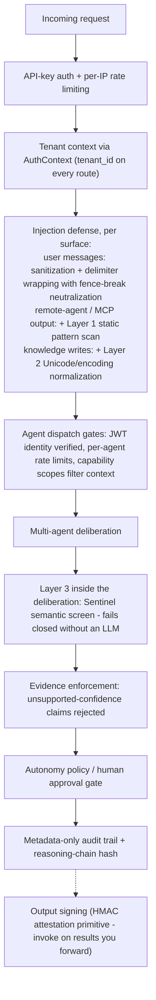
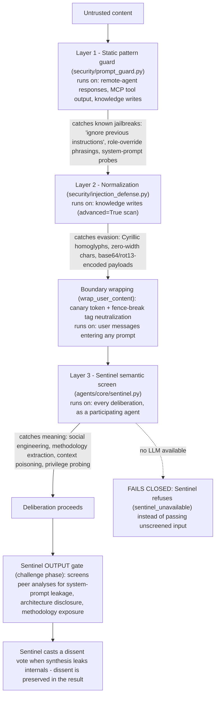
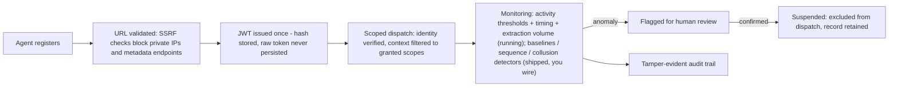

# Security Model

How the scaffold thinks about threats, where the controls live, and what is honestly out of scope. For vulnerability reporting, see [SECURITY.md](../SECURITY.md).

The single source of truth for the control-by-control capability matrix (implementation files and the tests that prove each control) and the stated non-claims is the generated project's own governance document: [GOVERNANCE.md](../template/%7B%7Bproject_slug%7D%7D/docs/GOVERNANCE.md). It ships inside every generated project, so the people operating the system always have it next to the code. This page is the map; that document is the territory.

---

## Defense in Depth: One Request's Journey

Every control below is implemented and tested in the generated project. The diagram shows where each control sits relative to one request. Three honest notes on wiring: injection defense is applied per surface rather than as one ingress filter, and coverage differs by surface -- user messages get sanitization plus boundary wrapping (no pattern scan at runtime), remote-agent responses and MCP tool output get the Layer 1 pattern scan without Layer 2 decoding, and knowledge writes get the full Layer 1+2 scan (the per-surface breakdown is a stated Non-Claim in the generated GOVERNANCE.md). Output signing is a primitive you invoke on results you emit downstream, not an automatic step.

No single layer is trusted to be perfect; each assumes the one before it can be bypassed.

## Prompt Injection: The Three Layers, and Where Sentinel Sits

Zooming into the injection-defense portion of that path -- each layer catches what the previous one cannot, and the Sentinel agent guards both directions:

Layers 1 and 2 are deterministic (regex + Unicode analysis, no LLM, free); the [README shows them catching real payloads](../README.md#see-it-run). Not every surface passes through every layer at runtime -- the diagram annotates where each layer actually runs today: user messages are sanitized and boundary-wrapped but not pattern-scanned; remote-agent and MCP content is pattern-scanned without the Layer 2 decoding pass; knowledge writes get the full scan. Layer 3 is the only layer that understands intent, which is why it is an agent inside the deliberation rather than a filter in front of it: Sentinel screens the input as its Phase 1 analysis, screens the other agents' outputs for leaks as its Phase 2 challenge, and casts a dissent vote at synthesis that is preserved in the result rather than silenced. The adversarial harness attacks the deterministic layers and the dispatch/scope gates in CI; it runs with core agents disabled, so Layer 3's behavior is covered by unit tests rather than adversarial pressure.

## Trust Boundaries

Generated projects treat the following as **untrusted** at all times:

| Boundary | Attack surface | Primary controls |
|----------|----------------|------------------|
| User input (chat, tasks, API bodies) | Prompt injection, encoding attacks, oversized payloads | Sanitization + boundary wrapping with fence-break neutralization at every prompt-composition site, semantic Sentinel screening (Layer 3) inside the deliberation, input size limits, input validation on every mutating route. The Layer 1 pattern scan does not run on user messages at runtime (stated Non-Claim) |
| Remote agent registration | SSRF, private-IP and metadata-endpoint access, credential exfiltration | URL validation (scheme, private ranges, cloud metadata IPs), API keys resolved from environment only, identity token hashes only on disk |
| Remote agent responses | Injection via analysis/challenge/vote fields, oversized responses | Response sanitization + Layer 1 pattern scan (without Layer 2 decoding), size limits, adversarial harness coverage |
| MCP tool output | Injection via tool results | Sanitization + Layer 1 pattern scan (without Layer 2 decoding) + `MCP_DATA` boundary wrapping, per-tenant registry, `mcp:` scope gating, non-fatal failure handling |
| Persisted state (registry, learning store) | Tampering with visibility/tenant metadata, poisoned corrections | Validation on load (invalid entries skipped, never widened), four-eyes correction approval, content policy screening, override and contradiction detectors (collusion/drift detectors ship as libraries you wire) |
| The agents themselves | Misbehaving or compromised agents | Per-agent JWT identity verified at dispatch, per-agent rate limits, scope-filtered task context, suspension lifecycle (behavioral baselines and lockstep detection ship as libraries you wire) |

## The Agents Are Inside the Perimeter

The last row of that table deserves its own section, because it is the scaffold's least common design decision. Most agent frameworks treat agents as trusted extensions of the application. This scaffold treats them as insiders, the way a mature security program treats people with badges: authenticated, least-privileged, behaviorally monitored, and removable -- because an agent holds credentials, touches data, and acts at machine speed, and any of them can be compromised through the content they read.

| Control | What it does | Where it lives |
|---------|--------------|----------------|
| Identity | Per-agent JWT verified at dispatch; tokens are SHA-256 hashed and only the hash is persisted -- the raw token is issued once and held in memory, and a reloaded agent must rotate credentials before it passes verification | `agents/identity.py`, `agents/registry_persistence.py` |
| Least privilege | Capability scopes filter what each agent sees; out-of-scope findings are flagged | `agents/capability.py`, `orchestration/scope_filter.py` |
| Behavioral baselines | Refusal rate, confidence, latency, and scope discipline compared against each agent's own history -- valid credentials with anomalous behavior still get flagged. Shipped as a tested detector library; the default runtime does not invoke it -- you wire it into dispatch (stated Non-Claim) | `learning/activity.py` |
| Multi-step patterns | Sequences of individually-benign actions that add up to extraction are detected across a window. Shipped as a tested detector library; not wired into the default runtime (stated Non-Claim) | `harness/sequence_detector.py` |
| Timing regularity | Machine-like request cadence (suspiciously low variation in inter-request intervals) is flagged -- valid credentials driven by a script on a timer still surface | `learning/timing_analysis.py` |
| Extraction volume | Successful knowledge-endpoint reads (corrections and reflections listings; failed requests such as 401s and guard 429s never count) are counted per user and tenant-wide over a rolling window; elevated/capped volume is flagged on either listing, with an opt-in 429 on the corrections listing as the only enforcement | `learning/extraction_guard.py` |
| Approval-pair dominance | Directed proposer->approver pairs that dominate correction approvals -- four-eyes satisfied, but always by the same two accounts -- are flagged with escalating severity | `learning/approval_patterns.py` |
| Collusion | Lockstep agreement between agents that should be independent is flagged (e.g. two agents defeating four-eyes review). Shipped as a tested detector library; nothing records votes into it at runtime yet (stated Non-Claim) | `learning/collusion.py` |
| Containment | Suspension removes an agent from dispatch and listings without deleting its record | `agents/registry.py` |
| Accountability | Reasoning-chain hashes make after-the-fact edits detectable; corrections that shape future behavior need two humans | `security/reasoning_chain_hash.py`, `learning/corrections.py` |

The lifecycle, end to end:

## Posture Decisions

- **Fail closed.** When a control cannot run -- Sentinel has no LLM, persisted metadata fails validation, an identity token is missing -- the system dissents, skips, or blocks. It never silently passes.
- **Secrets never persist in the clear.** Raw identity tokens live in memory only; disk gets SHA-256 hashes. Agent API keys come from environment variables, never from persistence files.
- **Audit without content.** The deliberation audit trail is structurally metadata-only (phases, counts, durations, outcomes) so prompt and response content cannot leak through it. Each run stores a reasoning-chain hash making after-the-fact edits detectable.
- **Human gates on state that shapes behavior.** Corrections require four-eyes approval; integrity findings are flagged for human review, never auto-actioned; restricted autonomy levels force check-ins before results are acted on.

## What Is Out of Scope (Non-Claims)

Stating what a control does *not* do is part of the control. The authoritative list lives in [GOVERNANCE.md -- Known Limitations / Non-Claims](../template/%7B%7Bproject_slug%7D%7D/docs/GOVERNANCE.md#known-limitations--non-claims). Highlights:

- Several shipped detectors (behavioral baselines, collusion, correction drift, sequence monitoring, response-side canary checking, model routing) are tested libraries the default runtime does not invoke -- they detect nothing until you wire them.
- Layer 1-2 injection scanning coverage varies by surface: user messages are wrapped but not pattern-scanned; remote/MCP content is scanned without Layer 2 decoding.
- Heuristic classifiers (content policy, override detection) are regex/keyword based -- they reduce risk, they do not eliminate it.
- The audit trail is tamper-evident within a run, not tamper-proof; output signing is symmetric HMAC, not third-party non-repudiation.
- PII redaction is a harm-reduction layer, not a GDPR/CCPA compliance guarantee.
- Erasure removes live rows, not backups or downstream exports.
- Single-node assumptions apply unless persistence is shared and per-instance configuration is disciplined.

## Verification

The scaffold validates its own security posture on every change:

- **Adversarial harness**: six deterministic hostile agents (no LLM, zero cost) attack a full round table with injection payloads in every field; CI asserts the deterministic defenses and dispatch/scope gates contain them (core agents are disabled in these runs, so the Sentinel semantic layer is exercised by unit tests, not by this harness).
- **Red-team scans, Bandit, and AI security checks** run in the 18-check validation pipeline against every generated configuration.
- **700 generated tests** (85% coverage) include dedicated suites for injection defense, agent identity, tamper evidence, governance, the corrections lifecycle, extraction defense (timing regularity, knowledge-read volume, approval-pair escalation), and governance reporting.

The process has caught real issues before release -- for example, a tenant-isolation bug where remote agents reverted to public visibility on restart ([fix](https://github.com/KangaKode/roundtable/commit/9168334ac050e22022ab2787b7b3ff3ce06796cc)).
