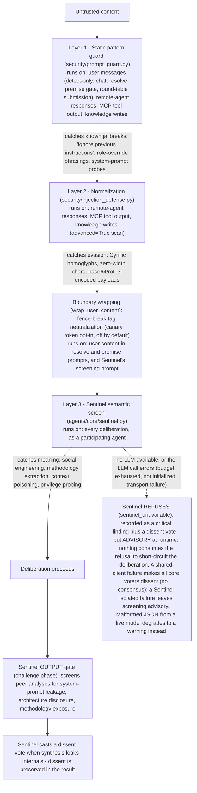
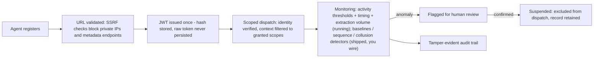

# Security Model

How the scaffold thinks about threats, where the controls live, and what is honestly out of scope. For vulnerability reporting, see [SECURITY.md](../SECURITY.md).

The single source of truth for the control-by-control capability matrix (implementation files and the tests that prove each control) and the stated non-claims is the generated project's own governance document: [GOVERNANCE.md](../template/%7B%7Bproject_slug%7D%7D/docs/GOVERNANCE.md). It ships inside every generated project, so the people operating the system always have it next to the code. This page is the map; that document is the territory.

---

## Defense in Depth: One Request's Journey

Every control below is implemented and tested in the generated project. The diagram shows where each control sits relative to one request. Two honest notes on wiring. First, injection defense is applied per surface rather than as one ingress filter, and coverage differs by surface: user messages get a detect-only Layer 1 pattern scan at all four ingestion surfaces (chat, resolve, premise gate, round-table submission -- findings are logged and flagged for operators, never blocked or rewritten) and are boundary-wrapped with fence-break neutralization on the resolve and premise paths (and by Sentinel for its own screening prompt) but embedded unwrapped in chat synthesis and round-table agent prompts; remote-agent responses and MCP tool output are sanitized and get the full Layer 1+2 scan (pattern matching plus homoglyph/invisible-char/encoding decoding), log-only; knowledge writes get the same full scan and are the only surface where a finding refuses the input (the per-surface breakdown is a stated Non-Claim in the generated GOVERNANCE.md). Second, output signing is a primitive you invoke on results you emit downstream, not an automatic step.

```mermaid
flowchart TD
    Req[Incoming request] --> Auth["API-key auth + per-IP rate limiting"]
    Auth --> Tenant["Tenant context via AuthContext (tenant_id on every route)"]
    Tenant --> Inj["Injection defense, per surface:<br/>user messages: detect-only Layer 1 scan on all four surfaces (log + integrity flag, never blocks) + delimiter wrapping with fence-break neutralization (resolve + premise paths; chat and round-table prompts embed content unwrapped)<br/>remote-agent / MCP output: sanitization + full Layer 1+2 scan (patterns + Unicode/encoding decoding), log-only<br/>knowledge writes: full Layer 1+2 scan, findings refuse the write"]
    Inj --> Dispatch["Agent dispatch gates: JWT identity verified, per-agent rate limits, capability scopes filter context - re-checked before every deliberation phase (analyze, challenge, vote)"]
    Dispatch --> Delib["Multi-agent deliberation"]
    Delib --> L3["Layer 3 inside the deliberation: Sentinel semantic screen - refuses on a missing/errored LLM (recorded as critical finding + dissent vote; advisory - the deliberation itself is not halted)"]
    L3 --> Enforce["Evidence enforcement: unsupported-confidence claims rejected"]
    Enforce --> Gate["Autonomy policy / human approval gate"]
    Gate --> Audit["Metadata-only audit trail + reasoning-chain hash"]
    Audit -.-> Sign["Output signing (HMAC attestation primitive - invoke on results you forward)"]
```

No single layer is trusted to be perfect; each assumes the one before it can be bypassed.

## Prompt Injection: The Three Layers, and Where Sentinel Sits

Zooming into the injection-defense portion of that path -- each layer catches what the previous one cannot, and the Sentinel agent guards both directions:

Layers 1 and 2 are deterministic (regex + Unicode analysis, no LLM, free); the [README shows them catching real payloads](../README.md#see-it-run). Not every surface passes through every layer at runtime -- the diagram annotates where each layer actually runs today: user messages get a detect-only Layer 1 scan on all four ingestion surfaces (chat, resolve, premise gate, round-table submission; findings are logged and recorded as integrity flags, never blocked -- users legitimately discuss injection techniques) and are boundary-wrapped on the resolve and premise paths but embedded unwrapped in chat synthesis and round-table agent prompts; remote-agent and MCP content is sanitized and gets the full Layer 1+2 scan including the decoding pass, log-only; knowledge writes get the full scan and are the only surface where findings refuse the input. Layer 3 is the only layer that understands intent, which is why it is an agent inside the deliberation rather than a filter in front of it: Sentinel screens the input as its Phase 1 analysis, screens the other agents' outputs for leaks as its Phase 2 challenge, and casts a dissent vote at synthesis that is preserved in the result rather than silenced. The adversarial harness attacks the deterministic layers -- Layers 1-2, fence-break/wrapping containment, and enforcement/synthesis containment -- in CI; it runs with core agents disabled and no registry, so Layer 3 and the dispatch/scope gates are covered by their dedicated unit tests (`test_agent_identity.py`, orchestration/scope tests) rather than adversarial pressure.

## Trust Boundaries

Generated projects treat the following as **untrusted** at all times:

| Boundary | Attack surface | Primary controls |
|----------|----------------|------------------|
| User input (chat, tasks, API bodies) | Prompt injection, encoding attacks, oversized payloads | Detect-only Layer 1 pattern scan at all four ingestion surfaces (chat, resolve, premise gate, round-table submission -- logged + integrity-flagged, never blocked or rewritten), boundary wrapping with fence-break neutralization on the resolve and premise paths (chat and round-table prompts embed content unwrapped), semantic Sentinel screening (Layer 3) inside the deliberation, input size limits, input validation on every mutating route. No user-message path runs sanitization or blocks on scan findings (stated Non-Claim) |
| Remote agent registration | SSRF, private-IP and metadata-endpoint access, credential exfiltration | URL validation (scheme, private ranges, cloud metadata IPs), API keys resolved from environment only, identity token hashes only on disk |
| Remote agent responses | Injection via analysis/challenge/vote fields, oversized responses | Response sanitization + full Layer 1+2 scan (patterns + Unicode/encoding decoding, log-only), size limits, adversarial harness coverage |
| MCP tool output | Injection via tool results | Sanitization + full Layer 1+2 scan (patterns + Unicode/encoding decoding, log-only) + `MCP_DATA` boundary wrapping, per-tenant registry, `mcp:` scope gating, non-fatal failure handling |
| Persisted state (registry, learning store) | Tampering with visibility/tenant metadata, poisoned corrections | Validation on load (invalid entries skipped, never widened), explicit four-eyes approval posture (`CORRECTIONS_FOUR_EYES`: strict rejects self-approval; the warn default allows it but logs loudly and records an integrity flag, since single-key identity cannot satisfy the rule), content policy screening, override and contradiction detectors (collusion/drift detectors ship as libraries you wire) |
| Cross-tenant API access | A valid credential in one tenant enumerating or taking over another tenant's agents (e.g. rotating their identity tokens), or a same-name registration in another tenant weakening dispatch gates | Registry keyed by (tenant_id, name); every agents-API operation (list/get/health/rotate/revoke/suspend/unregister) resolves only within the caller's resolved tenant; cross-tenant access reads as 404 (never 403) so existence does not leak. Dispatch gates (identity, capability/scope filtering, activity touch) resolve the dispatched agent by object identity, so a cross-tenant name collision cannot re-open a revoked agent's gate or disable scope filtering -- an unresolvable registered agent fails closed. Activity events, anomaly flags, and retention are attributed to the caller's resolved tenant. Tenant *resolution* beyond "default" requires wiring multi-tenant auth (PLATFORM_GUIDE.md) |
| The agents themselves | Misbehaving or compromised agents | Per-agent JWT identity verified at dispatch, per-agent rate limits, scope-filtered task context, suspension lifecycle (behavioral baselines and lockstep detection ship as libraries you wire) |

## The Agents Are Inside the Perimeter

The last row of that table deserves its own section, because it is the scaffold's least common design decision. Most agent frameworks treat agents as trusted extensions of the application. This scaffold treats them as insiders, the way a mature security program treats people with badges: authenticated, least-privileged, behaviorally monitored, and removable -- because an agent holds credentials, touches data, and acts at machine speed, and any of them can be compromised through the content they read.

| Control | What it does | Where it lives |
|---------|--------------|----------------|
| Identity | Per-agent JWT verified before every deliberation phase dispatch (analyze, challenge, vote); tokens are SHA-256 hashed and only the hash is persisted -- the raw token is issued once and held in memory, and a reloaded agent must rotate credentials before it passes verification | `agents/identity.py`, `agents/registry_persistence.py`, `orchestration/dispatch_helpers.py` |
| Least privilege | Capability scopes filter what each agent sees; out-of-scope findings are flagged | `agents/capability.py`, `orchestration/scope_filter.py` |
| Behavioral baselines | Refusal rate, confidence, latency, and scope discipline compared against each agent's own history -- valid credentials with anomalous behavior still get flagged. Shipped as a tested detector library; the default runtime does not invoke it -- you wire it into dispatch (stated Non-Claim) | `learning/activity.py` |
| Multi-step patterns | Sequences of individually-benign actions that add up to extraction are detected across a window. Shipped as a tested detector library; not wired into the default runtime (stated Non-Claim) | `harness/sequence_detector.py` |
| Timing regularity | Machine-like request cadence (suspiciously low variation in inter-request intervals) is flagged -- valid credentials driven by a script on a timer still surface | `learning/timing_analysis.py` |
| Extraction volume | Successful knowledge-endpoint reads (corrections and reflections listings; failed requests such as 401s and guard 429s never count) are counted per user and tenant-wide over a rolling window; elevated/capped volume is flagged on either listing, with an opt-in 429 on the corrections listing as the only enforcement | `learning/extraction_guard.py` |
| Approval-pair dominance | Directed proposer->approver pairs that dominate correction approvals -- four-eyes satisfied, but always by the same two accounts -- are flagged with escalating severity | `learning/approval_patterns.py` |
| Collusion | Lockstep agreement between agents that should be independent is flagged (e.g. two agents defeating four-eyes review). Shipped as a tested detector library; nothing records votes into it at runtime yet (stated Non-Claim) | `learning/collusion.py` |
| Containment | Suspension removes an agent from dispatch and listings without deleting its record; gates are re-checked per deliberation phase, so a mid-run suspension excludes the agent from the remaining phases. Consensus shrinks to the votes actually cast, and any vote-phase gate-out marks the result degraded with a `vote_gated_count` so the shrunken denominator is never silent | `agents/registry.py` |
| Accountability | Reasoning-chain hashes make after-the-fact edits detectable; corrections that shape future behavior need two humans | `security/reasoning_chain_hash.py`, `learning/corrections.py` |

The lifecycle, end to end:

## Posture Decisions

- **Fail closed, stated precisely.** When persisted metadata fails validation or an identity token is missing, the system skips or blocks -- those gates are enforcing. When Sentinel has no LLM or its LLM call errors (budget exhausted, client not initialized, transport failure; the client marks these with an explicit `is_error`/`error_type` contract), its refusal is recorded as a critical finding (`premise_valid=False`) plus a dissent vote -- but no runtime path consumes that refusal to short-circuit the deliberation, so screening on a Sentinel-isolated failure is advisory: with enough other voters the run can still reach consensus on unscreened input. A shared-client failure makes all core voters dissent, so consensus fails. Wiring the refusal into a hard "refused" outcome is an explicit follow-up. Malformed JSON from a *live* model deliberately degrades to a warning rather than a refusal, so formatting quirks don't hard-fail deliberations.
- **Secrets never persist in the clear.** Raw identity tokens live in memory only; disk gets SHA-256 hashes. Agent API keys come from environment variables, never from persistence files.
- **Audit without content.** The deliberation audit trail is structurally metadata-only (phases, counts, durations, outcomes) so prompt and response content cannot leak through it. Each run stores a reasoning-chain hash making after-the-fact edits detectable.
- **Human gates on state that shapes behavior.** Corrections require human approval, with an explicit four-eyes posture: strict mode rejects self-approval, and the default warn mode -- honest about single-key identity, where proposer and approver are always the same "user" -- allows it while logging loudly and recording an integrity flag. Integrity findings are flagged for human review, never auto-actioned; restricted autonomy levels force check-ins before results are acted on.

## What Is Out of Scope (Non-Claims)

Stating what a control does *not* do is part of the control. The authoritative list lives in [GOVERNANCE.md -- Known Limitations / Non-Claims](../template/%7B%7Bproject_slug%7D%7D/docs/GOVERNANCE.md#known-limitations--non-claims). Highlights:

- Sentinel's fail-closed refusal is advisory at runtime: it is recorded as a critical finding plus a dissent vote, but nothing consumes it to halt the deliberation (wiring a hard "refused" outcome is an explicit follow-up).
- Several shipped detectors (behavioral baselines, collusion, correction drift, sequence monitoring, response-side canary checking) are tested libraries the default runtime does not invoke -- they detect nothing until you wire them. The model router is likewise initialized but not consulted by the LLM client until you wire it.
- Layer 1-2 injection scanning coverage varies by surface: the user-message scan is detect-only (log + integrity flag, never a block) and Layer 1 only; user content is wrapped only on the resolve and premise paths (chat and round-table prompts embed it unwrapped); remote/MCP findings warn but never drop content -- only knowledge writes refuse on findings. Layer 2's decoding is bounded, not a universal unmasker: it decodes only contiguous standard-alphabet base64 runs of 20+ characters (up to 3 nesting levels), even-length hex runs of 20+ characters, and a single ROT13 pass; base64url, whitespace-chunked base64, 4+-deep nesting, URL-encoding, and HTML entities pass Layers 1-2 undetected (see the generated GOVERNANCE.md Non-Claims).
- Heuristic classifiers (content policy, override detection) are regex/keyword based -- they reduce risk, they do not eliminate it.
- The audit trail is tamper-evident within a run, not tamper-proof; output signing is symmetric HMAC, not third-party non-repudiation.
- PII redaction is a harm-reduction layer, not a GDPR/CCPA compliance guarantee.
- Erasure removes live rows, not backups or downstream exports.
- Single-node assumptions apply unless persistence is shared and per-instance configuration is disciplined.

## Verification

The scaffold validates its own security posture on every change:

- **Adversarial harness**: six deterministic hostile agents (no LLM, zero cost) attack a full round table with injection payloads in every field; CI asserts the deterministic defenses (Layers 1-2, wrapping, enforcement/synthesis containment) hold. These runs disable core agents and use no registry, so the Sentinel semantic layer and the dispatch/scope gates are exercised by their dedicated unit tests, not by this harness.
- **Red-team scans, Bandit, and AI security checks** run in the 18-check validation pipeline against every generated configuration.
- **864 generated tests** (87% coverage, measured on a default full-profile generation) include dedicated suites for injection defense (including the detect-only user-message scan), agent identity, tamper evidence, governance, the corrections lifecycle, extraction defense (timing regularity, knowledge-read volume, approval-pair escalation), governance reporting, multi-tenant integrity (cross-tenant 404s on the agent control plane, per-tenant activity attribution, the four-eyes posture), and the fail-closed contract (LLM error handling, mid-run suspension gating).

The process has caught real issues before release -- for example, a tenant-isolation bug where remote agents reverted to public visibility on restart ([fix](https://github.com/KangaKode/roundtable/commit/9168334ac050e22022ab2787b7b3ff3ce06796cc)).
