# Architecture Map: AI-Native SDLC Assurance

**Status:** Design artifact
**Parent spec:** [AI-Native SDLC Assurance Design](../../superpowers/specs/2026-07-26-ai-native-sdlc-assurance-design.md)

## Existing Components

- `docs/DEVELOPMENT_PROCESS.md` defines this repository’s design and review
  gates.
- `.cursor/rules/development-process.mdc` is the always-applied operational
  summary for agents working in this repository.
- `template/{{project_slug}}/docs/DEVELOPMENT_PROCESS.md` and
  `template/{{project_slug}}/.cursor/rules/` ship equivalent governance to
  generated projects.
- `.github/workflows/validate.yml` validates the template repository.
- `template/{{project_slug}}/.github/workflows/ci.yml.jinja` generates
  downstream CI.
- `scripts/agent_review.py` and generated `scripts/red_team_check.py` provide
  deterministic checks.
- Template reviewer definitions under
  `template/{{project_slug}}/.cursor/agents/` provide scoped agentic review.
- `scripts/validate_generated.sh` is the end-to-end template validation gate.

## New or Changed Responsibilities

### Process Policy

`docs/DEVELOPMENT_PROCESS.md` becomes the source of truth for:

- risk-tier selection and override rules;
- tier-specific design artifacts;
- bug-class classification and completion criteria;
- proof-of-finding requirements; and
- reviewer shadow/promotion policy.

The root always-applied rule remains a concise mechanics summary. The generated
development-process document and rules mirror the parts downstream users must
follow.

### Threat-Model Artifact

The design-doc author and process docs gain a fourth high-tier artifact:
`docs/designs/<feature>/THREAT_MODEL.md`. It records assets, trust boundaries,
abuse cases, mitigations, residual risks, and validation.

### Security CI

The root workflow gains a dedicated security job for Gitleaks and `pip-audit`.
The generated workflow gains an equivalent job alongside existing test and lint
jobs. Bandit remains independent so the tools retain distinct failure signals.
A shared template script validates expiring advisory exceptions and invokes the
pinned auditor for root or generated dependency inputs.

### Finding Evidence

Reviewer prompts share one conceptual evidence contract while retaining
domain-specific details. `scripts/agent_review.py` gains stable rule identifiers
and matched evidence for deterministic failures. Unverified agentic concerns are
non-blocking.

### Bug-Class Register

A root register records recurring bug classes affecting this repository. An
empty, documented template register gives generated projects the same durable
audit mechanism. The register points to relevant rules and tests; it does not
replace domain-specific instructions.

### Reviewer Assurance

A fixture-driven deterministic harness and coverage manifest ship in generated
projects and check vulnerable snippets and safe near-misses. A
reviewer-assurance document records prompt-reviewer status (`SHADOW` or
`BLOCKING`), evaluation date, fixture set, human approver, and limitations.

### Generated-Asset Validation

`scripts/validate_generated.sh` retains the template’s nested `.cursor` tree,
then asserts rendered workflows, process docs, registers, reviewer-eval assets,
and index links in every profile. This closes the current validation blind spot
where `.cursor` is omitted from test generations.

## Dependency Direction

```mermaid
flowchart TD
    ProcessPolicy[DevelopmentProcessPolicy] --> RootRule[RootAgentRule]
    ProcessPolicy --> TemplatePolicy[GeneratedProcessPolicy]
    ProcessPolicy --> ArtifactAuthor[DesignDocAuthor]
    EvidenceContract[FindingEvidenceContract] --> ReviewerPrompts[ReviewerPrompts]
    EvidenceContract --> DeterministicReview[AgentReviewScript]
    ReviewerFixtures[ReviewerFixtures] --> DeterministicReview
    ReviewerFixtures --> ShadowProtocol[PromptReviewerShadowProtocol]
    BugRegister[BugClassRegister] --> RootRule
    BugRegister --> RegressionTests[RegressionTests]
    RootCI[RootSecurityCI] --> Gitleaks[Gitleaks]
    RootCI --> AuditGate[ExpiringExceptionGate]
    AuditGate --> PipAuditCore[PipAuditCore]
    TemplateCI[GeneratedSecurityCI] --> Gitleaks
    TemplateCI --> AuditGate
    AuditGate --> PipAuditGenerated[PipAuditGenerated]
    Validation[GeneratedValidation] --> TemplatePolicy
    Validation --> DeterministicReview
    Validation --> GeneratedCursor[GeneratedCursorAssets]
```

Policy and documentation may reference executable checks. Executable checks do
not import or parse governance Markdown at runtime.

## Implementation Boundaries

- No new hosted service or database.
- No automatic mutation of rules from findings.
- No LLM credentials or agent execution in GitHub Actions.
- No replacement of Bandit, existing red-team checks, or human approval.
- No dependency-locking migration in this change.
