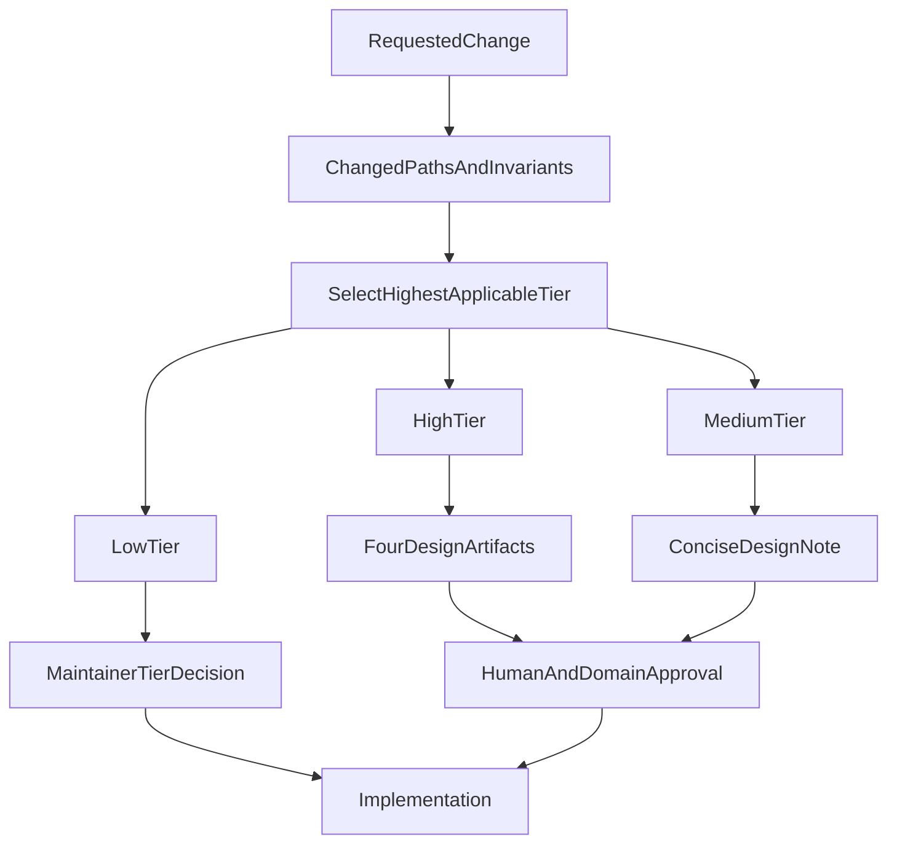
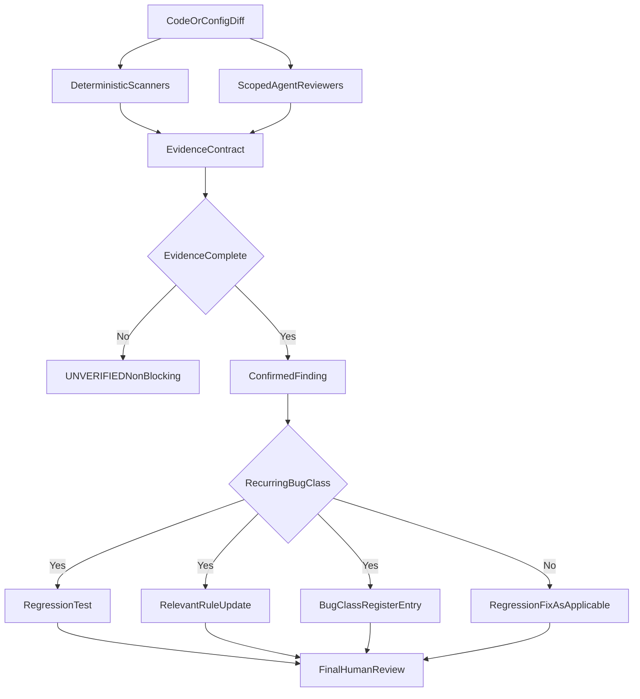
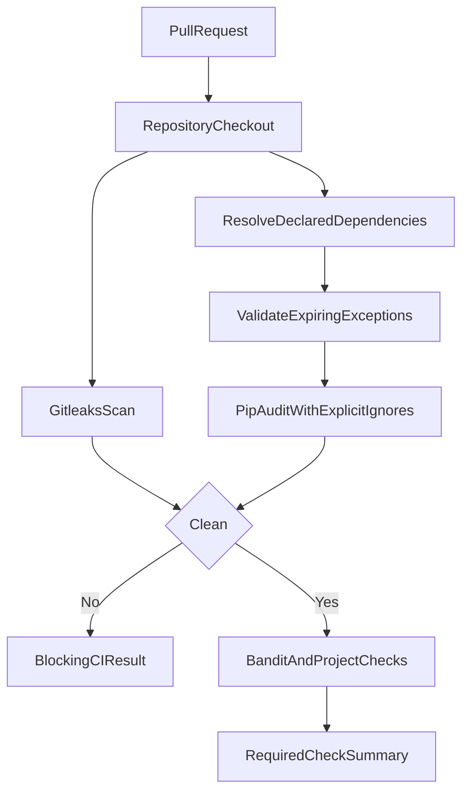
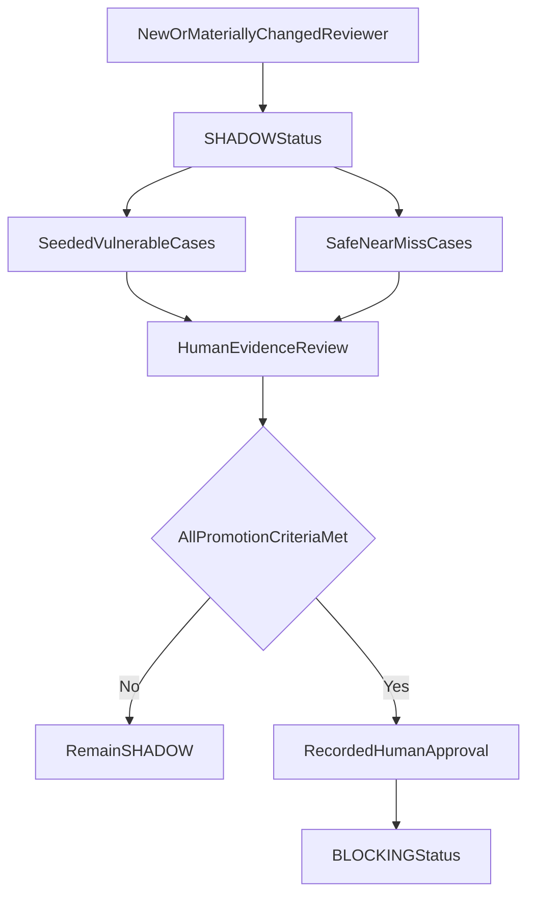

# Data Flow: AI-Native SDLC Assurance

**Status:** Design artifact
**Parent spec:** [AI-Native SDLC Assurance Design](../../superpowers/specs/2026-07-26-ai-native-sdlc-assurance-design.md)

## Sources of Truth

- Risk policy: `docs/DEVELOPMENT_PROCESS.md`
- Agent mechanics: `.cursor/rules/development-process.mdc`
- Recurring classes: the bug-class register plus linked domain rules and tests
- Reviewer status: reviewer-assurance register
- CI result: GitHub Actions job conclusions and scanner output
- Generated-project behavior: rendered template files, validated from the
  template source

## Change Classification Flow

Sensitive invariants override changed-line count. A low-tier exemption never
bypasses CI or human merge ownership.

## Finding Verification and Feedback Flow

Agent-generated classifications and rule edits are recommendations. The human
reviewer approves the classification and all resulting changes.

## CI Scanner Flow

Gitleaks and `pip-audit` only report or refuse. They never rewrite history,
rotate credentials, suppress advisories, or modify dependency versions.
Malformed or expired exception records stop the job before auditing. An active
record supplies only its named advisory ID to `--ignore-vuln`.

## Reviewer Promotion Flow

The shipped coverage manifest determines which fixture paths run
deterministically in CI and which require a manual prompt-reviewer run.
Documentation and status records preserve that distinction. Prompt-based
reviewer outputs are evaluated manually because CI has no authenticated agent
runner.

## Trust Boundaries

- Repository content and diffs are untrusted inputs to reviewers.
- Scanner databases and action releases are external supply-chain inputs.
- Generated files are not authoritative; template sources are.
- Agentic review output is advisory until a human accepts it.
- The bug-class register is an audit index, not executable policy.
- GitHub branch protection is outside the repository and must be configured to
  require the root summary job, which depends on security.
- Generated projects receive setup instructions naming the summary job (which
  depends on test, lint, and security) as the required check; their external
  branch-protection state remains outside this scaffold’s proof boundary.
