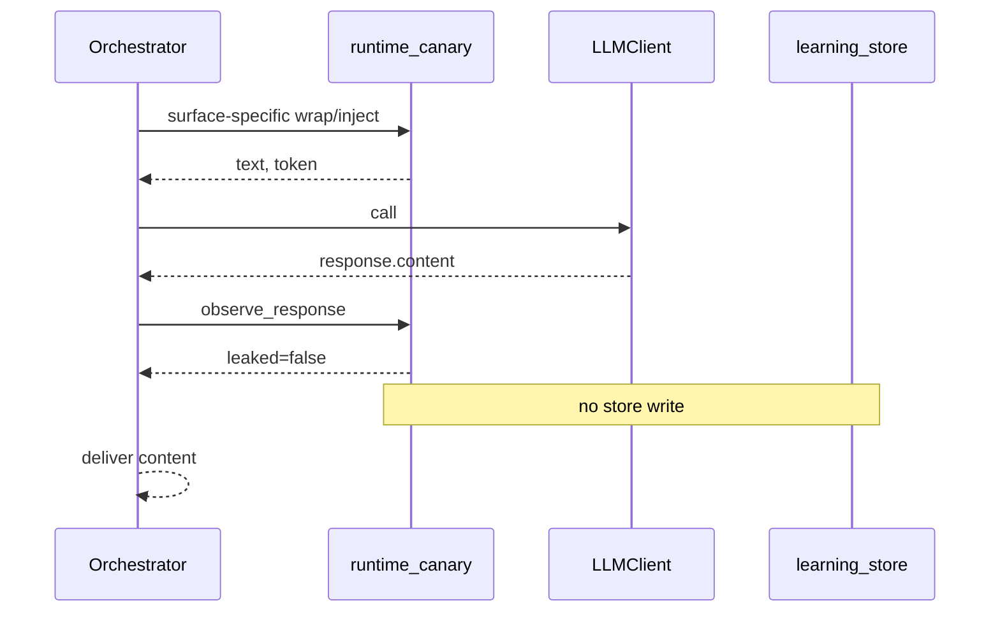

# Data Flow: Runtime Canary Enforcement

**Status:** Design artifact (High risk-tier) — REV 2

## Source of Truth

| Data | Source | Persistence |
|------|--------|-------------|
| Toggles | Env at call time | None |
| Canary token | `inject_canary` / wrap canary=True | Stack-local for one LLM call only |
| Leak finding | `check_canary` | `integrity_flags` (`canary_leak`) |
| Refuse decision | `should_refuse` | API/SSE fields only |

## Per-Surface Off-Path (byte-identical) — pinned

| Surface | Detection OFF | Detection ON |
|---------|---------------|--------------|
| Chat user field | Raw `message` (unwrapped) | `wrap_user_content(message, canary=True)` |
| Resolve query | `wrap_user_content(query, label="TASK_CONTENT")` no canary | Same wrap with `canary=True` |
| RT analyses blob | Raw `analyses_json` in context | `inject_canary(analyses_json, label=...)` into context; trusted instruction unchanged |

## Happy Path (detection on, clean)

## Leak Detect-Only

1. `check_canary` → warning log (no token in message text).
2. Off-loop: `asyncio.to_thread(insert_flag_once, store, flag_type="canary_leak", subject_id=surface, tenant_id=tenant_id, detail={"surface": surface}, severity="warning")`.
3. Return leaked=true; deliver model content unchanged.

## Leak Enforce

1. Flag write attempted (same as detect-only; failure does not block refuse).
2. Clear caller-visible model text; set refuse fields (see Architecture Map).
3. Chat: sticky short-circuit — no FactChecker retry; no history append of leaked text.
4. Round-table: set `canary_refusal`, skip voting.

## Trust Boundaries

| Boundary | Control |
|----------|---------|
| Env → process | Default off |
| Orchestrator → LLM | Opt-in canary embed only |
| LLM → observe | Exact substring vs per-call token |
| Observe → store | Allowlisted detail; `subject_id=surface`; off-loop I/O |
| Orchestrator → client | Bounded enums; SSE skip content + emit `refused` |

## Failure Modes

| Failure | Behavior |
|---------|----------|
| Detection off | Per-surface off-path above |
| Enforce without detect | No-op |
| Store slow/down | to_thread + swallow; deliver or refuse still completes |
| Empty token/text | No leak |
| Concurrent requests | Independent tokens |
