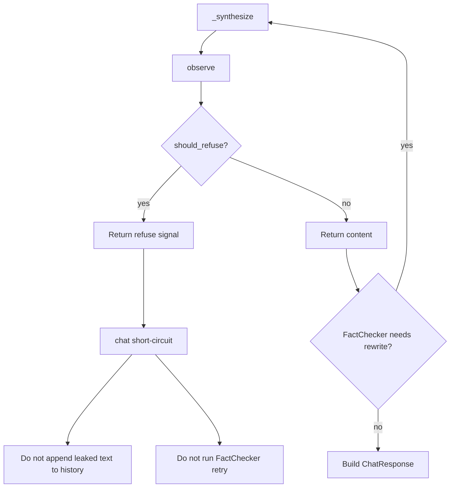

# Workflow States: Runtime Canary Enforcement

**Status:** Design artifact (High risk-tier) — REV 2

## Operator Configuration

| State | Inject | Check + flag | Refuse |
|-------|--------|--------------|--------|
| Defaults off | No | No | No |
| Detect-only | Yes (per-surface adapters) | Yes | No |
| Detect + enforce | Yes | Yes | Yes |
| Enforce without detect | No | No | No |

## Per-Call Flow

```mermaid
flowchart TD
  start[Synthesis LLM call] --> det{detection_enabled?}
  det -->|no| offPath[Surface off-path byte-identical]
  offPath --> call[llm.call]
  call --> deliver[Deliver as today]
  det -->|yes| wrap[Surface wrap or inject]
  wrap --> call2[llm.call]
  call2 --> obs[observe_response]
  obs --> leak{leaked?}
  leak -->|no| deliver
  leak -->|yes| enf{should_refuse?}
  enf -->|no| deliverFlag[Deliver content + flag]
  enf -->|yes| refuse[Structured refusal]
```

## Chat Sticky Refuse (MUST)



## Chat SSE Wire Contract (pinned)

On orchestrator refuse:

1. **Do not** emit `event: content` with model text.
2. **Emit** `event: refused` data:
   `{"refusal_source":"canary","refusal_reason":"canary_leak"}`
3. **Emit** `event: metadata` with `content=""`, `refused=true`,
   `refusal_source="canary"`, `refusal_reason="canary_leak"`, plus other
   metadata fields as today (agents_consulted, etc.).

Non-refuse streams unchanged (`content` then `metadata`).

## Resolve Outcomes

| Outcome | content | refused | refusal_source | refusal_reason | escalated |
|---------|---------|---------|----------------|----------------|-----------|
| Clean | model | false | null | null | per existing gates |
| Detect leak | model | false | null | null | per existing gates |
| Enforce leak | `""` | true | canary | canary_leak | **false** |

## Round-table Outcomes

| Outcome | status | refusal_source | refusal_reason | voting |
|---------|--------|----------------|----------------|--------|
| Clean / detect leak | completed | null | null | proceeds |
| Enforce leak | refused | canary | canary_leak | skipped |

## GOVERNANCE Copy (implementation MUST land this)

### Capability row (new)

| Capability | Description | Code | Tests |
|------------|-------------|------|-------|
| Runtime canary (opt-in) | With `RUNTIME_CANARY_ENABLED=true` (default off), the three final caller-visible LLM surfaces — chat synthesis, `/resolve` `TASK_CONTENT`, round-table synthesis analyses context — embed a per-call canary and run `check_canary` on the model text. Hits persist as `canary_leak` integrity flags (`subject_id` = surface). With `RUNTIME_CANARY_ENFORCEMENT_ENABLED=true` (default off; no-op unless detection is on), a hit returns a structured refusal (`refusal_source=canary`, `refusal_reason=canary_leak`) and clears caller-visible model text. Startup self-test (`STARTUP_CANARY_ENABLED`) remains independent. | `orchestration/runtime_canary.py`, chat/resolve/round-table wire sites | `tests/test_runtime_canary.py` |

### Non-Claim replacement (replaces startup-only canary Non-Claim)

**Runtime canary is opt-in and bounded — not always-on scanning and not
containment.** Unset `RUNTIME_CANARY_ENABLED` leaves the three surfaces
byte-identical to pre-feature behavior (chat user field stays unwrapped;
resolve keeps XML wrap without canary; round-table analyses context
unchanged). Detection uses exact substring match on the per-call token
(paraphrased echoes are false negatives). Intermediate agent consults,
cross-check, premise, and MCP tool bodies are not canary-scanned.
Enforcement refuses explicitly and never silently strips a canary from a
successful-looking response. This is not ASI05 egress control, not ASI10
graduated halt/suspend policy, and not a substitute for Sentinel screening.
`STARTUP_CANARY_ENABLED` only validates the primitive round-trip at boot.

### Docs checklist for implementers

- `GOVERNANCE.md` — capability + Non-Claim as above
- `.env.example.jinja` — both flags, default commented/off
- `OPERATIONS.md.jinja` — ops meaning of detect vs enforce
- `PLATFORM_GUIDE.md` (root + template) — opt-in wiring row
- `SECURITY_MODEL.md` — distinguish startup vs runtime
- `ARCHITECTURE.md.jinja` — no longer “caller-invoked only” for canary check
- Do **not** flip ASI05 / ASI10 SECURITY_MAPPING covered rows
