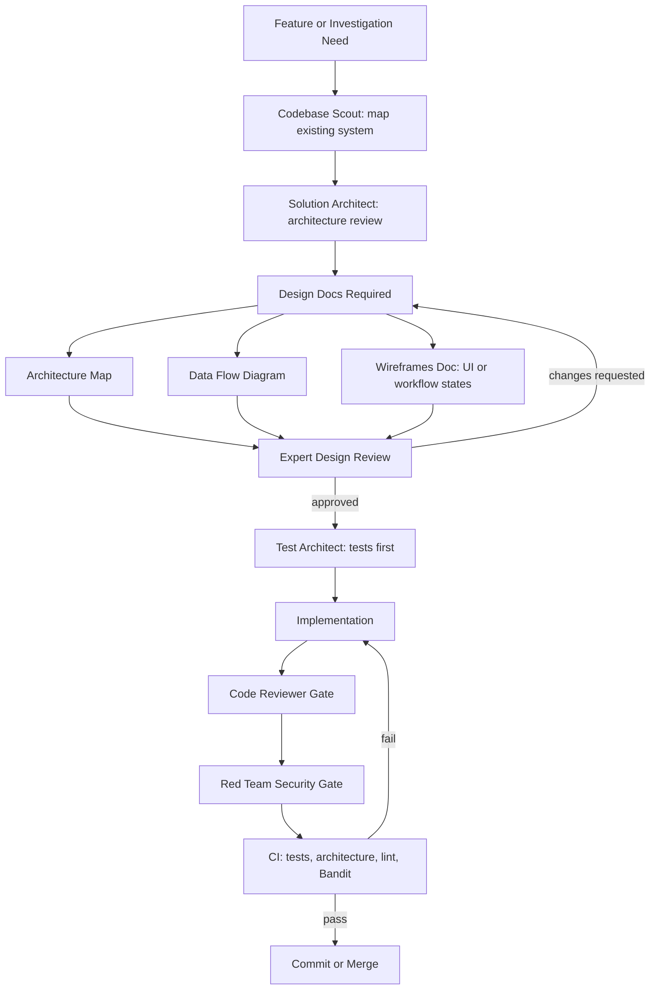

# Development Process

This project uses a gated AI-assisted development workflow. The goal is to keep agent-written code reviewable, maintainable, and safe to operate.

This process is a governance scaffold. It improves reviewability and repeatability, but it does not replace human ownership of design, implementation, or release decisions.

## Workflow

## Required Design Artifacts

Meaningful features require three design documents before implementation:

| Artifact | Purpose |
|----------|---------|
| Architecture Map | Maps existing modules, new components, layer ownership, dependencies, and implementation order |
| Data Flow Diagram | Identifies source of truth, data movement, trust boundaries, and write paths |
| Wireframes | Describes user-visible states; for non-UI work, describes workflow states and operator decisions |

Use `docs/designs/<feature-name>/` for feature-specific artifacts if your team prefers grouped design docs. Otherwise, follow the project agent templates for individual `docs/ARCHITECTURE_MAP_<FEATURE>.md`, `docs/DATA_FLOW_<FEATURE>.md`, and `docs/WIREFRAMES_<FEATURE>.md` files.

## Gates

| Gate | What It Prevents |
|------|------------------|
| Architecture review | New code bypassing existing modules, layering rules, or ownership boundaries |
| Design review | Ambiguous scope, missing data-flow reasoning, and unreviewed trust-boundary changes |
| Test-first planning | Implementation that cannot be verified or safely refactored |
| Code review | Maintainability, correctness, and architecture drift |
| Red-team review | Security regressions, prompt-injection risk, data leaks, and unsafe automation |
| CI validation | Broken tests, lint failures, security findings, and template regressions |

## Roundtable POC Handoff

If a POC changes agents, orchestration, external agent protocol behavior, or
evidence enforcement, complete [ROUNDTABLE_HANDOFF.md](ROUNDTABLE_HANDOFF.md)
before engineering review. The handoff captures agent contracts, phase evidence,
failure behavior, observability, and demo-only production blockers.

## Operating Rule

Do not combine design and implementation for meaningful feature work. First create the required design artifacts, get review, then implement with tests. Small test-only changes and tiny bug fixes can skip the full ceremony when the maintainer explicitly decides the risk is low.
