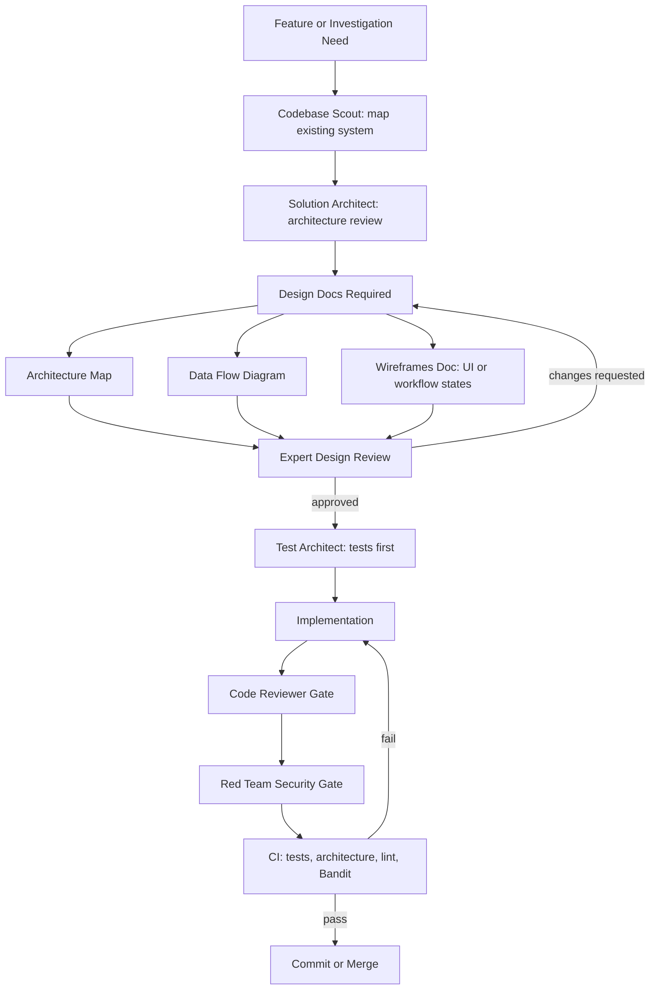

# Development Process

This project uses a gated AI-assisted development workflow. The goal is to keep agent-written code reviewable, maintainable, and safe to operate.

This process is a governance scaffold. It improves reviewability and repeatability, but it does not replace human ownership of design, implementation, or release decisions.

For features too large for a single agent session, see the [Phased Model Strategy](#phased-model-strategy) section below.

## Workflow

## Required Design Artifacts

Meaningful features require three design documents before implementation:

| Artifact | Purpose |
|----------|---------|
| Architecture Map | Maps existing modules, new components, layer ownership, dependencies, and implementation order |
| Data Flow Diagram | Identifies source of truth, data movement, trust boundaries, and write paths |
| Wireframes | Describes user-visible states; for non-UI work, describes workflow states and operator decisions |

Use `docs/designs/<feature-name>/` for feature-specific artifacts if your team prefers grouped design docs. Otherwise, follow the project agent templates for individual `docs/ARCHITECTURE_MAP_<FEATURE>.md`, `docs/DATA_FLOW_<FEATURE>.md`, and `docs/WIREFRAMES_<FEATURE>.md` files.

## Gates

| Gate | What It Prevents |
|------|------------------|
| Architecture review | New code bypassing existing modules, layering rules, or ownership boundaries |
| Design review | Ambiguous scope, missing data-flow reasoning, and unreviewed trust-boundary changes |
| Test-first planning | Implementation that cannot be verified or safely refactored |
| Code review | Maintainability, correctness, and architecture drift |
| Red-team review | Security regressions, prompt-injection risk, data leaks, and unsafe automation |
| CI validation | Broken tests, lint failures, security findings, and template regressions |

## Roundtable POC Handoff

If a POC changes agents, orchestration, external agent protocol behavior, or
evidence enforcement, complete [ROUNDTABLE_HANDOFF.md](ROUNDTABLE_HANDOFF.md)
before engineering review. The handoff captures agent contracts, phase evidence,
failure behavior, observability, and demo-only production blockers.

## Operating Rule

Do not combine design and implementation for meaningful feature work. First create the required design artifacts, get review, then implement with tests. Small test-only changes and tiny bug fixes can skip the full ceremony when the maintainer explicitly decides the risk is low.

## Phased Model Strategy

For features too large for a single agent session, this project layers a four-phase, multi-agent delivery workflow on top of the gates above. Roles are capability-based and model-agnostic; model names are dated examples only.

### The Four Phases

| Phase | Work | Artifact | Human gate |
|-------|------|----------|------------|
| 1. Brainstorm | Deep-reasoning model explores scope, constraints, risks, success criteria with the human | Brainstorm brief | Approve brief |
| 2. Tickets | Structured-writing model turns the brief into small, dependency-ordered, independently testable tickets | Ticket set | Approve tickets |
| 3. Plan | Orchestrator model improves tickets, sequences file-collision-free parallel waves, writes builder briefs | Wave plan + briefs | Approve plan |
| 4. Build | Parallel builder agents implement one ticket each in isolated contexts; orchestrator verifies and integrates | Working, tested code | Accept per wave |

### Model Roles by Capability

| Role | Needs | Example as of 2026 |
|------|-------|--------------------|
| Brainstorm partner | Strong reasoning and dialogue; cost matters little | Frontier deep-reasoning model |
| Ticket writer | Structure and faithfulness, not maximum creativity | Mid-tier structured-output model |
| Delivery planner | Long context, tool use, judgment | Frontier model with strong tool use |
| Builder | Strong coding at efficient cost | Cost-efficient coding model, one per ticket |

### Token Economics

Expensive deep-reasoning tokens are spent once up front (brainstorm and plan), where judgment compounds across every downstream ticket, while bulk implementation tokens go to cost-efficient builders working from precise briefs. Parallel builders with isolated contexts avoid one giant context window accumulating stale state, and a failure is contained to one ticket rather than corrupting a monolithic session.

### Where the Existing Gates Fit

This strategy composes with the workflow above -- it does not replace it. The required design artifacts are produced inside or alongside Phase 3, before builds start. The code review, red-team, and CI gates apply per ticket in Phase 4. Builders never merge or deploy, and the human approves every phase transition.

See `.cursor/skills/phased-delivery/SKILL.md` for the full workflow (including the ticket quality bar and a Linear-style MCP worked example) and `.cursor/agents/delivery-planner.md` for the Phase 3 planning agent.

Guidance verified: 2026-07
