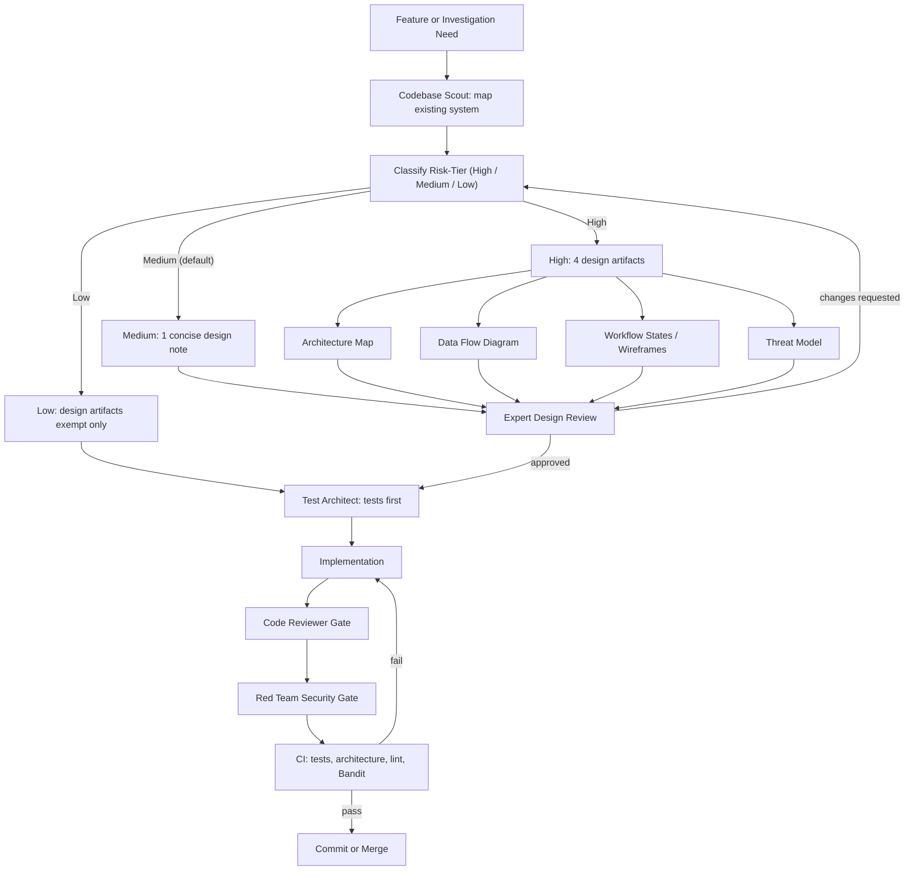

# Development Process

This project uses a gated AI-assisted development workflow. The goal is to
keep agent-written code reviewable, maintainable, and safe to operate.

This process is a governance scaffold. It improves reviewability and
repeatability, but it does not replace human ownership of design,
implementation, or release decisions.

For features too large for a single agent session, see the
[Phased Model Strategy](#phased-model-strategy) section below.

## Workflow

## Risk-Tier Policy

Every change is classified into a risk-tier — **High**, **Medium**, or
**Low** — before implementation. The **highest applicable tier wins**: a
small diff cannot be downgraded when it touches a high-tier path or
invariant. The maintainer records the chosen tier and the rationale in
the PR description.

### High

High-tier changes touch security or authentication, agent identity or
permissions, enforcement, migrations/schema/RLS, tenant or learning data,
secrets or deployment boundaries, CI workflows, or hooks. Applicable path
globs — both root and generated — include:

- `src/*/security/**` and root `security/**`;
- authentication and authorization middleware (for example
  `src/<project_slug>/api/middleware/auth.py` in gateway-enabled
  projects);
- agent-identity or scope dispatch
  (`src/<project_slug>/agents/registry.py`, identity/scope routing);
- `enforcement/**` and any invariant-enforcement wiring;
- `learning/tables.py` and its `MIGRATIONS`;
- `.github/workflows/**` (any CI workflow);
- `.cursor/hooks*` and other agent hooks;
- deployment manifests (`deploy/**`, `Dockerfile*`, `docker-compose*.yml`,
  `k8s/**`);
- secret configuration (`.env*`, secret managers, key material).

Required before implementation — all four design artifacts:

| Artifact          | Purpose                                                                                     |
|-------------------|---------------------------------------------------------------------------------------------|
| Architecture Map  | Maps existing modules, new components, layer ownership, dependencies, and implementation order |
| Data Flow Diagram | Identifies source of truth, data movement, trust boundaries, and write paths                |
| Workflow States   | Describes workflow states, operator decisions, and (where relevant) UI wireframes           |
| Threat Model      | Assets, actors, trust boundaries, abuse cases, controls, residual risks, security acceptance |

Primary layout: `docs/designs/<feature>/{ARCHITECTURE_MAP,DATA_FLOW,WORKFLOW_STATES,THREAT_MODEL}.md`.
High-tier changes always receive all relevant domain reviews (security,
architecture, and any other affected domain) and code review.

### Medium

**Medium is the default risk-tier** for every change that is neither High
nor Low, including single-file or multi-file behavior changes that do not
alter a high-tier invariant. It requires **one concise design note**
covering architecture impact, data movement, failure behavior, risks, and
planned tests. The note may be split into two documents only when doing
so makes review materially clearer.

### Low

Low-tier work is limited to documentation- or presentation-only changes,
test-only changes, or fixes under 20 gross changed lines measured as
**additions plus deletions** (excluding mechanically generated
artifacts) that do not touch high-tier paths or invariants.

Low-tier work is **exempt from design artifacts** only. Every other gate
still applies. Low-tier changes preserve:

- branch isolation — never commit directly to `main`;
- CI validation — quick checks, tests, and the blocking `security` job
  (Gitleaks over full history plus `pip-audit` through the fail-closed
  exceptions gate) still run and still block;
- applicable tests — new or updated tests for the touched behavior when
  there is any behavior to test;
- human ownership — the maintainer approves the tier and the diff; and
- post-change review — the code-review and red-team gates below.

The maintainer records the tier and rationale in the PR description
whenever invoking the Low exemption.

## Gates

| Gate | What It Prevents |
|------|------------------|
| Risk-tier classification | Downgrading changes that touch a high-tier path or invariant, and skipping design ceremony where it matters |
| Architecture review | New code bypassing existing modules, layering rules, or ownership boundaries |
| Design review | Ambiguous scope, missing data-flow reasoning, and unreviewed trust-boundary changes |
| Threat-model review (High) | Unmitigated abuse cases, missing controls, and undocumented residual risks |
| Test-first planning | Implementation that cannot be verified or safely refactored |
| Code review | Maintainability, correctness, and architecture drift |
| Red-team review | Security regressions, prompt-injection risk, data leaks, and unsafe automation |
| CI validation | Broken tests, lint failures, security findings, and template regressions |
| Secret scanning (Gitleaks) | New secrets committed to the tree or reintroduced through history (`security` job, `.github/workflows/ci.yml`; pinned action, `fetch-depth: 0`) |
| Dependency auditing (`pip-audit`) | Merging a change that ships known-vulnerable Python dependencies; every exception must pass through the fail-closed gate at `scripts/pip_audit_gate.py` with a named owner, compensating control, and expiry -- expired entries automatically restore blocking behaviour |

## Roundtable POC Handoff

If a POC changes agents, orchestration, external agent protocol behavior, or
evidence enforcement, complete [ROUNDTABLE_HANDOFF.md](ROUNDTABLE_HANDOFF.md)
before engineering review. The handoff captures agent contracts, phase evidence,
failure behavior, observability, and demo-only production blockers.

## Operating Rule

Do not combine design and implementation for High-tier feature work.
First create the required design artifacts, get review, then implement
with tests. Medium-tier work still leads with the one concise design
note. The Low exemption removes design artifacts only — it does not
remove branch isolation, CI, applicable tests, human ownership, or
post-change review.

## Phased Model Strategy

For features too large for a single agent session, this project layers a
four-phase, multi-agent delivery workflow on top of the gates above.
Roles are capability-based and model-agnostic; model names are dated
examples only. Design ceremony inside Phase 3 scales with the risk-tier
above: High produces all four artifacts, Medium produces one concise
design note, Low leans on ticket-level briefs.

### The Four Phases

| Phase | Work | Artifact | Human gate |
|-------|------|----------|------------|
| 1. Brainstorm | Deep-reasoning model explores scope, constraints, risks, success criteria with the human | Brainstorm brief | Approve brief |
| 2. Tickets | Structured-writing model turns the brief into small, dependency-ordered, independently testable tickets | Ticket set | Approve tickets |
| 3. Plan | Orchestrator model improves tickets, sequences file-collision-free parallel waves, writes builder briefs | Wave plan + briefs | Approve plan |
| 4. Build | Parallel builder agents implement one ticket each in isolated contexts; orchestrator verifies and integrates | Working, tested code | Accept per wave |

### Model Roles by Capability

| Role | Needs | Example as of 2026 |
|------|-------|--------------------|
| Brainstorm partner | Strong reasoning and dialogue; cost matters little | Frontier deep-reasoning model |
| Ticket writer | Structure and faithfulness, not maximum creativity | Mid-tier structured-output model |
| Delivery planner | Long context, tool use, judgment | Frontier model with strong tool use |
| Builder | Strong coding at efficient cost | Cost-efficient coding model, one per ticket |

### Token Economics

Expensive deep-reasoning tokens are spent once up front (brainstorm and
plan), where judgment compounds across every downstream ticket, while
bulk implementation tokens go to cost-efficient builders working from
precise briefs. Parallel builders with isolated contexts avoid one giant
context window accumulating stale state, and a failure is contained to
one ticket rather than corrupting a monolithic session.

### Where the Existing Gates Fit

This strategy composes with the workflow above -- it does not replace
it. Design artifacts (High) or the one concise note (Medium) are
produced inside or alongside Phase 3, before builds start. The
code-review, red-team, and CI gates apply per ticket in Phase 4.
Builders never merge or deploy, and the human approves every phase
transition.

See `.cursor/skills/phased-delivery/SKILL.md` for the full workflow
(including the ticket quality bar and a Linear-style MCP worked example)
and `.cursor/agents/delivery-planner.md` for the Phase 3 planning agent.

Guidance verified: 2026-07
