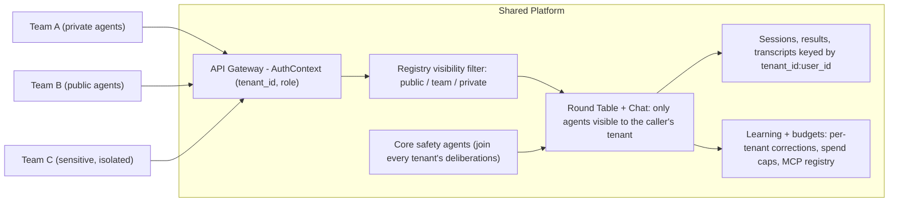

# Platform Deployment Guide

How to deploy this scaffold as a shared AI platform where multiple teams connect their own agents, with tenant isolation, RBAC, and cross-team agent sharing.

---

## Architecture Overview



Every request carries an `AuthContext`; agent visibility, session state, learned corrections, budgets, and MCP servers are all partitioned by `tenant_id`, so Team C's agents and data never appear in Team A's deliberations.

---

## Step 1: Enable Multi-Tenancy

The scaffold ships with `AuthContext` that propagates `tenant_id` to all routes. By default, everything is `"default"`. To enable real multi-tenancy:

### 1a. Replace API key auth with JWT/OIDC

Edit `src/<project>/api/middleware/auth.py`. Replace the API key logic in `verify_api_key` with your identity provider:

```python
async def verify_api_key(
    request: Request,
    credentials: HTTPAuthorizationCredentials | None = Security(security_scheme),
) -> AuthContext:
    # Replace this with your identity provider
    # Example: decode JWT, extract tenant_id and role
    if credentials is None:
        raise HTTPException(status_code=401, detail="Missing credentials")

    payload = decode_jwt(credentials.credentials)  # Your JWT decoder
    context = AuthContext(
        api_key=credentials.credentials,
        user_id=payload["sub"],
        tenant_id=payload["org_id"],      # Maps to tenant isolation
        # Add custom fields as needed:
        # role=payload.get("role", "viewer"),
    )
    # Keep this mirror: activity tracking (and any middleware that runs
    # outside the dependency graph) reads request.state.auth_context to
    # attribute events to the caller's tenant/user.
    request.state.auth_context = context
    return context
```

Every route in the system already receives `AuthContext` -- no other changes needed for tenant identification. Once your IdP integration is live, set `MULTI_TENANT_AUTH_ENABLED=true` in the environment: it is a detection-only declaration that makes the activity middleware log a one-time warning if an authenticated request's event ever resolves to the `"default"` tenant (the signature of a broken `request.state.auth_context` mirror; unauthenticated traffic such as health probes legitimately falls back to `"default"` and never triggers it). It never blocks anything.

> **SECURITY: JWT Verification**
> - Always verify the JWT signature cryptographically against your IdP's public key. Never use decode-only.
> - Validate `iss` (issuer), `aud` (audience), and `exp` (expiry) claims.
> - Reject `alg: none` and weak algorithms. Use `RS256` or `ES256`.
> - Example: `jwt.decode(token, public_key, algorithms=["RS256"], audience="your-app")`
> - Never trust tenant_id from the request body. Always extract it from the verified JWT.

### 1b. Add role to AuthContext

Edit the `AuthContext` dataclass in `auth.py`:

```python
@dataclass
class AuthContext:
    api_key: str | None = None
    user_id: str = "anon"
    tenant_id: str = "default"
    role: str = "viewer"  # Add this: "admin", "member", "viewer"
```

---

## Step 2: Add RBAC (Role-Based Access Control)

Create a permission check dependency. Add to `api/middleware/auth.py`:

```python
from functools import wraps

ROLE_HIERARCHY = {"admin": 3, "member": 2, "viewer": 1}

def require_role(minimum_role: str):
    """FastAPI dependency that enforces a minimum role."""
    def dependency(auth: AuthContext = Depends(verify_api_key)):
        user_level = ROLE_HIERARCHY.get(auth.role, 0)
        required_level = ROLE_HIERARCHY.get(minimum_role, 0)
        if user_level < required_level:
            raise HTTPException(
                status_code=403,
                detail=f"Requires {minimum_role} role (you have {auth.role})",
            )
        return auth
    return dependency
```

Then use it on sensitive routes:

```python
# Anyone can chat
@router.post("/chat")
async def send_message(auth: AuthContext = Depends(verify_api_key)): ...

# Only members can submit round table tasks
@router.post("/round-table/tasks")
async def submit_task(auth: AuthContext = Depends(require_role("member"))): ...

# Only admins can register agents
@router.post("/agents")
async def register_agent(auth: AuthContext = Depends(require_role("admin"))): ...
```

### Recommended route-to-role matrix

Apply `require_role` to every route. Here's the recommended minimum:

| Route | Method | Minimum Role | Rationale |
|-------|--------|-------------|-----------|
| `/resolve` | POST | viewer | Cheapest tier: one enforced call, escalates to chat |
| `/chat` | POST | viewer | Low-risk, read-oriented |
| `/chat/stream` | POST | viewer | Same as chat |
| `/chat/clear` | POST | member | Modifies state |
| `/chat/escalate` | POST | member | Triggers full round table |
| `/round-table/tasks` | POST | member | Expensive (LLM calls) |
| `/round-table/tasks/{id}` | GET | viewer | Read-only |
| `/round-table/search` | GET | viewer | Read-only |
| `/agents` | GET | viewer | List visible agents |
| `/agents` | POST | admin | Registers new agent |
| `/agents/{id}` | GET | viewer | Read-only |
| `/agents/{id}` | DELETE | admin | Removes agent |
| `/agents/health` | POST | admin | Triggers outbound HTTP |
| `/feedback` | POST | member | Records signals |
| `/feedback` | GET | viewer | Read-only |
| `/preferences` | POST | member | Modifies preferences |
| `/preferences` | GET | viewer | Read-only |
| `/checkins` | GET | viewer | Read-only |
| `/checkins/{id}/respond` | POST | member | Approves/rejects |
| `/reports/governance` | GET | admin | Aggregated oversight data (counts only, but org-wide) |
| `/health` | GET | (public) | K8s probes, no auth |
| `/health/ready` | GET | (public) | K8s probes, no auth |
| `/metrics` | GET | admin | Operational data |
```

---

## Step 3: Register Team Agents with Visibility

When a team registers their agents, set `visibility` and `tenant_id`:

### Local agents (Python, running in the platform)

```python
# In gateway.py or a team-specific startup script
from <project>.agents.registry import AgentEntry

# Team A: private agents (only Team A can use them)
registry.register_local(
    TeamAAnalyst(llm_client=llm_client),
    capabilities=["compliance"],
)
# Manually set visibility after registration
entry = registry.get_entry("team_a_analyst")
entry.visibility = "team"
entry.tenant_id = "team_a"

# Team B: public agents (everyone can use them)
registry.register_local(
    TeamBReviewer(llm_client=llm_client),
    capabilities=["code_review"],
)
# Public by default -- visible to all tenants
```

### Remote agents (any language, running externally)

Teams register their agents via the API:

```bash
# Team C registers a private, sensitive agent
curl -X POST https://platform.example.com/api/v1/agents \
  -H "Authorization: Bearer $TEAM_C_JWT" \
  -H "Content-Type: application/json" \
  -d '{
    "name": "incident_responder",
    "domain": "security incident analysis",
    "base_url": "https://team-c-internal.example.com",
    "capabilities": ["incident_response", "forensics"]
  }'
```

Registration already respects tenant isolation out of the box: the `register_agent` route passes `auth.tenant_id` to `registry.register_remote()`, the registry keys every entry by `(tenant_id, name)` (so two tenants can each own an agent with the same name), and all agents-API operations -- list, get, health, rotate/revoke credentials, suspend/unsuspend, unregister -- resolve only within the caller's tenant. Cross-tenant access returns 404, never 403, so agent existence in other tenants does not leak. In-process dispatch gates (identity verification, capability/scope filtering, last-active tracking) resolve the dispatched agent by object identity, so a same-name agent in another tenant never weakens them. What remains yours: harden the visibility default (see the checklist below).

### Visibility rules

| Visibility | Who can see it | Who can use it in round tables |
|------------|----------------|-------------------------------|
| `public` | All tenants | Any team's chat or round table |
| `team` | Same tenant only | Only the registering team |
| `private` | Registering user only | Only the specific user |

> **SECURITY: Visibility enforcement checklist**
> - `GET /agents` is the tenant's MANAGEMENT view: it lists only agents registered by the caller's tenant (via `registry.list_info(tenant_id=...)`), including suspended ones. Dispatch-time visibility (which agents join a round table, including other tenants' `public` agents) is the separate `registry.list_for_tenant(auth.tenant_id)` filter, already used by the round-table and chat paths.
> - For `private` agents, `list_for_tenant` alone is insufficient -- it filters by tenant but not user. Implement `list_for_user(tenant_id, user_id)` that also checks `entry.user_id == auth.user_id` for private agents.
> - Only platform admins should set `visibility="public"`. Default all new registrations to `"team"`. Reject `visibility="public"` from non-admin callers.
> - Never read `tenant_id` from the request body. Always use `auth.tenant_id` from the verified JWT.
> - Update `_save_remote_agents` and `_load_remote_agents` in `registry.py` to persist `tenant_id` and `visibility` fields. Without this, remote agents revert to `visibility="public"` and `tenant_id="default"` on restart.

---

## Step 4: Isolate Sensitive Teams

For a team like Team C that handles sensitive data (security incidents, legal, HR):

### Data isolation

Chat sessions, harness sessions, round table results, and transcript search are
keyed or filtered by `{tenant_id}:{user_id}`. To complete isolation, map
`auth.tenant_id` to `project_id` when creating feedback, trust, preference, and
check-in trackers.

### Complete data store isolation checklist

| Data Store | Current Isolation | What You Add |
|------------|------------------|--------------|
| Chat sessions (`_orchestrators`) | Keyed by `tenant_id:user_id:session_id` | **Already isolated** |
| Harness sessions (`_sessions`) | Keyed by `tenant_id:user_id:session_id` | **Already isolated** |
| Round table result cache | Keyed by `tenant_id:user_id:task_id` | **Already isolated** |
| Transcript search index | Stores and filters by `tenant_id:user_id` owner key | **Already isolated** |
| Feedback signals (SQLite) | Has `project_id` column | Map `auth.tenant_id` to `project_id` |
| Agent trust scores (SQLite) | Has `project_id` column | Map `auth.tenant_id` to `project_id` |
| User preferences (SQLite) | Has `project_id` column | Map `auth.tenant_id` to `project_id` |
| Check-ins (SQLite) | Has `project_id` column | Map `auth.tenant_id` to `project_id` |
| Vector search | Project-scoped embeddings | Prefer pgvector with Postgres for shared production platforms; include `tenant_id` in filters/index keys |
| Agent registry | Has `tenant_id` + `visibility` fields | Use `list_for_tenant()` everywhere |
| LLM usage tracking | Global accumulator | Aggregate by `auth.tenant_id` for billing |

> **SECURITY:** Prefer tenant-scoped queries over post-query filtering. Post-query filtering (e.g., fetching all transcripts then removing other tenants') can leak data through timing side channels, error messages, or log entries. Where possible, pass `tenant_id` into the query itself.

### Agent isolation

Set `visibility="private"` or `"team"` on all of Team C's agents. Update the round table to only include agents visible to the requesting tenant:

```python
# In the submit_task route, before creating the RoundTable:
visible_agents = registry.list_for_tenant(auth.tenant_id)
agents = [e.agent for e in visible_agents if e.healthy]
```

### LLM isolation (optional)

If Team C needs separate LLM credentials (different API key, different model):

```python
# Per-tenant LLM client
tenant_llm_clients = {
    "team_c": create_client(api_key=os.environ["TEAM_C_API_KEY"]),
    "default": create_client(),
}
llm = tenant_llm_clients.get(auth.tenant_id, tenant_llm_clients["default"])
```

---

## Step 5: Connect External Team Agents Safely

When a new department wants to connect their agent to the platform:

### What they need to implement

Three HTTP endpoints (any language):

```
POST /analyze   -- Returns AgentAnalysis JSON
POST /challenge -- Returns AgentChallenge JSON
POST /vote      -- Returns AgentVote JSON
```

See [AGENT_PROTOCOL.md](AGENT_PROTOCOL.md) for the full HTTP contract with JSON schemas and examples.

### What the platform does automatically

- **SSRF protection**: The agent's `base_url` is validated at registration (no private IPs, no cloud metadata endpoints), and DNS is re-resolved and re-checked against the same blocklist before every request attempt -- including each retry -- (`security/validators.py`, `revalidate_url_at_connect`), so a hostname rebound to an internal address after registration is refused; a resolver failure at re-check time fails closed. Residual TOCTOU: the re-check and the connect within one attempt are still two separate resolutions, so a rebind landing in that gap wins; for high-assurance deployments pin the resolved IP at the transport or use an IP allowlist. Escape hatches for endpoints that legitimately resolve to private addresses: `validate_url(..., allow_private=True)` at registration time (local dev), and `RemoteAgent(..., allow_private_endpoint=True)` for directly constructed agents pointing at docker-compose service names or corp-internal hostnames (skips the connect-time re-check -- only for endpoints you control).
- **Response sanitization**: All agent responses are sanitized for prompt injection and size-limited (5MB body, 50K per field)
- **Evidence enforcement**: The enforcement pipeline validates the agent's analysis before it enters the challenge phase
- **Rate limiting**: Per-IP rate limits on all endpoints (per-tenant when you add tenant-based keying)

Agent calls are synchronous: the orchestrator dispatches `/analyze`,
`/challenge`, and `/vote` over HTTP and waits (with timeout and retries)
for each response. There is no async callback path -- an earlier webhook
receiver was removed because nothing ever consumed its results; if your
agents need long-running work, poll or queue inside your agent behind
the synchronous endpoint contract.

### Onboarding checklist for a new team

1. Team gets a JWT/API key with their `tenant_id` and `role` from your identity provider
2. Team builds their agent (any language) implementing the 3-endpoint protocol
3. Team registers via `POST /api/v1/agents` with their credentials
4. Platform admin sets visibility (`public` if shared, `team` if private)
5. Team's agent now participates in their round tables and chat sessions
6. Core safety agents (Skeptic, Quality, Evidence, FactChecker, Citation, Sentinel) automatically participate alongside the team's agents

---

## Agent Integrity

Once multiple teams connect agents, the agents themselves become an attack surface. The platform ships with a set of integrity controls, each mapped to a concrete threat:

| Threat | Control |
|--------|---------|
| Agent impersonation (a rogue process claims to be a registered agent) | JWT identity tokens, verified at every dispatch |
| Agent spam (one agent floods deliberations, burning LLM budget) | Per-agent rate limits (default 100 calls/hour) |
| Data exfiltration via scope creep (an agent reads context it has no business seeing) | Scope filtering on input + output source audit |
| Compromised or misbehaving agent needing emergency removal | Suspension + credential revocation |
| Forgotten agents (registered once, never cleaned up, still credentialed) | Dormancy flagging after inactivity |
| Degraded deliberations (so few agents respond the result is not trustworthy) | `min_quorum` on round table results |

### Identity tokens

Every registered agent gets a platform-issued JWT (HS256) binding its name, tenant, scopes, and meta-agent flag. Orchestrators verify the token before every dispatch:

- Local agents without tokens are allowed (backward compatible).
- Remote agents without tokens are **blocked** until credentials are rotated.
- Suspended agents and agents with invalid/expired tokens are always blocked.

Only the SHA-256 hash of a token is ever persisted -- the raw token is shown exactly once at issuance. After a restart, reloaded remote agents have no raw token in memory and must rotate before they dispatch again.

Configure via environment:

```bash
# Required in production (64+ char hex). Generate one:
#   python -c "import secrets; print(secrets.token_hex(32))"
AGENT_IDENTITY_SIGNING_KEY=<64+ char hex>

# Kill switch (dev only). Skips signature checks but STILL enforces
# token expiry. Ignored in production.
AGENT_IDENTITY_ENABLED=true

# Days without dispatch before an agent is flagged dormant (default 30)
AGENT_DORMANT_AFTER_DAYS=30
```

In development, an ephemeral signing key is generated per process, so tokens do not survive restarts -- fine for local work, wrong for production.

The token layer is also an extension point: `issue_token` / `verify_token` / `hash_token` in `agents/identity.py` are the entire boundary between the registry and the JWT implementation. To integrate an external workload-identity provider or token authority (a corporate STS, a service-mesh identity system, a secrets platform that issues short-lived credentials), replace those three functions -- callers, dispatch gates, and the credential API keep working without interface changes.

### Credential lifecycle endpoints

```bash
# Re-issue an agent's token. The raw token is returned ONCE -- store it securely.
curl -X POST https://platform.example.com/api/v1/agents/incident_responder/credentials/rotate \
  -H "Authorization: Bearer $ADMIN_JWT"

# Revoke credentials. Remote agents are blocked at dispatch until rotated.
curl -X DELETE https://platform.example.com/api/v1/agents/incident_responder/credentials \
  -H "Authorization: Bearer $ADMIN_JWT"

# Emergency removal from all deliberations and tenant listings (reversible)
curl -X POST https://platform.example.com/api/v1/agents/incident_responder/suspend \
  -H "Authorization: Bearer $ADMIN_JWT"
curl -X POST https://platform.example.com/api/v1/agents/incident_responder/unsuspend \
  -H "Authorization: Bearer $ADMIN_JWT"
```

`GET /api/v1/agents` reports `suspended`, `credential_status` (`active`/`none`), `expires_at`, `last_active`, and `dormant` per agent, so an audit of stale or de-credentialed agents is one API call. Restrict rotate/revoke/suspend to admins in your `require_role` matrix.

### Rotate before expiry

Identity tokens carry an `exp` claim set at issue time from `AGENT_DEFAULT_TTL_DAYS` (default 7 days in production/staging, 90 in dev, clamped by `AGENT_MAX_TTL_DAYS`). Expiry is enforced at every dispatch -- even with the `AGENT_IDENTITY_ENABLED=false` kill switch, which skips signature checks but keeps expiry -- so an agent whose token lapses silently drops out of deliberations.

Two things make that visible instead of silent:

- **Register and rotate responses return `expires_at`** (ISO 8601 UTC), and agent listings/detail include it per agent. Schedule rotation before that timestamp passes; there is no auto-renewal.
- **Agents blocked by the identity gate at dispatch record an `agent_identity_blocked` integrity flag** (when a learning store is available -- the API gateway threads it automatically). Repeated blocks for the same agent dedupe into one unresolved flag with a hit counter, so `GET /api/v1/activity/anomalies` shows you which agents are being excluded and how often. Flag persistence is fire-and-forget: it never fails or slows dispatch.

Operationally: watch for `agent_identity_blocked` flags and read the `reason` field in the flag detail before acting. `invalid_or_expired_token` and `missing_token` mean "this agent's credential needs rotation now" -- the deliberations it missed are already degraded. `suspended` is expected while an agent is administratively suspended (the flag documents the exclusion; it is not a credential problem). `ambiguous_name` means the registry cannot resolve the agent to a single entry (same name in multiple tenants) and needs an operator to fix the registration.

### Scopes and rate limits

Registration accepts `access_scopes`, `max_calls_per_hour`, and `is_meta_agent`. Scopes name the task-context keys the agent may read; before dispatch the context is filtered down to those keys, and after dispatch any finding citing a data source outside the agent's scopes is logged as a violation. An empty scope list means unrestricted (the zero-config default). Meta-agents additionally always receive `peer_analyses`.

```bash
curl -X POST https://platform.example.com/api/v1/agents \
  -H "Authorization: Bearer $TEAM_JWT" \
  -H "Content-Type: application/json" \
  -d '{
    "name": "finance_analyst",
    "domain": "financial analysis",
    "base_url": "https://finance-team.example.com",
    "access_scopes": ["financial", "budgets"],
    "max_calls_per_hour": 50
  }'
```

### Quorum degradation

A round table where most agents were skipped (suspended, rate limited, bad credentials) or crashed can quietly produce a one-agent "consensus". `RoundTableConfig.min_quorum` (default 2) guards this: when at least one agent failed or was gated AND fewer successful domain-agent analyses than `min_quorum` remain, the result is marked `degraded=True` with `failed_agent_count` set. Surface this flag to users -- a degraded deliberation is a signal to retry, not a verdict.

### Premise refusal gate (Phase 0.5)

Before any expensive phase, each agent gets one cheap, low-temperature LLM call judging whether the task's premise is sound (`orchestration/premise.py`). When at least `RoundTableConfig.refusal_threshold` agents independently refuse, the run short-circuits: the API returns `status="refused"` with what is wrong, what is missing, and a better question. The threshold is clamped to a floor of 2 (a single compromised agent can never veto a room alone) and a ceiling of half the room. The gate fails open -- a parse failure or LLM error counts as "proceed", and with no LLM configured the gate is skipped; the Sentinel's fail-closed screening remains the backstop for hostile input. Disable with `premise_challenge_enabled=False`.

---

## Agentic Governance

Agent integrity controls govern individual agents; agentic governance governs the deliberations themselves -- how much autonomy a deployment grants, what each tenant may spend, and what trace a run leaves behind. Four controls compose:

1. **Graduated autonomy** (`orchestration/autonomy.py`): trust levels 1 (most trusted) through 6 (most restricted) map to an `AutonomyPolicy` -- approval gate, specialist cap, rate-limit multiplier, and conflict auto-escalation. Set `RoundTableConfig.autonomy_level` or pass `autonomy_level=` to the chat orchestrator, which caps consulted specialists and auto-escalates to a full round table on specialist conflict per policy. Unknown or invalid levels always resolve to the most restrictive policy (fail-safe).
2. **Per-tenant budgets** (`llm/budget_manager.py`): each tenant gets a spend cap with a warn threshold. The LLM client checks the budget *before* every provider call and raises `BudgetExceededError` for exhausted tenants; spend is recorded after each call and persists in the learning store's `budget_spend` table. A budget of 0 means unlimited.
3. **Deliberation audit trail** (`orchestration/deliberation_audit.py`): metadata-only events (phases, agent counts, durations, outcomes) keyed by correlation id in the `audit_events` table. Detail values are structurally restricted to numbers, booleans, and short labels, so the trail cannot leak prompt or response content. Each completed run also stores a reasoning-chain SHA-256 (`security/reasoning_chain_hash.py`) computed over its ordered phase artifacts -- recompute it from the recorded phases and compare to catch after-the-fact edits (tamper-evident within a run; see [GOVERNANCE.md](GOVERNANCE.md) for the honest boundary). Outputs can additionally be signed and verified via `enforcement/signer.py` (`OUTPUT_SIGNING_KEY`).
4. **Check-ins** (`learning/checkin_manager.py`): when the resolved policy requires human approval, the round table marks its result `requires_approval=True` and opens a check-in a human must answer before the recommendation is acted on.

Composed, the flow is: a request enters at some autonomy level, the policy caps how many agents deliberate, the budget gate bounds what the deliberation may cost, the auditor records that it happened, and restricted levels end in a human approval gate rather than autonomous action.

### Configuration

```bash
# Tune individual policy fields per level (partial JSON overrides; malformed
# or invalid values are logged and ignored -- defaults win):
AUTONOMY_POLICIES='{"2": {"max_specialists": 3}, "4": {"rate_limit_multiplier": 1.0}}'
```

The gateway wires a learning-store-backed `BudgetManager` and `DeliberationAuditor` at startup (non-fatal when the store is unavailable) and attaches the budget manager to the LLM client.

### API routes

| Route | Method | Purpose |
|-------|--------|---------|
| `/api/v1/budgets/{tenant_id}` | GET | Budget config, current spend, and status for a tenant |
| `/api/v1/budgets/{tenant_id}` | PUT | Set or replace a tenant's spend cap and warn threshold |
| `/api/v1/audit/deliberations/{correlation_id}` | GET | Metadata timeline for one deliberation run (404 when empty) |
| `/api/v1/corrections` | POST | Propose a correction (override-screened; PII-redacted) |
| `/api/v1/corrections` | GET | List this tenant's corrections (filter by `status`, `agent_id`, `stale`, `currently_valid`) |
| `/api/v1/corrections/{id}/approve` | POST | Approve -- approver is the authenticated caller (four-eyes posture per `CORRECTIONS_FOUR_EYES`); on a successor row invalidates the ancestor (501 without `store.update_if`; 409 on a lost race) |
| `/api/v1/corrections/{id}/supersede` | POST | Propose a successor with `supersedes_id={id}`; ancestor is invalidated only when the successor is approved (same defense stack as `POST /corrections`; ancestor must be a currently-valid approved row in the caller's tenant) |
| `/api/v1/corrections/{id}/reject` | POST | Reject a proposed correction (terminal) |
| `/api/v1/corrections/{id}/retire` | POST | Retire an approved correction |
| `/api/v1/corrections/{id}/revalidate` | POST | Re-confirm an approved correction (refreshes staleness clock, updated_at untouched) |
| `/api/v1/corrections/{id}` | DELETE | GDPR Art. 17 hard-delete (daily-capped, audited); refused (409, body names successor ids) while any successor points at this row -- erase top-down |
| `/api/v1/reflections` | GET | Process lessons from past deliberations (filter by `reflection_type`) |
| `/api/v1/mcp/servers` | POST / GET | Register / list this tenant's MCP servers |
| `/api/v1/mcp/servers/{name}` | DELETE | Remove an MCP server registration |
| `/api/v1/mcp/servers/{name}/health` | POST | Reachability + tool count |
| `/api/v1/mcp/servers/{name}/invoke` | POST | Call one tool (sanitized output) |

The corrections routes make the platform API-first for the learning loop: a non-Python client (or a reviewer UI) can drive the whole propose -> approve -> retire lifecycle over HTTP. `created_by`/`approved_by` always come from the authenticated caller, so the four-eyes rule cannot be spoofed by naming someone else in a request body.

See [GOVERNANCE.md](GOVERNANCE.md) for the full capability matrix, the honest "known limitations / non-claims" list, and extension points.

---

## Scaling the Learning Layer

The extended learning tables (corrections, activity events, agent dispatch stats, integrity flags, reflections, error schemas) sit behind a deliberately tiny `LearningStore` protocol in `learning/store.py` (table definitions live in `learning/tables.py`) -- six methods (`ensure_schema` / `insert` / `query` / `update` / `count` / `delete`) with allowlist-validated identifiers and parameterized values. Two reference backends ship with the scaffold:

- **SQLite (default)** -- stdlib `sqlite3`, zero configuration, right for single-node deployments.
- **Postgres (opt-in)** -- answer `learning_backend=postgres` at generation time, or set `LEARNING_BACKEND=postgres` plus `LEARNING_POSTGRES_DSN` at runtime, and install the extra: `pip install '.[postgres]'`.

Because every caller goes through the protocol, enterprise deployments extend without touching callers:

- **Row-level security**: every table carries `tenant_id`, so Postgres RLS policies keyed on it give hard tenant isolation. See the [Postgres RLS appendix](#appendix-postgres-row-level-security-rls-for-the-learning-tables) for copy-paste policies, the honest limits on the shipped autocommit store, and a policy-coverage CI check.
- **pgvector**: co-locate the vector store with the learning tables in the same Postgres instance.
- **Alembic migrations**: the built-in forward-only `MIGRATIONS` list is fine for a handful of schema changes; swap in Alembic when schema churn justifies it.
- **Bring your own store**: implement the six methods against anything (MySQL, DynamoDB, an internal storage service).

**Retrieval ranking on the default in-memory store.** Out of the box (no embedding provider configured), preference and transcript search rank with pure-Python BM25 -- honest lexical ranking, resistant to the keyword-stuffing that gamed the old binary scorer. Set a real embedding provider (`EMBEDDING_PROVIDER=local|openai|auto`) to unlock the hybrid path: BM25 and cosine similarity fused with Reciprocal Rank Fusion, which is where retrieval quality actually comes from -- the deterministic hash fallback is filler, not semantics. Two integration notes: result `score` scales differ by path (raw BM25 when lexical-only, RRF sums when hybrid, 0-1 fractions on the legacy path), so compare scores only within one result set; and `LEXICAL_RANKING_ENABLED=false` restores the old scorer byte-identically if downstream code depended on it. The Chroma/pgvector paths are unaffected -- BM25 applies to the in-memory store only.

### Learning loops, honestly framed

Every learning surface answers three questions -- what evolves, what feedback drives it, and where the loop closes. None of them closes on model-generated signal:

| Surface | What evolves | Feedback signal | Where the loop closes |
|---------|-------------|-----------------|----------------------|
| Corrections | Prompt-grounded knowledge | Human propose -> approve (four-eyes posture) | At human approval, never before -- unapproved text never reaches a prompt |
| Error schemas | Generalized schemas served alongside corrections | Clusters of >= 3 approved corrections from >= 2 proposers | Auto-extracted on approval, but derived only from human-approved inputs |
| Trust scores | Per-agent EMA feeding routing (bounded: at most +0.19 of a routing score) | **External** human accept/reject/modify signals via the feedback surface | On each human signal write; the trust-guard defenses (decay, min-interaction gate, burst flags) are read-time and detect-only |
| Preferences / graduation | Cross-project global profile | Stable observed preference patterns | Only through an explicitly approved graduation check-in |
| Reflections | Nothing at runtime | Structured deliberation fields (deterministic, no LLM) | Deliberately OPEN -- reflections are a read-only report surface |
| Detection layer (baselines, collusion, drift, poisoning, bursts) | Nothing | Integrity flags for humans | A human resolving the flag -- detect, never act |

The consistency rule behind the table: loops close on EXTERNAL human signal or stay open. Trust hardening is driven by human accept/reject feedback; routing decisions derived from the system's own reflections were considered and REJECTED as a self-consuming loop (the system grading its own homework and then acting on the grade). Reflections therefore stay a report surface, and every detector flags for a human instead of feeding anything back into behavior.

### Learning integrity

The learning layer reshapes agent behavior, so it gets its own integrity controls. All findings are persisted as integrity flags and surfaced through `GET /api/v1/activity/anomalies` (resolve via `POST /api/v1/activity/anomalies/{flag_id}/resolve`) -- nothing is auto-rejected or auto-suspended; a human closes every flag:

- **Corrections lifecycle**: corrections only influence prompts after human approval, with an explicit four-eyes posture (`CORRECTIONS_FOUR_EYES`) and a check-in opened per proposal. `strict` rejects approver == proposer with a 409 -- use it once your IdP gives callers real distinct identities. `warn` (the default) allows self-approval but logs loudly and records a `four_eyes_unenforceable` integrity flag once per (tenant, approver): under the scaffold's single API key every caller is the same user, so strict mode would make approval impossible -- warn mode keeps single-operator deployments working while making the gap visible. Library callers can pin `require_four_eyes=True` (always strict) or `False` (silently allowed). The full lifecycle is exposed over HTTP at `/api/v1/corrections` (see the governance API routes above).
- **Corrections validity + human-gated supersession**: approved rows carry `valid_at` / `invalid_at` / `supersedes_id` (v9 migration, `''` = still-valid sentinel). `POST /corrections/{id}/supersede` proposes a successor with the ancestor id -- content-policy, PII redaction, and override screening run identically to `POST /corrections`, so ancestor-invalidating writes get the same posture as any propose. Four-eyes on the supersession approve applies to the successor pair (`created_by` vs `approved_by` on the new row) -- NOT the ancestor's proposer. On approve of a successor: successor transitions to approved (`valid_at` set), then a conditional `store.update_if` on the ancestor invalidates it (`invalid_at=now`, `updated_at` untouched); a lost race compensates the successor (invalidates it), records a `supersession_partial_failure` integrity flag, and returns 409. `store.update_if` is REQUIRED for this write path -- stores that lack it return 501 with the successor still `status=proposed` (no silent unconditional-write fallback). `get_approved_for_context` filters `invalid_at=''` on the hot path, so invalidated ancestors drop out of grounding immediately after approve. Every successful supersession approve writes a metadata-only `correction_superseded` audit event (best-effort/fire-and-forget; audit failure never fails the approve) -- query via `GET /audit/deliberations` or scan `audit_events`. Erasing an ancestor while any successor still points at it returns 409 (body names the blocking successor ids) -- erase top-down; a chain of length N under the default `ERASURE_DAILY_CAP=10` may take multiple days. Compensated-loser rows are distinguishable via their `supersession_partial_failure` integrity flag (subject_id = successor id).
  - **Behavior change for upgraders** (`stale=true` default): `GET /corrections?stale=true` now defaults to currently-valid rows (`invalid_at=''`), so invalidated ancestors no longer appear in the aging review queue. Pass `currently_valid=false` alongside `stale=true` to surface invalidated history. The full listing (no query params) is unchanged.
- **Right to be forgotten**: `learning/erasure.py` hard-deletes a correction on request (GDPR Art. 17) -- an actual row delete, not a status flip -- with a per-tenant daily cap (`ERASURE_DAILY_CAP`, default 10) so a compromised credential cannot bulk-wipe learned knowledge, and a metadata-only audit event recording that the erasure happened. Derived artifacts: error schemas citing the erased correction are deleted and re-extracted from the remaining corrections only (the erased text does not survive in generalized form), and the approval check-ins opened for the correction -- their prompts embed the original/corrected claim verbatim, and expiry alone never deletes them -- are hard-deleted whatever their status (the API passes the check-in manager through; library callers must do the same to get this sweep, and the response's `checkins_deleted` count reports what happened). Reflections and the RAG preference/transcript indexes are not derived from corrections and are untouched. Backups and text already sent to LLM providers remain out of scope (see GOVERNANCE.md Non-Claims).
- **Context budget**: approved corrections render into prompts under a character budget (`CORRECTION_CONTEXT_BUDGET`, default 4000) with sanitized fields.
- **Override screening**: each proposed correction is screened for prompt injection, safety-agent targeting ("ignore the skeptic"), and evidence-level inflation before it reaches a reviewer.
- **Collusion detection** (opt-in, default off): pairwise vote-lockstep and reciprocal never-challenge analysis flags agent pairs that stop checking each other. Set `COLLUSION_DETECTION_ENABLED=true` and the gateway feeds every round-table deliberation's votes into one per-process detector -- detect-only (integrity flags + an optional check-in per finding), fire-and-forget. Note the vote window lives in process memory: lockstep findings need >= 5 rounds within one process lifetime, and a restart resets the window (see GOVERNANCE.md Non-Claims).
- **Correction drift** (opt-in, default off): a rising share of "softening" language in recent approved corrections flags a possible slow-poisoning campaign. Set `LOOP_INTEGRITY_DETECTION_ENABLED=true` and the gateway runs `analyze_correction_drift` on each corrections approval, cooldown-gated so repeat approvals cannot flood duplicate flags. Library users are NOT auto-wired -- pass the hook explicitly:

  ```python
  from <project>.learning import CorrectionsManager, create_drift_check_hook

  manager = CorrectionsManager(
      store,
      on_approve=create_drift_check_hook(store),  # None while the flag is off
  )
  ```

  The flag is evaluated when the hook is CREATED -- set
  `LOOP_INTEGRITY_DETECTION_ENABLED` before constructing the manager, or the
  callback is silently `None` (the gateway re-creates the hook per approval,
  so it picks up the flag live). The hook derives the tenant from the
  approved `Correction` it receives. The same flag also activates the multi-turn poisoning scan on chat turns (see GOVERNANCE.md's Loop-integrity detection row); both are detect-only.
- **User activity anomalies**: per-user request bursts, repeated auth failures, and agent-registration sprees trip configurable thresholds (`ACTIVITY_TRACKING_ENABLED` to opt out).
- **Agent behavioral baselines** (opt-in, default off): each agent's refusal rate, confidence, latency, and scope discipline are compared against its own history -- an agent with valid credentials that stops behaving like itself still gets flagged. Set `BASELINE_TRACKING_ENABLED=true` and every round-table/chat dispatch records its stats (duration, refusal, confidence, scope violations) under the caller's tenant; `resolve`/single-shot dispatches are not covered. Recording is wired; run `AgentBaselineTracker.check_deviation` (or `compute_baseline`) from your review tooling to analyze drift.
- **Delegation records** (opt-in, default off): set `DELEGATION_RECORDS_ENABLED=true` and every gated dispatch writes one `delegation_records` row -- task id, tenant, phase (`analyze`/`challenge`/`vote`), agent, and `derived_from_json` naming the upstream artifacts that fed that dispatch (analyze: nothing; challenge: the agents whose Phase-1 analyses were consumed; vote: the synthesis). **Be clear about what these document: phase-derivation hops in the hub-and-spoke orchestration.** Agents never call each other in this architecture, so there are no agent-to-agent calls to record -- the rows answer "whose output influenced this dispatch", which is what incident reconstruction actually needs. Writes are fire-and-forget off the event loop (a failing store never fails or slows a dispatch), and nothing analyzes the rows automatically -- they are query material for your review tooling (`learning/delegation.py`).
- **Extraction sequences** (opt-in, default off): `harness/sequence_detector.py` backward-chains over recent activity to catch multi-step playbooks (query -> pull backing corrections -> export) that individually stay under the volume thresholds above. Patterns are expressed against your own routes; matches persist as integrity flags. Set `SEQUENCE_DETECTION_ENABLED=true` and the scan runs on the activity middleware's sampled pass (`ACTIVITY_CHECK_SAMPLE_N`, default every 25th request) -- it needs activity tracking and a learning store.
- **Timing regularity**: `learning/timing_analysis.py` computes the coefficient of variation over a user's inter-request intervals; a suspiciously LOW CV (machine-like cadence, e.g. a scraper on a fixed timer) is flagged. Runs on a sampled schedule from the activity middleware (`ACTIVITY_CHECK_SAMPLE_N`, default every 25th request -- the same sampling also runs the burst-threshold check). Tune `TIMING_MIN_SAMPLES` / `TIMING_CV_THRESHOLD`; expect false positives from cron jobs and monitors.
- **Extraction guard**: `learning/extraction_guard.py` counts knowledge-endpoint reads (GET /corrections and friends) per user and tenant-wide over a rolling window (`EXTRACTION_USER_THRESHOLD` / `EXTRACTION_TENANT_THRESHOLD` / `EXTRACTION_WINDOW_MINUTES`) and maps them to normal/elevated/capped. Detection-only by default; the single opt-in enforcement point (`EXTRACTION_GUARD_ENFORCE=true`) is a 429 + Retry-After on `GET /corrections` while capped.
- **Approval-pair escalation**: `learning/approval_patterns.py` counts directed proposer->approver pairs over recently approved corrections (`PAIR_APPROVAL_THRESHOLD` / `PAIR_WINDOW_DAYS`); a pair that dominates approvals -- four-eyes satisfied, but always by the same two accounts -- is flagged, with severity escalating on sustained volume. Auto-runs on each approval. Rings of 3+ users evade pair counting (stated non-claim).
- **Approval-health stats** (governance report): a **health check on the human gate** under `GET /reports/governance` → `sections.approval_health` -- propose→approve latency, lifecycle / self-approval / supersession-activity counts, and references to existing integrity flags. Review signal only; see GOVERNANCE Known Limitations (not a rubber-stamping detector).

#### Which detection toggles to enable, and when

Every opt-in hook defaults off so a fresh scaffold has no surprises, and every one is detect-only: findings land as integrity flags in `GET /api/v1/activity/anomalies`, and a human closes each flag. Recommended posture by deployment scenario:

- **Every deployment**: `STARTUP_CANARY_ENABLED=true`. It is a one-shot self-check at boot with no per-request cost, and a failure means the injection-defense machinery itself is broken -- something you want flagged before the first real request, not discovered during an incident.
- **You connect external or third-party agents** (Step 5): `BASELINE_TRACKING_ENABLED=true` and `COLLUSION_DETECTION_ENABLED=true`. These are the two hooks built for agents you do not fully control: baselines catch a credentialed agent that stops behaving like itself, and collusion analysis catches pairs that stop checking each other. Both need a learning store. Two operational notes: `agent_dispatch_stats` grows one row per dispatch with no pruner yet (see the data-retention table), and the deviation analysis itself (`check_deviation`) is operator-invoked -- recording alone flags nothing.
- **You need per-dispatch accountability or incident reconstruction** (audits, regulated deployments, "which agents touched this decision" questions): `DELEGATION_RECORDS_ENABLED=true`. Every gated dispatch leaves a queryable row tying agent, phase, and upstream derivation to the task id, so reconstructing a deliberation after the fact is SQL instead of log archaeology. Needs a learning store; same no-pruner caveat as dispatch stats (one row per agent per phase).
- **Many users can read knowledge endpoints** (corrections, reflections, search): `SEQUENCE_DETECTION_ENABLED=true`, alongside the default-on volume and timing checks it complements. It catches multi-step extraction playbooks that stay under per-endpoint thresholds. Requires activity tracking (`ACTIVITY_TRACKING_ENABLED`, on by default) and a learning store.
- **Internal-only deployment, built-in agents, trusted users**: the defaults are a reasonable floor -- identity checks, rate limits, activity thresholds, and corrections governance are always on. Enable the startup canary anyway; skip the rest until your exposure changes.

`MODEL_ROUTING_ENABLED` is deliberately not in this list: it is a cost feature, not a detector. Enable it only after setting `MODEL_TIER_MAP_JSON` to models your configured provider actually serves (see `.env.example`).

#### Heavier extraction enforcement (recipes)

The shipped default is detect-and-flag; the only built-in enforcement is the opt-in 429 above. If your threat model justifies acting on these signals automatically, these are the recommended shapes -- each is a small, local change, and each trades availability or answer quality for containment, so gate them on a human decision:

- **Budget clamp while elevated**: in the round-table or chat route, call `evaluate_extraction_mode()` and, when elevated, pass a reduced per-request budget (or set a lower `CORRECTION_CONTEXT_BUDGET` for that request) so a suspected extractor gets shallower answers instead of a hard block.
- **Degraded knowledge context while capped**: where `build_knowledge_context` is called, skip the corrections block for capped callers (serve the model's base knowledge only). Never silently truncate the `GET /corrections` listing itself -- return everything or an explicit 429, so operators can trust what they see.
- **Hard-block a flagged pair with override**: on `POST /corrections/{id}/approve`, reject (409) when an UNRESOLVED `approval_pair_dominance` flag exists for the caller's directed pair, and let a reviewer resolve the flag (`POST /api/v1/activity/anomalies/{flag_id}/resolve`) to unblock -- the resolve endpoint doubles as the human override.
- **Contradiction detection**: `learning/contradiction.py` scans a tenant's approved corrections pairwise (pure-Python TF-IDF cosine + a negation/reversal marker list) and flags pairs that likely disagree -- two approved corrections saying "use X" and "stop using X" would otherwise silently fight over agent context. Findings are integrity flags for human review; nothing is auto-retired.

### Learning maturity

Beyond individual corrections, the learning layer compounds knowledge in two deterministic, LLM-free ways:

- **Reflections** (`learning/reflector.py`): after every round table run, up to 3 structured observations about HOW the deliberation worked are extracted from result fields (which agent's findings dominated the synthesis, whether one evidence source dominated, whether the challenge phase moved positions, whether dissenting voters were still incorporated). Capped per session and per tenant per day; read them back at `GET /api/v1/reflections`.
- **Error schemata** (`learning/error_schemata.py`): when an agent accumulates >= 3 approved corrections on the same theme (grouped by agent and evidence level) from >= 2 distinct proposers, `extract_error_schemas()` generalizes them into one reusable schema -- title, description, deduplicated mitigation steps -- stored in the `error_schemas` table. Active schemas render into single-shot resolution context alongside raw corrections, so one schema can replace many near-duplicate entries. Re-running extraction updates schemas in place; the distinct-proposer floor means one user cannot single-handedly shape an agent's standing guidance.

### Adversarial verification

Shipping defenses is not the same as proving they hold. The generated project includes a red-team harness -- `tests/adversarial_payloads.py` (a payload library by attack vector) and `tests/adversarial_agents.py` (6 deterministic hostile agents implementing the agent protocol) -- exercised by `tests/test_adversarial_defense.py`. The hostile agents attack a full round table with injection payloads in every field they can populate; the tests assert no payload survives into the synthesis and that every attack vector is detected. No LLM calls, so the suite is deterministic and free. Extend the payloads and agents with attacks specific to your deployment and it becomes your standing red-team gate.

### Tracing (optional)

Per-phase OpenTelemetry spans are available behind the `[otel]` extra:

```bash
pip install '.[otel]'
```

With the extra installed AND a tracer provider configured (the standard `OTEL_*` environment variables with the SDK's autoconfiguration, or an explicit `set_tracer_provider` in your startup code -- the scaffold never configures one for you), every round-table phase (`deliberation.phase.premise` / `.strategy` / `.independent` / `.challenge` / `.synthesis` / `.vote`) and every chat stage (`chat.phase.route` / `.consult` / `.cross_check` / `.synthesize` / `.enforce`) appears as a span with attributes like `agent_count`. Span naming follows the spirit of the OTel GenAI semantic conventions; no formal convention compliance is claimed.

Without the extra, the span helper is a plain `nullcontext`; with the extra but no provider, spans are non-recording (the OTel API default). Either way the wrapped code runs unchanged -- there is no toggle to set and nothing to configure to keep it off (`observability/tracing.py`).

---

## MCP Connectors

The `connectors/` package integrates external tool servers over the Model Context Protocol without giving agents direct tool access. The platform is the only caller (`connectors/mcp_client.py`), so every call is governed the same way:

- **Registration** (`POST /api/v1/mcp/servers`): each server is registered per tenant with a validated URL (anti-SSRF -- private IPs, localhost, and cloud metadata endpoints are rejected), an `mcp:*` scope key, and a credential env var *reference* (`MCP_*`) -- the secret itself never appears in a request body or the persisted registry file (`MCP_REGISTRY_PATH`). Loaded registry files are re-validated entry by entry, so a tampered file cannot inject an unsafe server.
- **Scope gating**: an MCP server's data enters the round-table task context under its scope key (e.g. `mcp:tickets`), which means the existing `ScopeFilter` decides which agents see it -- only agents whose `AgentCapability.access_scopes` include that key. Registering a server does not expose it to any agent by itself.
- **Enrichment, non-fatal by construction** (`orchestration/mcp_enrichment.py`): before dispatch, the platform calls each needed server's configured default tool. Responses are scanned for injection patterns, sanitized, and boundary-wrapped (`MCP_DATA`) before entering context. A down server, missing credential, or timeout logs a warning and the task proceeds without that data.
- **Direct invocation** (`POST /api/v1/mcp/servers/{name}/invoke`): call one tool ad hoc; output is sanitized before it leaves the platform, and errors come back as structured fields, never stack traces.

The real transport is the official `mcp` SDK, installed via the optional extra (`pip install '.[mcp]'`) -- like the Postgres extra, projects that don't use MCP pay nothing. Tests and custom protocols can inject their own transport into `MCPClient`.

---

## Compliance Considerations for Regulated Industries

If your platform operates in a regulated industry (finance, healthcare, legal, government), AI interactions may be subject to legal discovery, audit, or regulatory review. Consider adding:

### Discoverability awareness

Users interacting with AI agents should be informed that their prompts, agent responses, and round table deliberations may be discoverable in litigation or regulatory proceedings. Common approaches:

- **Chat banner**: Persistent, non-dismissable notice above the chat input (e.g., *"All prompts and AI outputs are potentially discoverable in litigation or regulatory proceedings."*)
- **Round table notice**: Same banner above the round table task submission
- **API response header**: `X-AI-Discoverability-Notice` header on all AI-generated responses
- **Export disclaimer**: Discoverability paragraph appended to any exported reports or artifacts

### Audit trail

The scaffold already writes round table artifacts as JSON and indexes transcripts for search. For regulated deployments, consider adding:

- **Prompt/response hash logging**: SHA-256 hash of every prompt and response stored in a tamper-evident audit database, separate from the application database
- **Immutable storage**: Write artifacts to append-only storage (S3 with object lock, immutable database tables)
- **Timestamp attestation**: Cryptographic timestamps on artifacts for non-repudiation

### Legal hold

When litigation or regulatory investigation is anticipated, log deletion must stop. Consider:

- **Legal hold flag**: Environment variable or config that disables all log cleanup, cache eviction, and data retention policies when active
- **Hold notification**: Log a warning on startup when legal hold is active so operators are aware

### Data retention

Define retention policies for each data store and document them for your legal/compliance team:

| Data Store | Default Retention | Regulatory Consideration |
|------------|------------------|--------------------------|
| Chat sessions | In-memory (lost on restart) | May need persistent storage for compliance |
| Round table artifacts | Filesystem (permanent) | Define retention period with legal team |
| Transcript search index | Vector store / pgvector (permanent if enabled) | Subject to discovery; include in hold policy |
| Feedback signals | SQLite (permanent) | May contain PII; subject to GDPR/CCPA |
| Agent trust scores | SQLite (permanent) | Audit trail for routing decisions |
| Learned corrections | Learning store (until erased) | PII-redacted at write; hard-deletable via `DELETE /api/v1/corrections/{id}` (GDPR Art. 17) |
| Agent dispatch stats (`agent_dispatch_stats`) | SQLite (permanent; grows one row per agent dispatch when `BASELINE_TRACKING_ENABLED`; no pruner yet) | Behavioral telemetry per agent/tenant; define a pruning policy before long-term production use |
| Delegation records (`delegation_records`) | SQLite (permanent; grows one row per agent per phase when `DELEGATION_RECORDS_ENABLED`; no pruner yet) | Phase-derivation audit trail per task/tenant; define a pruning policy before long-term production use |

> **Note:** These are considerations for your legal and compliance team to evaluate. The scaffold provides the infrastructure hooks -- your organization defines the policies.

---

## Summary: What's Built vs What You Add

| Capability | Status | Notes |
|------------|--------|-------|
| AuthContext with tenant_id | **Built** | Propagates to all 25+ routes |
| Agent visibility (public/team/private) | **Built** | `list_for_tenant()` filters by rules |
| Session isolation | **Built** | `{tenant_id}:{user_id}:{session_id}` |
| Core safety agents | **Built** | Auto-included in every round table; evidence/skeptic/sentinel overlay joins every chat consultation |
| Evidence enforcement | **Built** | Runs on Phase 1 round-table analyses; extend validators for challenge and vote paths as needed |
| Chat synthesis enforcement | **Built** | FactChecker checks every chat synthesis, with one corrective re-synthesis on rejection |
| Tenant-aware chat routing | **Built** | Routing and LLM agent suggestions are validated against the tenant-visible agent set |
| Agent integrity (identity tokens, rate limits, scopes, suspension, quorum) | **Built** | Set `AGENT_IDENTITY_SIGNING_KEY` in production; rotate/revoke/suspend via API |
| Learning persistence (SQLite default, Postgres opt-in) | **Built** | `LearningStore` protocol -- bring your own backend via 5 methods |
| Learning integrity (corrections four-eyes, override screening, activity thresholds, timing/extraction/approval-pair detection) | **Built** | Findings surface at `GET /api/v1/activity/anomalies`; humans resolve |
| Collusion / behavioral-baseline / sequence detectors | **Opt-in wiring provided (default off)** | `COLLUSION_DETECTION_ENABLED` / `BASELINE_TRACKING_ENABLED` / `SEQUENCE_DETECTION_ENABLED`; detect-only, fire-and-forget (see Learning integrity above) |
| Delegation records (phase-derivation audit trail) | **Opt-in wiring provided (default off)** | `DELEGATION_RECORDS_ENABLED`; one row per gated dispatch, fire-and-forget; documents phase derivation, not agent-to-agent calls (see Learning integrity above) |
| Per-phase OTel tracing | **Opt-in via `[otel]` extra** | No env toggle: inert without the extra and a user-configured tracer provider (see Tracing above) |
| Loop-integrity detection (correction drift + multi-turn poisoning) | **Opt-in wiring provided (default off)** | `LOOP_INTEGRITY_DETECTION_ENABLED=true` runs the drift check on each gateway approval and the poisoning scan on each chat turn; library users wire `on_approve` themselves (see Correction drift above). Detect-only |
| Model routing (tiers, cascade, budget downgrades) | **Opt-in wiring provided (default off)** | `MODEL_ROUTING_ENABLED=true` makes the gateway's LLM client route per call role and try one cascade step up-tier on final failure |
| Startup canary self-check | **Opt-in wiring provided (default off)** | `STARTUP_CANARY_ENABLED=true` self-tests the canary machinery once at boot; failure logs + flags, never blocks startup |
| Sentinel refusal enforcement | **Opt-in wiring provided (default off)** | `SENTINEL_ENFORCEMENT_ENABLED=true` (or `RoundTableConfig.sentinel_enforcement=True`) halts a round table with an explicit refusal on a HIGH Sentinel verdict, a Sentinel refusal, or a missing Sentinel analysis. The one opt-in that ENFORCES rather than detects: it fails closed and trades availability for screening coverage (see GOVERNANCE.md and OPERATIONS.md) |
| Agentic governance (graduated autonomy, per-tenant budgets, audit trail, content policy, PII redaction) | **Built** | Tune levels via `AUTONOMY_POLICIES`; budgets/audit at `/api/v1/budgets` and `/api/v1/audit/deliberations` |
| SIEM export, tamper-proof audit storage | **You add** | Poll `audit_events` by `created_at`; ship to append-only storage |
| JWT/OIDC auth | **You add** | Replace `verify_api_key` (~20 lines) |
| RBAC role checks | **You add** | `require_role()` dependency (~15 lines) |
| Per-tenant data scoping | **Partially built** | Request caches/search are scoped; map learning DB `project_id` to `auth.tenant_id` |
| Per-tenant LLM clients | **You add** | Optional, for credential isolation |
| Agent marketplace UI | **You add** | `list_for_tenant()` provides the data |

---

## Appendix: Postgres Row-Level Security (RLS) for the Learning Tables

This appendix is optional and only relevant when you run the learning store on
Postgres (`learning_backend=postgres` at generation time, or `LEARNING_BACKEND=postgres`
plus `LEARNING_POSTGRES_DSN` at runtime; both need the `[postgres]` extra:
`pip install '.[postgres]'`). It gives you copy-paste RLS policies for every
learning table that carries `tenant_id`, plus an honest account of what those
policies do and do not enforce for the shipped store.

### Read this first: RLS is a no-op on the shipped store's app path

The shipped `PostgresLearningStore` (`learning/store.py`) opens **one shared
`psycopg` connection with `autocommit=True`** and reuses it for every insert,
query, update, and delete. RLS policies below key on a per-session GUC
(`app.tenant_id`) that you would set with `SET LOCAL` inside a transaction --
but `SET LOCAL` only lasts for the current transaction, and under autocommit
there is no surrounding transaction to scope it to. **On the shipped store,
`SET LOCAL app.tenant_id = ...` is therefore a no-op**, and the policies below
would either block every row (GUC never set) or, if you set it with a plain
`SET` on the shared connection, leak the value across concurrent tenants. Do
not rely on RLS for app-path tenant isolation until you make the store changes
in the last subsection.

So why ship the policies at all? Because RLS is real **defense-in-depth for the
paths that do not go through the app connection**:

- **Direct SQL access** (a `psql` session, a migration tool, an admin script)
  that connects as a non-superuser role gets tenant-scoped automatically.
- **BI / analytics tools** (Metabase, Superset, a read replica for dashboards)
  that connect with a per-tenant role cannot read across tenants even if a
  query forgets a `WHERE tenant_id = ...`.
- **Bring-your-own backend**: if you replace the store with one that uses a
  connection or transaction per request (the recommended shape), the same
  policies become live enforcement for the app path too.

RLS is the backstop that survives an application bug that forgets a tenant
filter. The application-level scoping (`tenant_id` on every row, equality
filters in the store) is the primary control; RLS is the seatbelt.

### The tables that carry `tenant_id`

All eight extended learning tables (single source of truth: `learning/tables.py`)
carry a `tenant_id` column and are candidates for RLS:

| Table | Purpose |
|-------|---------|
| `corrections` | Reviewed knowledge that grounds resolution tiers |
| `activity_events` | Per-request activity log (extraction/timing signals) |
| `agent_dispatch_stats` | Per-agent dispatch metrics |
| `integrity_flags` | Behavioral/integrity findings for human review |
| `audit_events` | Metadata-only deliberation audit trail |
| `budget_spend` | Per-tenant LLM cost ledger |
| `reflections` | Deterministic post-deliberation lessons |
| `error_schemas` | Generalized corrections (compacted knowledge) |

(The `schema_version` bookkeeping table has no `tenant_id` and is intentionally
excluded. There is no `checkins` table in the learning store -- check-ins live in
`learning/checkin_manager.py`, not in `tables.py`.)

### Copy-paste policies

Run this once, connected as the table owner, after the store has created the
schema. Each table gets RLS enabled *and forced* (so even the table owner is
subject to policy, unless they `BYPASSRLS`), plus one policy scoping every row
to the session's `app.tenant_id`. `current_setting('app.tenant_id', true)`
returns `NULL` when the GUC is unset (the `true` = `missing_ok`), so an
unscoped connection sees no rows rather than erroring.

```sql
-- Run as the table owner. Assumes the app connects as a NON-superuser,
-- NON-BYPASSRLS role (create one: CREATE ROLE app_rw LOGIN PASSWORD '...';).
DO $$
DECLARE
    t text;
    tenant_tables text[] := ARRAY[
        'corrections', 'activity_events', 'agent_dispatch_stats',
        'integrity_flags', 'audit_events', 'budget_spend',
        'reflections', 'error_schemas'
    ];
BEGIN
    FOREACH t IN ARRAY tenant_tables LOOP
        EXECUTE format('ALTER TABLE %I ENABLE ROW LEVEL SECURITY', t);
        EXECUTE format('ALTER TABLE %I FORCE ROW LEVEL SECURITY', t);
        EXECUTE format('DROP POLICY IF EXISTS tenant_isolation ON %I', t);
        EXECUTE format(
            'CREATE POLICY tenant_isolation ON %I '
            'USING (tenant_id = current_setting(''app.tenant_id'', true)) '
            'WITH CHECK (tenant_id = current_setting(''app.tenant_id'', true))',
            t
        );
    END LOOP;
END $$;
```

The `USING` clause filters reads (and the rows an `UPDATE`/`DELETE` can touch);
the `WITH CHECK` clause rejects `INSERT`/`UPDATE` rows whose `tenant_id` does not
match the session GUC, so a compromised app path cannot write cross-tenant rows
either. Grant the app role the usual `SELECT, INSERT, UPDATE, DELETE` on these
tables; RLS narrows what those grants can reach.

If you prefer explicit per-table statements over the loop, the pattern for one
table is:

```sql
ALTER TABLE corrections ENABLE ROW LEVEL SECURITY;
ALTER TABLE corrections FORCE ROW LEVEL SECURITY;
CREATE POLICY tenant_isolation ON corrections
    USING (tenant_id = current_setting('app.tenant_id', true))
    WITH CHECK (tenant_id = current_setting('app.tenant_id', true));
```

### What you must change in the store for app-path enforcement

To make these policies enforce on the application path, the store must set
`app.tenant_id` in the **same transaction** as each operation, which means
abandoning the single shared autocommit connection in favor of per-operation
transaction scoping. This is a *you-add* extension, not shipped behavior. The
smallest honest change is a store wrapper that, for every call, opens a
transaction, sets the GUC, runs the operation, and commits. Note that
`SET LOCAL` cannot take bind parameters in psycopg3; the parameterizable
equivalent is `SELECT set_config('app.tenant_id', %s, true)` -- the trailing
`true` makes it transaction-local, exactly like `SET LOCAL`:

```python
# YOU ADD -- an extension, not shipped. Requires a per-operation (or
# per-request) transaction so the transaction-local GUC is scoped
# correctly. Pass the tenant explicitly rather than reading it from
# a global.
import psycopg
from psycopg.rows import dict_row


class RlsScopedPostgresStore:
    """Sketch: sets app.tenant_id inside each transaction so RLS enforces.

    Trade-off vs the shipped store: a transaction (and, ideally, a pooled
    connection) per operation instead of one shared autocommit connection.
    Use a real pool (psycopg_pool) in production.
    """

    def __init__(self, dsn: str):
        self._dsn = dsn

    def query(self, tenant_id: str, table: str, filters: dict) -> list[dict]:
        # Build SQL via the SAME allowlist-validated helpers the shipped
        # store uses (_select_sql); never interpolate identifiers by hand.
        from myproject.learning.store import _select_sql  # your project slug

        sql, values = _select_sql(table, filters, "", 0, "%s")
        with psycopg.connect(self._dsn, row_factory=dict_row) as conn:
            with conn.transaction():  # set_config(..., true) is scoped to this
                conn.execute(
                    "SELECT set_config('app.tenant_id', %s, true)", (tenant_id,)
                )
                return [dict(r) for r in conn.execute(sql, values).fetchall()]
```

Wire `auth.tenant_id` (from the verified JWT -- never from the request body)
through to the `tenant_id` argument on every call. The same pattern applies to
`insert`/`update`/`count`/`delete`. Once every app operation runs inside a
GUC-scoped transaction, the RLS policies above become live enforcement instead
of a dormant backstop.

### Optional: a pre-commit / CI check that policies exist

If your team adopts RLS, this short script fails when any table with a
`tenant_id` column is missing an RLS policy -- a cheap guard against adding a
new tenant table and forgetting to protect it. It is a **recipe, not a shipped
file**: drop it into your own `scripts/` and wire it into pre-commit or CI.

```python
#!/usr/bin/env python3
"""Fail if any tenant_id table lacks an RLS policy. Recipe -- you add this."""
import os
import sys

import psycopg  # from the [postgres] extra

dsn = os.environ["LEARNING_POSTGRES_DSN"]
with psycopg.connect(dsn) as conn:
    # Tables in the public schema that carry a tenant_id column.
    tenant_tables = {
        r[0]
        for r in conn.execute(
            "SELECT table_name FROM information_schema.columns "
            "WHERE table_schema = 'public' AND column_name = 'tenant_id'"
        ).fetchall()
    }
    # Tables that have at least one RLS policy.
    protected = {
        r[0]
        for r in conn.execute(
            "SELECT tablename FROM pg_policies WHERE schemaname = 'public'"
        ).fetchall()
    }

unprotected = sorted(tenant_tables - protected)
if unprotected:
    print("RLS MISSING on tenant tables: " + ", ".join(unprotected))
    sys.exit(1)
print(f"RLS present on all {len(tenant_tables)} tenant tables.")
```

This checks that a policy *exists*; it does not verify the policy is correct.
Pair it with an integration test that connects as a per-tenant role and asserts
cross-tenant reads return nothing.
